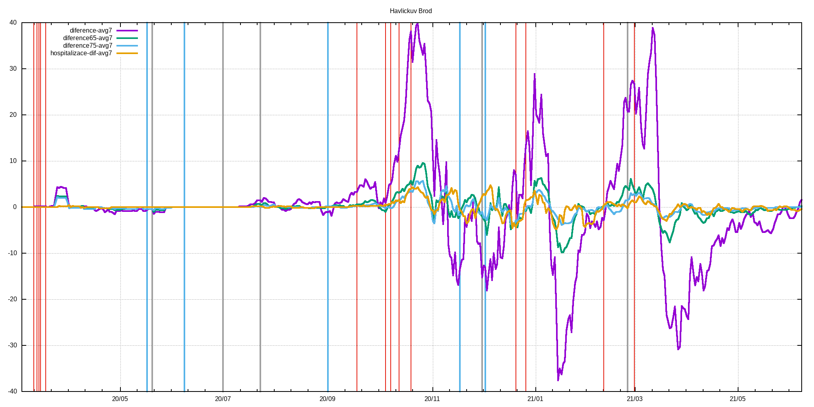

# c19_cz orp data extractor with gnuplot visualization
Few lame BASH & AWK & GNUPLOT scripts that extract ORP and LAU level data published by MZCR

## TL;DR - graphs are in ./figs & ./figs-lau directories

**Data source**: https://onemocneni-aktualne.mzcr.cz/api/v2/covid-19/orp.csv

**Directories logic**:
```
./extr                              #extracted & processed data for each ORP
./extr/2001.csv                     #original data for Benesov
./extr/2001.dif                     #processed data for Benesov - first difference & daily new cases added
./extr/2001.difa                    #7-day average of dtto

./extr-lau                          #LAU level of data - cumsum of pozitive,recovered,deaths
./extr-lau/CZ0100.csv               #original data for CZ0100 LAU -> Prague
./extr-lau/CZ0100.dif               #1st difference of original data -> # of new poz./rec./deaths
./extr-lau/CZ0100.difa              #7-day average of dtto
./extr-lau/CZ0100d.csv              #dates and ages of deceased

./figs                              #figs. generated by gnuplot scripts, leading 'a' in the filename means averaged version
./figs/Benesov/2001dif.png          #1st difference of prevalence data
./figs/Benesov/2001dif65.png        #dtto but only for 65+, 75+ & hospitalizations data
./figs/Benesov/2001new.png          #daily new cases
./figs/Benesov/2001new65.png        #dtto but only for 65+, 75+ & hospitalization data
./figs/Benesov/2001p.png            #prevalence
./figs/Benesov/2001p65.png          #dtto but only for 65+, 75+ & hospitalization data

./figs-lau                          #figs. for LAUs
./figs-lau/Benesov/CZ0201.png       #new pozitive & new recovered
./figs-lau/Benesov/CZ0201d.png      #deaths
./figs-lau/Benesov/CZ0201hist.png   #histogram of all deaths for this LAU
```
## Selected restrictions (red), easings (blue) and outbreaks (black)
```
# restrictions
2020-03-11 Schools closed
2020-03-13 Borders closed
2020-03-14 Services closed
2020-03-15 Lockdown
2020-03-18 Masks
2020-09-01 Indoor masks excl. schools
2020-09-18 Univ. masks
2020-10-05 SoE
2020-10-08 Distance learning at univs. & secondary schools
2020-10-13 Anti-COVID measures
2020-10-20 Outdoor mask & partial lockdown
2020-11-18 Shops restrictions
2020-12-21 UK flights banned
2020-12-27 PES at 4. with exceptions
2021-02-11 Cheb, Sokolov and Trutnov isolated
2021-02-25 FFP2+ mandatory
2021-03-01 Lockdown

#easings
2020-05-17 End of SoE
2020-06-08 Restrictions lifting, borders opened
2020-09-01 Schools reopened
2020-11-18 Primary schools reopened
2020-12-03 PES at 3.

#outbreaks
2020-05-20 Karvina miners outbreak
2020-07-01 OKD outbreak
2020-07-23 Prague music club outbreak
2020-12-01 B.1.1.7 confirmed in December
2021-02-25 B.1.351 confirmed
```
## Example output for LAU
<br>
<em>Havl Brod</em><br>
<br>
<br>
<br>
<br>
<br>

## Example output for ORP
<br>
<em>Havl Brod</em><br>
<br>
<br>
<br>
<br>
<br>
<br>
<br>
<br>
<br>
<br>
<br>
<br>

## Overall deaths histogram
<br>
## Histogram statistics
```


* FILE: 
  Records:           23583
  Out of range:          0
  Invalid:               0
  Column headers:        0
  Blank:                 0
  Data Blocks:           1

* COLUMNS:
  Mean:             276.9282               77.9582
  Std Dev:           56.6263               10.3331
  Sample StdDev:     56.6275               10.3333
  Skewness:          -1.1572               -0.8420
  Kurtosis:           6.4046                4.6080
  Avg Dev:           45.3288                8.0174
  Sum:           6.53080e+06           1.83849e+06
  Sum Sq.:       1.88418e+09           1.45843e+08

  Mean Err.:          0.3687                0.0673
  Std Dev Err.:       0.2607                0.0476
  Skewness Err.:      0.0160                0.0160
  Kurtosis Err.:      0.0319                0.0319

  Minimum:            0.0000 [    0]        8.0000 [19742]
  Maximum:          357.0000 [23582]      104.0000 [13101]
  Quartile:         234.0000               72.0000
  Median:           283.0000               79.0000
  Quartile:         323.0000               86.0000

  Linear Model:       y = -0.01422 x + 81.9
  Slope:              -0.01422 +- 0.001185
  Intercept:          81.9 +- 0.3349
  Correlation:        r = -0.07793
  Sum xy:             5.081e+08

iter      chisq       delta/lim  lambda   a             b             c             d            
   0 9.7024068711e+05   0.00e+00  3.32e+03    1.508380e-03   1.158730e+01   4.015430e+02   9.436430e-03
   1 5.0977177172e+05  -9.03e+04  3.32e+02    1.513035e-03   1.202546e+01   4.302234e+02   9.153111e-03
   2 4.8597966607e+05  -4.90e+03  3.32e+01    1.633803e-03   1.148684e+01   4.579843e+02   9.449409e-03
   * 3.2513797163e+07   9.85e+04  3.32e+02   -5.228300e-04  -2.969695e+00   1.039698e+03   2.143188e-02
   3 4.8262310989e+05  -6.95e+02  3.32e+01    1.643405e-03   1.123259e+01   4.688052e+02   9.644319e-03
   * 3.2513842960e+07   9.85e+04  3.32e+02   -5.869414e-04  -2.885045e+00   1.063345e+03   2.188858e-02
   4 4.8239684368e+05  -4.69e+01  3.32e+01    1.623154e-03   1.106274e+01   4.761110e+02   9.791801e-03
   * 3.2513839474e+07   9.85e+04  3.32e+02   -5.905865e-04  -2.861901e+00   1.080752e+03   2.224436e-02
   5 4.8238318898e+05  -2.83e+00  3.32e+01    1.599501e-03   1.090402e+01   4.830641e+02   9.934875e-03
   * 3.2513845249e+07   9.85e+04  3.32e+02   -5.799095e-04  -2.806401e+00   1.095876e+03   2.255597e-02
   * 4.8238318983e+05   1.77e-04  3.32e+03    1.576100e-03   1.074800e+01   4.900850e+02   1.007948e-02
   6 4.8234350889e+05  -8.23e+00  3.32e+02    1.599304e-03   1.090373e+01   4.831459e+02   9.937188e-03
   * 4.8238006090e+05   7.58e+00  3.32e+03    1.575200e-03   1.074757e+01   4.901213e+02   1.008059e-02
   * 4.8234423428e+05   1.50e-01  3.32e+04    1.599074e-03   1.090224e+01   4.832184e+02   9.938681e-03
   * 4.8234397680e+05   9.70e-02  3.32e+05    1.599303e-03   1.090377e+01   4.831467e+02   9.937245e-03
   * 4.8234352061e+05   2.43e-03  3.32e+06    1.599304e-03   1.090373e+01   4.831459e+02   9.937190e-03
   * 4.8234350901e+05   2.46e-05  3.32e+07    1.599304e-03   1.090373e+01   4.831459e+02   9.937188e-03
   * 4.8234350890e+05   2.46e-07  3.32e+08    1.599304e-03   1.090373e+01   4.831459e+02   9.937188e-03
   * 4.8234350889e+05   2.38e-09  3.32e+09    1.599304e-03   1.090373e+01   4.831459e+02   9.937188e-03
   7 4.8234350889e+05  -2.05e-10  3.32e+08    1.599304e-03   1.090373e+01   4.831459e+02   9.937188e-03
iter      chisq       delta/lim  lambda   a             b             c             d            

After 7 iterations the fit converged.
final sum of squares of residuals : 482344
rel. change during last iteration : -2.05151e-15

degrees of freedom    (FIT_NDF)                        : 40
rms of residuals      (FIT_STDFIT) = sqrt(WSSR/ndf)    : 109.812
variance of residuals (reduced chisquare) = WSSR/ndf   : 12058.6

Final set of parameters            Asymptotic Standard Error
=======================            ==========================
a               = 0.0015993        +/- 0.007378     (461.3%)
b               = 10.9037          +/- 46.34        (425%)
c               = 483.146          +/- 2071         (428.7%)
d               = 0.00993719       +/- 0.04266      (429.3%)

correlation matrix of the fit parameters:
                a      b      c      d      
a               1.000 
b               0.998  1.000 
c              -0.998 -1.000  1.000 
d              -0.999 -1.000  1.000  1.000 
```
