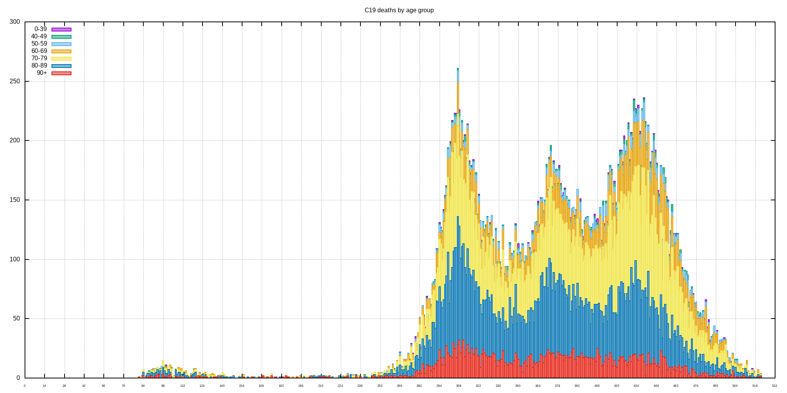
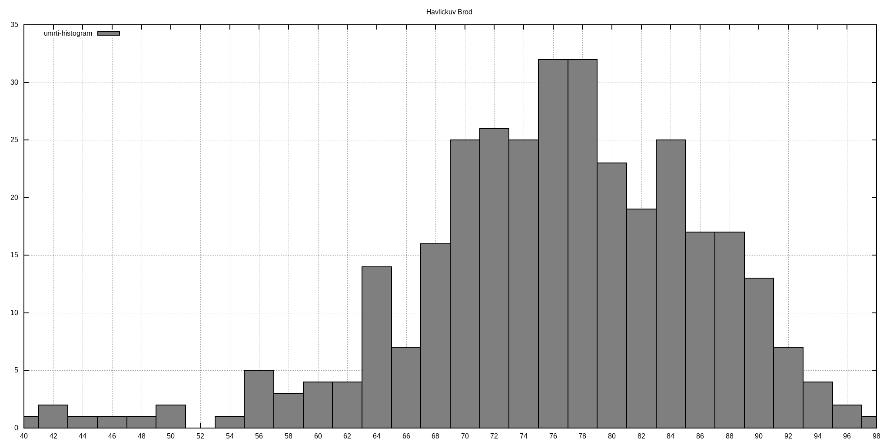
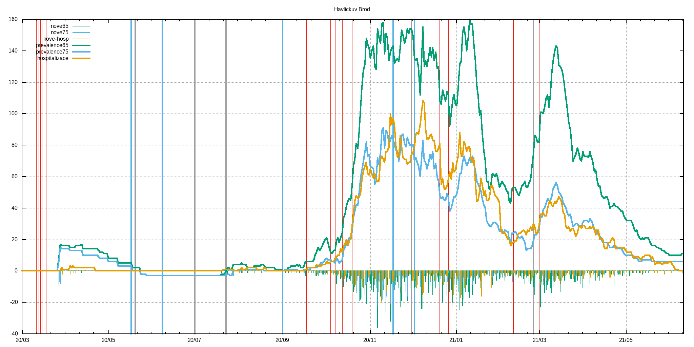
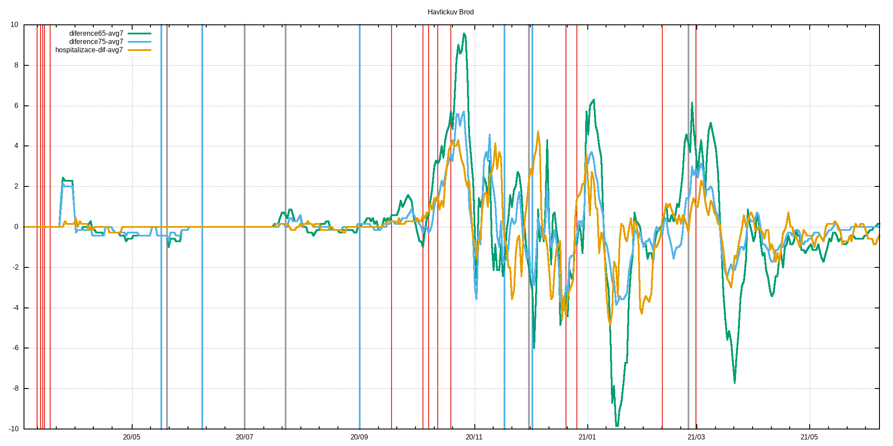
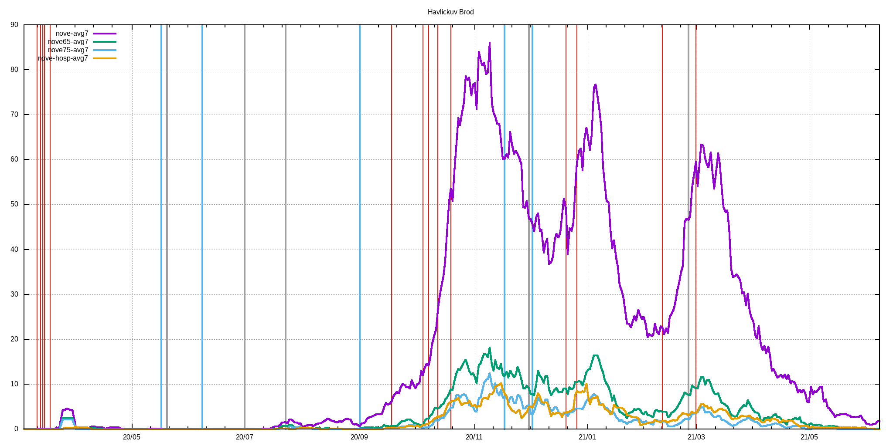
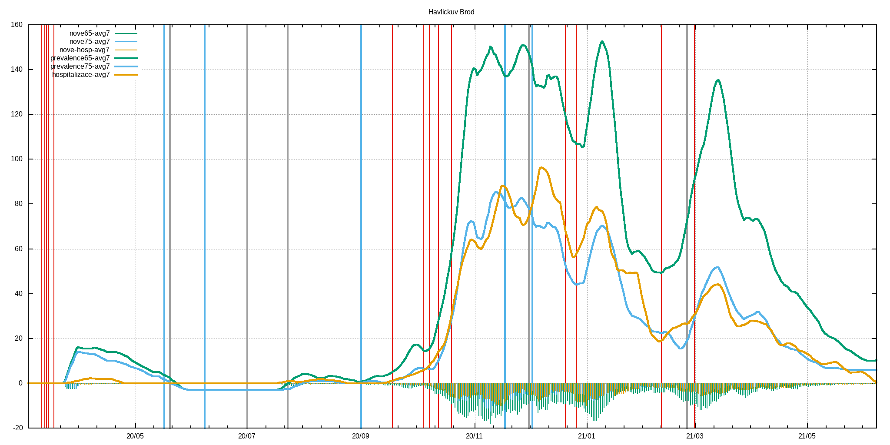

# c19_cz orp data extractor with gnuplot visualization
Few lame BASH & AWK & GNUPLOT scripts that extract ORP, LAU level and other data published by MZCR

## TL;DR - graphs are in ./figs & ./figs-lau directories and at the bottom of this README.md

**Data source**: https://onemocneni-aktualne.mzcr.cz/api/v2/covid-19/orp.csv

**Directories logic**:
```
./extr                              #extracted & processed data for each ORP
./extr/2001.csv                     #original data for Benesov
./extr/2001.dif                     #processed data for Benesov - first difference & daily new cases added
./extr/2001.difa                    #7-day average of dtto

./extr-lau                          #LAU level of data - cumsum of pozitive,recovered,deaths
./extr-lau/CZ0100.csv               #original data for CZ0100 LAU -> Prague
./extr-lau/CZ0100.dif               #1st difference of original data -> # of new poz./rec./deaths
./extr-lau/CZ0100.difa              #7-day average of dtto
./extr-lau/CZ0100d.csv              #dates and ages of deceased

./figs                              #figs. generated by gnuplot scripts, leading 'a' in the filename means averaged version
./figs/Benesov/2001dif.png          #1st difference of prevalence data
./figs/Benesov/2001dif65.png        #dtto but only for 65+, 75+ & hospitalizations data
./figs/Benesov/2001new.png          #daily new cases
./figs/Benesov/2001new65.png        #dtto but only for 65+, 75+ & hospitalization data
./figs/Benesov/2001p.png            #prevalence
./figs/Benesov/2001p65.png          #dtto but only for 65+, 75+ & hospitalization data

./figs-lau                          #figs. for LAUs
./figs-lau/Benesov/CZ0201.png       #new pozitive & new recovered
./figs-lau/Benesov/CZ0201d.png      #deaths
./figs-lau/Benesov/CZ0201hist.png   #histogram of all deaths for this LAU
```
## Selected restrictions (red), easings (blue) and outbreaks (black)
```
# restrictions
2020-03-11 Schools closed
2020-03-13 Borders closed
2020-03-14 Services closed
2020-03-15 Lockdown
2020-03-18 Masks
2020-09-01 Indoor masks excl. schools
2020-09-18 Univ. masks
2020-10-05 SoE
2020-10-08 Distance learning at univs. & secondary schools
2020-10-13 Anti-COVID measures
2020-10-20 Outdoor mask & partial lockdown
2020-11-18 Shops restrictions
2020-12-21 UK flights banned
2020-12-27 PES at 4. with exceptions
2021-02-11 Cheb, Sokolov and Trutnov isolated
2021-02-25 FFP2+ mandatory
2021-03-01 Lockdown

#easings
2020-05-17 End of SoE
2020-06-08 Restrictions lifting, borders opened
2020-09-01 Schools reopened
2020-11-18 Primary schools reopened
2020-12-03 PES at 3.

#outbreaks
2020-05-20 Karvina miners outbreak
2020-07-01 OKD outbreak
2020-07-23 Prague music club outbreak
2020-12-01 B.1.1.7 confirmed in December
2021-02-25 B.1.351 confirmed
```
## Time evolution of C-19 positively tested population
<br>

## Prevalence divided among age groups
<br>

## Time evolution of deaths by age groups
<br>

## Time evolution of deaths histograms
<br>

## Up-to-date overall deaths histogram
<br>
## Histogram statistics
```


* FILE: 
  Records:           28012
  Out of range:          0
  Invalid:               0
  Column headers:        0
  Blank:                 0
  Data Blocks:           1

* COLUMNS:
  Mean:             291.4236               77.4801
  Std Dev:           61.9140               10.4190
  Sample StdDev:     61.9151               10.4192
  Skewness:          -0.9310               -0.8012
  Kurtosis:           5.1194                4.4462
  Avg Dev:           50.5232                8.0867
  Sum:           8.16336e+06           2.17037e+06
  Sum Sq.:       2.48638e+09           1.71202e+08

  Mean Err.:          0.3699                0.0623
  Std Dev Err.:       0.2616                0.0440
  Skewness Err.:      0.0146                0.0146
  Kurtosis Err.:      0.0293                0.0293

  Minimum:            0.0000 [    0]        8.0000 [19737]
  Maximum:          385.0000 [28011]      104.0000 [13099]
  Quartile:         241.0000               72.0000
  Median:           297.0000               78.0000
  Quartile:         344.0000               85.0000

  Linear Model:       y = -0.01962 x + 83.2
  Slope:              -0.01962 +- 0.0009986
  Intercept:          83.2 +- 0.2975
  Correlation:        r = -0.1166
  Sum xy:             6.304e+08

iter      chisq       delta/lim  lambda   a             b             c             d            
   0 3.7848220629e+06   0.00e+00  3.28e+03    1.508380e-03   1.158730e+01   4.015430e+02   9.436430e-03
   1 9.1901825381e+05  -3.12e+05  3.28e+02    1.523117e-03   1.267765e+01   4.730535e+02   8.743353e-03
   * 9.5512256772e+05   3.78e+03  3.28e+03    1.921181e-03   1.125802e+01   5.397418e+02   9.414042e-03
   2 7.9216523718e+05  -1.60e+04  3.28e+02    1.538972e-03   1.285282e+01   4.855349e+02   8.664998e-03
   * 9.7032646685e+05   1.84e+04  3.28e+03    1.887638e-03   1.131335e+01   5.391032e+02   9.387586e-03
   3 7.8597015215e+05  -7.88e+02  3.28e+02    1.552951e-03   1.284453e+01   4.890377e+02   8.666056e-03
   * 9.6053637101e+05   1.82e+04  3.28e+03    1.885166e-03   1.131022e+01   5.397370e+02   9.393625e-03
   4 7.8329824103e+05  -3.41e+02  3.28e+02    1.566236e-03   1.280443e+01   4.908844e+02   8.682850e-03
   * 9.4302113255e+05   1.69e+04  3.28e+03    1.886104e-03   1.130243e+01   5.404221e+02   9.403287e-03
   5 7.8090117614e+05  -3.07e+02  3.28e+02    1.578985e-03   1.276011e+01   4.924114e+02   8.702184e-03
   * 9.2547970399e+05   1.56e+04  3.28e+03    1.887446e-03   1.129438e+01   5.410848e+02   9.413153e-03
   6 7.7867261489e+05  -2.86e+02  3.28e+02    1.591243e-03   1.271630e+01   4.938525e+02   8.721627e-03
   * 9.0930888048e+05   1.44e+04  3.28e+03    1.888797e-03   1.128657e+01   5.417195e+02   9.422683e-03
   7 7.7659597155e+05  -2.67e+02  3.28e+02    1.603036e-03   1.267375e+01   4.952494e+02   8.740740e-03
   * 8.9462797416e+05   1.32e+04  3.28e+03    1.890108e-03   1.127905e+01   5.423276e+02   9.431815e-03
   8 7.7465884820e+05  -2.50e+02  3.28e+02    1.614387e-03   1.263255e+01   4.966103e+02   8.759450e-03
   * 8.8133261687e+05   1.21e+04  3.28e+03    1.891374e-03   1.127179e+01   5.429107e+02   9.440562e-03
   9 7.7285020837e+05  -2.34e+02  3.28e+02    1.625319e-03   1.259266e+01   4.979374e+02   8.777752e-03
   * 8.6929165743e+05   1.11e+04  3.28e+03    1.892596e-03   1.126479e+01   5.434708e+02   9.448951e-03
  10 7.7116008689e+05  -2.19e+02  3.28e+02    1.635852e-03   1.255402e+01   4.992320e+02   8.795651e-03
   * 8.5838118065e+05   1.02e+04  3.28e+03    1.893777e-03   1.125800e+01   5.440092e+02   9.457007e-03
  11 7.6957944822e+05  -2.05e+02  3.28e+02    1.646005e-03   1.251659e+01   5.004950e+02   8.813157e-03
   * 8.4848915213e+05   9.30e+03  3.28e+03    1.894918e-03   1.125142e+01   5.445275e+02   9.464753e-03
  12 7.6810007892e+05  -1.93e+02  3.28e+02    1.655794e-03   1.248032e+01   5.017273e+02   8.830277e-03
   * 8.3951504229e+05   8.51e+03  3.28e+03    1.896019e-03   1.124504e+01   5.450269e+02   9.472211e-03
  13 7.6671449726e+05  -1.81e+02  3.28e+02    1.665237e-03   1.244516e+01   5.029299e+02   8.847020e-03
   * 8.3136872173e+05   7.78e+03  3.28e+03    1.897084e-03   1.123882e+01   5.455086e+02   9.479399e-03
  14 7.6541587507e+05  -1.70e+02  3.28e+02    1.674349e-03   1.241107e+01   5.041036e+02   8.863394e-03
   * 8.2396935328e+05   7.11e+03  3.28e+03    1.898112e-03   1.123276e+01   5.459737e+02   9.486337e-03
  15 7.6419796966e+05  -1.59e+02  3.28e+02    1.683144e-03   1.237799e+01   5.052493e+02   8.879409e-03
   * 8.1724439022e+05   6.49e+03  3.28e+03    1.899105e-03   1.122686e+01   5.464233e+02   9.493039e-03
  16 7.6305506399e+05  -1.50e+02  3.28e+02    1.691636e-03   1.234590e+01   5.063676e+02   8.895073e-03
   * 8.1112868525e+05   5.93e+03  3.28e+03    1.900064e-03   1.122109e+01   5.468582e+02   9.499522e-03
  17 7.6198191423e+05  -1.41e+02  3.28e+02    1.699838e-03   1.231476e+01   5.074595e+02   8.910394e-03
   * 8.0556370016e+05   5.41e+03  3.28e+03    1.900989e-03   1.121545e+01   5.472793e+02   9.505798e-03
  18 7.6097370335e+05  -1.32e+02  3.28e+02    1.707761e-03   1.228452e+01   5.085256e+02   8.925380e-03
   * 8.0049680394e+05   4.94e+03  3.28e+03    1.901883e-03   1.120993e+01   5.476874e+02   9.511880e-03
  19 7.6002600018e+05  -1.25e+02  3.28e+02    1.715418e-03   1.225516e+01   5.095667e+02   8.940039e-03
   * 7.9588064928e+05   4.51e+03  3.28e+03    1.902744e-03   1.120453e+01   5.480833e+02   9.517781e-03
  20 7.5913472299e+05  -1.17e+02  3.28e+02    1.722818e-03   1.222665e+01   5.105835e+02   8.954380e-03
   * 7.9167261783e+05   4.11e+03  3.28e+03    1.903576e-03   1.119923e+01   5.484675e+02   9.523511e-03
  21 7.5829610721e+05  -1.11e+02  3.28e+02    1.729973e-03   1.219894e+01   5.115766e+02   8.968409e-03
   * 7.8783432659e+05   3.75e+03  3.28e+03    1.904378e-03   1.119403e+01   5.488408e+02   9.529079e-03
  22 7.5750667656e+05  -1.04e+02  3.28e+02    1.736891e-03   1.217201e+01   5.125468e+02   8.982136e-03
   * 7.8433118791e+05   3.42e+03  3.28e+03    1.905150e-03   1.118892e+01   5.492038e+02   9.534495e-03
  23 7.5676321729e+05  -9.82e+01  3.28e+02    1.743581e-03   1.214584e+01   5.134946e+02   8.995566e-03
   * 7.8113201736e+05   3.12e+03  3.28e+03    1.905895e-03   1.118390e+01   5.495569e+02   9.539768e-03
  24 7.5606275513e+05  -9.26e+01  3.28e+02    1.750053e-03   1.212039e+01   5.144207e+02   9.008708e-03
   * 7.7820868377e+05   2.85e+03  3.28e+03    1.906611e-03   1.117897e+01   5.499007e+02   9.544906e-03
  25 7.5540253459e+05  -8.74e+01  3.28e+02    1.756314e-03   1.209564e+01   5.153256e+02   9.021569e-03
   * 7.7553579677e+05   2.60e+03  3.28e+03    1.907301e-03   1.117412e+01   5.502356e+02   9.549915e-03
  26 7.5478000031e+05  -8.25e+01  3.28e+02    1.762373e-03   1.207157e+01   5.162100e+02   9.034156e-03
   * 7.7309042775e+05   2.37e+03  3.28e+03    1.907964e-03   1.116934e+01   5.505622e+02   9.554803e-03
  27 7.5419278028e+05  -7.79e+01  3.28e+02    1.768237e-03   1.204815e+01   5.170744e+02   9.046475e-03
   * 7.7085186027e+05   2.16e+03  3.28e+03    1.908602e-03   1.116464e+01   5.508808e+02   9.559576e-03
  28 7.5363867075e+05  -7.35e+01  3.28e+02    1.773912e-03   1.202536e+01   5.179194e+02   9.058533e-03
   * 7.6880136692e+05   1.97e+03  3.28e+03    1.909215e-03   1.116000e+01   5.511918e+02   9.564240e-03
  29 7.5311562248e+05  -6.95e+01  3.28e+02    1.779406e-03   1.200318e+01   5.187455e+02   9.070337e-03
   * 7.6692200959e+05   1.80e+03  3.28e+03    1.909803e-03   1.115543e+01   5.514956e+02   9.568801e-03
  30 7.5262172835e+05  -6.56e+01  3.28e+02    1.784725e-03   1.198158e+01   5.195532e+02   9.081894e-03
   * 7.6519846061e+05   1.64e+03  3.28e+03    1.910368e-03   1.115093e+01   5.517925e+02   9.573264e-03
  31 7.5215521213e+05  -6.20e+01  3.28e+02    1.789875e-03   1.196055e+01   5.203429e+02   9.093209e-03
   * 7.6361684249e+05   1.50e+03  3.28e+03    1.910909e-03   1.114649e+01   5.520828e+02   9.577633e-03
  32 7.5171441819e+05  -5.86e+01  3.28e+02    1.794862e-03   1.194007e+01   5.211153e+02   9.104289e-03
   * 7.6216458432e+05   1.37e+03  3.28e+03    1.911427e-03   1.114210e+01   5.523669e+02   9.581913e-03
  33 7.5129780228e+05  -5.55e+01  3.28e+02    1.799692e-03   1.192012e+01   5.218707e+02   9.115139e-03
   * 7.6083029294e+05   1.25e+03  3.28e+03    1.911923e-03   1.113778e+01   5.526450e+02   9.586110e-03
  34 7.5090392296e+05  -5.25e+01  3.28e+02    1.804369e-03   1.190068e+01   5.226097e+02   9.125766e-03
   * 7.5960363730e+05   1.15e+03  3.28e+03    1.912397e-03   1.113350e+01   5.529174e+02   9.590225e-03
  35 7.5053143390e+05  -4.96e+01  3.28e+02    1.808900e-03   1.188173e+01   5.233326e+02   9.136175e-03
   * 7.5847524474e+05   1.05e+03  3.28e+03    1.912850e-03   1.112928e+01   5.531844e+02   9.594264e-03
  36 7.5017907680e+05  -4.70e+01  3.28e+02    1.813289e-03   1.186327e+01   5.240398e+02   9.146371e-03
   * 7.5743660774e+05   9.58e+02  3.28e+03    1.913283e-03   1.112511e+01   5.534461e+02   9.598230e-03
  37 7.4984567491e+05  -4.45e+01  3.28e+02    1.817540e-03   1.184527e+01   5.247319e+02   9.156360e-03
   * 7.5648000016e+05   8.77e+02  3.28e+03    1.913695e-03   1.112099e+01   5.537028e+02   9.602126e-03
  38 7.4953012709e+05  -4.21e+01  3.28e+02    1.821659e-03   1.182772e+01   5.254092e+02   9.166148e-03
   * 7.5559840194e+05   8.03e+02  3.28e+03    1.914087e-03   1.111692e+01   5.539548e+02   9.605956e-03
  39 7.4923140240e+05  -3.99e+01  3.28e+02    1.825649e-03   1.181060e+01   5.260721e+02   9.175739e-03
   * 7.5478543131e+05   7.36e+02  3.28e+03    1.914460e-03   1.111289e+01   5.542022e+02   9.609721e-03
  40 7.4894853503e+05  -3.78e+01  3.28e+02    1.829515e-03   1.179390e+01   5.267210e+02   9.185138e-03
   * 7.5403528388e+05   6.75e+02  3.28e+03    1.914814e-03   1.110891e+01   5.544452e+02   9.613426e-03
  41 7.4868061980e+05  -3.58e+01  3.28e+02    1.833261e-03   1.177761e+01   5.273562e+02   9.194351e-03
   * 7.5334267773e+05   6.19e+02  3.28e+03    1.915150e-03   1.110497e+01   5.546840e+02   9.617073e-03
  42 7.4842680786e+05  -3.39e+01  3.28e+02    1.836890e-03   1.176172e+01   5.279781e+02   9.203382e-03
   * 7.5270280391e+05   5.68e+02  3.28e+03    1.915467e-03   1.110108e+01   5.549188e+02   9.620664e-03
  43 7.4818630282e+05  -3.21e+01  3.28e+02    1.840406e-03   1.174620e+01   5.285871e+02   9.212235e-03
   * 7.5211128196e+05   5.22e+02  3.28e+03    1.915768e-03   1.109722e+01   5.551497e+02   9.624201e-03
  44 7.4795835716e+05  -3.05e+01  3.28e+02    1.843813e-03   1.173106e+01   5.291835e+02   9.220916e-03
   * 7.5156411964e+05   4.80e+02  3.28e+03    1.916051e-03   1.109340e+01   5.553769e+02   9.627688e-03
  45 7.4774226893e+05  -2.89e+01  3.28e+02    1.847115e-03   1.171628e+01   5.297677e+02   9.229428e-03
   * 7.5105767679e+05   4.41e+02  3.28e+03    1.916317e-03   1.108963e+01   5.556005e+02   9.631125e-03
  46 7.4753737864e+05  -2.74e+01  3.28e+02    1.850314e-03   1.170184e+01   5.303399e+02   9.237776e-03
   * 7.5058863250e+05   4.07e+02  3.28e+03    1.916567e-03   1.108589e+01   5.558207e+02   9.634516e-03
  47 7.4734306648e+05  -2.60e+01  3.28e+02    1.853413e-03   1.168774e+01   5.309005e+02   9.245964e-03
   * 7.5015395569e+05   3.75e+02  3.28e+03    1.916801e-03   1.108218e+01   5.560376e+02   9.637861e-03
  48 7.4715874966e+05  -2.47e+01  3.28e+02    1.856416e-03   1.167397e+01   5.314497e+02   9.253996e-03
   * 7.4975087835e+05   3.46e+02  3.28e+03    1.917019e-03   1.107851e+01   5.562513e+02   9.641163e-03
  49 7.4698388000e+05  -2.34e+01  3.28e+02    1.859326e-03   1.166052e+01   5.319880e+02   9.261876e-03
   * 7.4937687148e+05   3.19e+02  3.28e+03    1.917222e-03   1.107488e+01   5.564620e+02   9.644423e-03
  50 7.4681794168e+05  -2.22e+01  3.28e+02    1.862145e-03   1.164737e+01   5.325155e+02   9.269607e-03
   * 7.4902962326e+05   2.95e+02  3.28e+03    1.917411e-03   1.107128e+01   5.566698e+02   9.647644e-03
  51 7.4666044917e+05  -2.11e+01  3.28e+02    1.864876e-03   1.163452e+01   5.330325e+02   9.277195e-03
   * 7.4870701936e+05   2.73e+02  3.28e+03    1.917585e-03   1.106771e+01   5.568747e+02   9.650826e-03
  52 7.4651094523e+05  -2.00e+01  3.28e+02    1.867522e-03   1.162196e+01   5.335393e+02   9.284642e-03
   * 7.4840712509e+05   2.53e+02  3.28e+03    1.917744e-03   1.106418e+01   5.570768e+02   9.653971e-03
  53 7.4636899919e+05  -1.90e+01  3.28e+02    1.870085e-03   1.160968e+01   5.340363e+02   9.291952e-03
   * 7.4812816924e+05   2.35e+02  3.28e+03    1.917890e-03   1.106067e+01   5.572764e+02   9.657081e-03
  54 7.4623420520e+05  -1.81e+01  3.28e+02    1.872568e-03   1.159768e+01   5.345235e+02   9.299128e-03
   * 7.4786852945e+05   2.19e+02  3.28e+03    1.918023e-03   1.105720e+01   5.574734e+02   9.660156e-03
  55 7.4610618075e+05  -1.72e+01  3.28e+02    1.874973e-03   1.158593e+01   5.350014e+02   9.306174e-03
   * 7.4762671896e+05   2.03e+02  3.28e+03    1.918142e-03   1.105375e+01   5.576680e+02   9.663199e-03
  56 7.4598456515e+05  -1.63e+01  3.28e+02    1.877303e-03   1.157445e+01   5.354701e+02   9.313093e-03
   * 7.4740137459e+05   1.90e+02  3.28e+03    1.918248e-03   1.105034e+01   5.578603e+02   9.666210e-03
  57 7.4586901822e+05  -1.55e+01  3.28e+02    1.879559e-03   1.156322e+01   5.359298e+02   9.319889e-03
   * 7.4719124582e+05   1.77e+02  3.28e+03    1.918342e-03   1.104695e+01   5.580502e+02   9.669190e-03
  58 7.4575921900e+05  -1.47e+01  3.28e+02    1.881743e-03   1.155222e+01   5.363809e+02   9.326563e-03
   * 7.4699518494e+05   1.65e+02  3.28e+03    1.918424e-03   1.104359e+01   5.582380e+02   9.672142e-03
  59 7.4565486464e+05  -1.40e+01  3.28e+02    1.883859e-03   1.154146e+01   5.368234e+02   9.333121e-03
   * 7.4681213801e+05   1.55e+02  3.28e+03    1.918493e-03   1.104026e+01   5.584237e+02   9.675064e-03
  60 7.4555566922e+05  -1.33e+01  3.28e+02    1.885907e-03   1.153093e+01   5.372577e+02   9.339564e-03
   * 7.4664113678e+05   1.45e+02  3.28e+03    1.918552e-03   1.103695e+01   5.586073e+02   9.677960e-03
  61 7.4546136278e+05  -1.27e+01  3.28e+02    1.887890e-03   1.152062e+01   5.376840e+02   9.345895e-03
   * 7.4648129120e+05   1.37e+02  3.28e+03    1.918598e-03   1.103367e+01   5.587890e+02   9.680829e-03
  62 7.4537169035e+05  -1.20e+01  3.28e+02    1.889810e-03   1.151053e+01   5.381024e+02   9.352117e-03
   * 7.4633178275e+05   1.29e+02  3.28e+03    1.918634e-03   1.103042e+01   5.589687e+02   9.683673e-03
  63 7.4528641107e+05  -1.14e+01  3.28e+02    1.891668e-03   1.150065e+01   5.385132e+02   9.358234e-03
   * 7.4619185829e+05   1.21e+02  3.28e+03    1.918658e-03   1.102719e+01   5.591466e+02   9.686492e-03
  64 7.4520529733e+05  -1.09e+01  3.28e+02    1.893466e-03   1.149097e+01   5.389165e+02   9.364247e-03
   * 7.4606082448e+05   1.15e+02  3.28e+03    1.918673e-03   1.102398e+01   5.593228e+02   9.689288e-03
  65 7.4512813402e+05  -1.04e+01  3.28e+02    1.895206e-03   1.148148e+01   5.393126e+02   9.370159e-03
   * 7.4593804273e+05   1.09e+02  3.28e+03    1.918676e-03   1.102079e+01   5.594972e+02   9.692061e-03
  66 7.4505471775e+05  -9.85e+00  3.28e+02    1.896889e-03   1.147219e+01   5.397016e+02   9.375973e-03
   * 7.4582292454e+05   1.03e+02  3.28e+03    1.918670e-03   1.101763e+01   5.596700e+02   9.694811e-03
  67 7.4498485622e+05  -9.38e+00  3.28e+02    1.898517e-03   1.146309e+01   5.400838e+02   9.381692e-03
   * 7.4571492736e+05   9.79e+01  3.28e+03    1.918654e-03   1.101449e+01   5.598411e+02   9.697541e-03
  68 7.4491836755e+05  -8.93e+00  3.28e+02    1.900092e-03   1.145416e+01   5.404592e+02   9.387317e-03
   * 7.4561355068e+05   9.32e+01  3.28e+03    1.918629e-03   1.101137e+01   5.600107e+02   9.700250e-03
  69 7.4485507968e+05  -8.50e+00  3.28e+02    1.901615e-03   1.144542e+01   5.408281e+02   9.392851e-03
   * 7.4551833260e+05   8.90e+01  3.28e+03    1.918594e-03   1.100828e+01   5.601788e+02   9.702939e-03
  70 7.4479482980e+05  -8.09e+00  3.28e+02    1.903088e-03   1.143684e+01   5.411906e+02   9.398297e-03
   * 7.4542884660e+05   8.51e+01  3.28e+03    1.918550e-03   1.100520e+01   5.603454e+02   9.705609e-03
  71 7.4473746384e+05  -7.70e+00  3.28e+02    1.904511e-03   1.142843e+01   5.415469e+02   9.403656e-03
   * 7.4534469863e+05   8.15e+01  3.28e+03    1.918497e-03   1.100215e+01   5.605107e+02   9.708260e-03
  72 7.4468283596e+05  -7.34e+00  3.28e+02    1.905886e-03   1.142018e+01   5.418972e+02   9.408931e-03
   * 7.4526552447e+05   7.82e+01  3.28e+03    1.918435e-03   1.099911e+01   5.606746e+02   9.710893e-03
  73 7.4463080807e+05  -6.99e+00  3.28e+02    1.907215e-03   1.141209e+01   5.422415e+02   9.414124e-03
   * 7.4519098732e+05   7.52e+01  3.28e+03    1.918365e-03   1.099609e+01   5.608371e+02   9.713509e-03
  74 7.4458124944e+05  -6.66e+00  3.28e+02    1.908499e-03   1.140415e+01   5.425801e+02   9.419237e-03
   * 7.4512077553e+05   7.24e+01  3.28e+03    1.918287e-03   1.099309e+01   5.609984e+02   9.716108e-03
  75 7.4453403623e+05  -6.34e+00  3.28e+02    1.909739e-03   1.139636e+01   5.429131e+02   9.424273e-03
   * 7.4505460060e+05   6.99e+01  3.28e+03    1.918200e-03   1.099012e+01   5.611584e+02   9.718691e-03
  76 7.4448905113e+05  -6.04e+00  3.28e+02    1.910936e-03   1.138872e+01   5.432407e+02   9.429232e-03
   * 7.4499219534e+05   6.75e+01  3.28e+03    1.918106e-03   1.098715e+01   5.613173e+02   9.721258e-03
  77 7.4444618300e+05  -5.76e+00  3.28e+02    1.912091e-03   1.138122e+01   5.435629e+02   9.434116e-03
   * 7.4493331216e+05   6.54e+01  3.28e+03    1.918004e-03   1.098421e+01   5.614749e+02   9.723810e-03
  78 7.4440532654e+05  -5.49e+00  3.28e+02    1.913206e-03   1.137385e+01   5.438800e+02   9.438929e-03
   * 7.4487772152e+05   6.34e+01  3.28e+03    1.917895e-03   1.098128e+01   5.616315e+02   9.726348e-03
  79 7.4436638192e+05  -5.23e+00  3.28e+02    1.914282e-03   1.136662e+01   5.441920e+02   9.443671e-03
   * 7.4482521049e+05   6.16e+01  3.28e+03    1.917778e-03   1.097837e+01   5.617870e+02   9.728871e-03
  80 7.4432925454e+05  -4.99e+00  3.28e+02    1.915319e-03   1.135951e+01   5.444991e+02   9.448345e-03
   * 7.4477558147e+05   5.99e+01  3.28e+03    1.917654e-03   1.097548e+01   5.619414e+02   9.731380e-03
  81 7.4429385470e+05  -4.76e+00  3.28e+02    1.916319e-03   1.135253e+01   5.448014e+02   9.452952e-03
   * 7.4472865100e+05   5.84e+01  3.28e+03    1.917523e-03   1.097260e+01   5.620948e+02   9.733876e-03
  82 7.4426009734e+05  -4.54e+00  3.28e+02    1.917283e-03   1.134568e+01   5.450990e+02   9.457493e-03
   * 7.4468424862e+05   5.70e+01  3.28e+03    1.917386e-03   1.096974e+01   5.622472e+02   9.736358e-03
  83 7.4422790180e+05  -4.33e+00  3.28e+02    1.918211e-03   1.133894e+01   5.453920e+02   9.461971e-03
   * 7.4464221592e+05   5.56e+01  3.28e+03    1.917242e-03   1.096689e+01   5.623986e+02   9.738829e-03
  84 7.4419719158e+05  -4.13e+00  3.28e+02    1.919105e-03   1.133232e+01   5.456806e+02   9.466387e-03
   * 7.4460240561e+05   5.44e+01  3.28e+03    1.917091e-03   1.096406e+01   5.625491e+02   9.741287e-03
  85 7.4416789410e+05  -3.94e+00  3.28e+02    1.919966e-03   1.132582e+01   5.459649e+02   9.470743e-03
   * 7.4456468062e+05   5.33e+01  3.28e+03    1.916934e-03   1.096124e+01   5.626987e+02   9.743733e-03
  86 7.4413994050e+05  -3.76e+00  3.28e+02    1.920794e-03   1.131942e+01   5.462449e+02   9.475040e-03
   * 7.4452891338e+05   5.22e+01  3.28e+03    1.916771e-03   1.095844e+01   5.628474e+02   9.746169e-03
  87 7.4411326544e+05  -3.58e+00  3.28e+02    1.921590e-03   1.131313e+01   5.465208e+02   9.479279e-03
   * 7.4449498510e+05   5.13e+01  3.28e+03    1.916602e-03   1.095565e+01   5.629953e+02   9.748593e-03
  88 7.4408780691e+05  -3.42e+00  3.28e+02    1.922355e-03   1.130694e+01   5.467927e+02   9.483462e-03
   * 7.4446278508e+05   5.04e+01  3.28e+03    1.916428e-03   1.095287e+01   5.631423e+02   9.751006e-03
  89 7.4406350606e+05  -3.27e+00  3.28e+02    1.923091e-03   1.130086e+01   5.470608e+02   9.487591e-03
   * 7.4443221013e+05   4.95e+01  3.28e+03    1.916247e-03   1.095011e+01   5.632885e+02   9.753409e-03
  90 7.4404030701e+05  -3.12e+00  3.28e+02    1.923797e-03   1.129487e+01   5.473249e+02   9.491667e-03
   * 7.4440316401e+05   4.87e+01  3.28e+03    1.916061e-03   1.094736e+01   5.634340e+02   9.755802e-03
  91 7.4401815671e+05  -2.98e+00  3.28e+02    1.924474e-03   1.128898e+01   5.475854e+02   9.495691e-03
   * 7.4437555691e+05   4.80e+01  3.28e+03    1.915870e-03   1.094463e+01   5.635787e+02   9.758185e-03
  92 7.4399700479e+05  -2.84e+00  3.28e+02    1.925124e-03   1.128319e+01   5.478423e+02   9.499664e-03
   * 7.4434930498e+05   4.73e+01  3.28e+03    1.915673e-03   1.094190e+01   5.637227e+02   9.760558e-03
  93 7.4397680343e+05  -2.72e+00  3.28e+02    1.925747e-03   1.127748e+01   5.480956e+02   9.503588e-03
   * 7.4432432993e+05   4.67e+01  3.28e+03    1.915472e-03   1.093919e+01   5.638659e+02   9.762923e-03
  94 7.4395750718e+05  -2.59e+00  3.28e+02    1.926343e-03   1.127186e+01   5.483455e+02   9.507464e-03
   * 7.4430055857e+05   4.61e+01  3.28e+03    1.915265e-03   1.093649e+01   5.640085e+02   9.765279e-03
  95 7.4393907289e+05  -2.48e+00  3.28e+02    1.926914e-03   1.126633e+01   5.485920e+02   9.511293e-03
   * 7.4427792248e+05   4.55e+01  3.28e+03    1.915053e-03   1.093380e+01   5.641504e+02   9.767626e-03
  96 7.4392145957e+05  -2.37e+00  3.28e+02    1.927460e-03   1.126089e+01   5.488353e+02   9.515077e-03
   * 7.4425635766e+05   4.50e+01  3.28e+03    1.914837e-03   1.093112e+01   5.642917e+02   9.769964e-03
  97 7.4390462826e+05  -2.26e+00  3.28e+02    1.927982e-03   1.125552e+01   5.490754e+02   9.518816e-03
   * 7.4423580423e+05   4.45e+01  3.28e+03    1.914616e-03   1.092846e+01   5.644323e+02   9.772295e-03
  98 7.4388854195e+05  -2.16e+00  3.28e+02    1.928480e-03   1.125024e+01   5.493123e+02   9.522512e-03
   * 7.4421620609e+05   4.40e+01  3.28e+03    1.914390e-03   1.092580e+01   5.645723e+02   9.774618e-03
  99 7.4387316546e+05  -2.07e+00  3.28e+02    1.928955e-03   1.124503e+01   5.495463e+02   9.526165e-03
   * 7.4419751073e+05   4.36e+01  3.28e+03    1.914160e-03   1.092315e+01   5.647117e+02   9.776933e-03
 100 7.4385846535e+05  -1.98e+00  3.28e+02    1.929407e-03   1.123990e+01   5.497773e+02   9.529777e-03
   * 7.4417966891e+05   4.32e+01  3.28e+03    1.913926e-03   1.092052e+01   5.648506e+02   9.779240e-03
 101 7.4384440985e+05  -1.89e+00  3.28e+02    1.929838e-03   1.123484e+01   5.500054e+02   9.533350e-03
   * 7.4416263446e+05   4.28e+01  3.28e+03    1.913687e-03   1.091789e+01   5.649888e+02   9.781541e-03
 102 7.4383096873e+05  -1.81e+00  3.28e+02    1.930247e-03   1.122985e+01   5.502307e+02   9.536883e-03
   * 7.4414636410e+05   4.24e+01  3.28e+03    1.913445e-03   1.091528e+01   5.651266e+02   9.783834e-03
 103 7.4381811329e+05  -1.73e+00  3.28e+02    1.930636e-03   1.122493e+01   5.504533e+02   9.540377e-03
   * 7.4413081717e+05   4.20e+01  3.28e+03    1.913198e-03   1.091267e+01   5.652638e+02   9.786121e-03
 104 7.4380581619e+05  -1.65e+00  3.28e+02    1.931004e-03   1.122008e+01   5.506732e+02   9.543835e-03
   * 7.4411595552e+05   4.17e+01  3.28e+03    1.912948e-03   1.091008e+01   5.654005e+02   9.788401e-03
 105 7.4379405146e+05  -1.58e+00  3.28e+02    1.931353e-03   1.121530e+01   5.508905e+02   9.547256e-03
   * 7.4410174331e+05   4.14e+01  3.28e+03    1.912694e-03   1.090749e+01   5.655367e+02   9.790675e-03
 106 7.4378279439e+05  -1.51e+00  3.28e+02    1.931682e-03   1.121058e+01   5.511052e+02   9.550642e-03
   * 7.4408814683e+05   4.10e+01  3.28e+03    1.912436e-03   1.090491e+01   5.656724e+02   9.792943e-03
 107 7.4377202149e+05  -1.45e+00  3.28e+02    1.931993e-03   1.120592e+01   5.513175e+02   9.553994e-03
   * 7.4407513443e+05   4.07e+01  3.28e+03    1.912174e-03   1.090234e+01   5.658076e+02   9.795205e-03
 108 7.4376171040e+05  -1.39e+00  3.28e+02    1.932286e-03   1.120133e+01   5.515274e+02   9.557312e-03
   * 7.4406267629e+05   4.04e+01  3.28e+03    1.911909e-03   1.089978e+01   5.659424e+02   9.797460e-03
 109 7.4375183985e+05  -1.33e+00  3.28e+02    1.932560e-03   1.119679e+01   5.517350e+02   9.560597e-03
   * 7.4405074437e+05   4.02e+01  3.28e+03    1.911641e-03   1.089723e+01   5.660768e+02   9.799711e-03
 110 7.4374238959e+05  -1.27e+00  3.28e+02    1.932818e-03   1.119232e+01   5.519402e+02   9.563850e-03
   * 7.4403931228e+05   3.99e+01  3.28e+03    1.911369e-03   1.089468e+01   5.662107e+02   9.801956e-03
 111 7.4373334038e+05  -1.22e+00  3.28e+02    1.933059e-03   1.118790e+01   5.521433e+02   9.567072e-03
   * 7.4402835513e+05   3.97e+01  3.28e+03    1.911094e-03   1.089215e+01   5.663442e+02   9.804195e-03
 112 7.4372467388e+05  -1.17e+00  3.28e+02    1.933283e-03   1.118353e+01   5.523441e+02   9.570264e-03
   * 7.4401784948e+05   3.94e+01  3.28e+03    1.910816e-03   1.088962e+01   5.664773e+02   9.806429e-03
 113 7.4371637265e+05  -1.12e+00  3.28e+02    1.933491e-03   1.117922e+01   5.525429e+02   9.573427e-03
   * 7.4400777324e+05   3.92e+01  3.28e+03    1.910535e-03   1.088710e+01   5.666100e+02   9.808659e-03
 114 7.4370842008e+05  -1.07e+00  3.28e+02    1.933684e-03   1.117496e+01   5.527395e+02   9.576560e-03
   * 7.4399810557e+05   3.89e+01  3.28e+03    1.910250e-03   1.088458e+01   5.667423e+02   9.810883e-03
 115 7.4370080037e+05  -1.02e+00  3.28e+02    1.933862e-03   1.117075e+01   5.529342e+02   9.579665e-03
   * 7.4398882678e+05   3.87e+01  3.28e+03    1.909963e-03   1.088208e+01   5.668742e+02   9.813103e-03
 116 7.4369349845e+05  -9.82e-01  3.28e+02    1.934025e-03   1.116659e+01   5.531269e+02   9.582743e-03
iter      chisq       delta/lim  lambda   a             b             c             d            

After 116 iterations the fit converged.
final sum of squares of residuals : 743693
rel. change during last iteration : -9.81845e-06

degrees of freedom    (FIT_NDF)                        : 41
rms of residuals      (FIT_STDFIT) = sqrt(WSSR/ndf)    : 134.681
variance of residuals (reduced chisquare) = WSSR/ndf   : 18138.9

Final set of parameters            Asymptotic Standard Error
=======================            ==========================
a               = 0.00193402       +/- 0.009416     (486.8%)
b               = 11.1666          +/- 50.24        (449.9%)
c               = 553.127          +/- 2510         (453.8%)
d               = 0.00958274       +/- 0.04355      (454.4%)

correlation matrix of the fit parameters:
                a      b      c      d      
a               1.000 
b               0.998  1.000 
c              -0.999 -1.000  1.000 
d              -0.999 -1.000  1.000  1.000 
```

## Example output for LAU
<br>
<em>Havl Brod</em><br>
<br>
<br>
<br>
<br>
<br>

## Example output for ORP
<br>
<em>Havl Brod</em><br>
<br>
<br>
<br>
<br>
<br>
<br>
<br>
<br>
<br>
<br>
<br>
<br>

