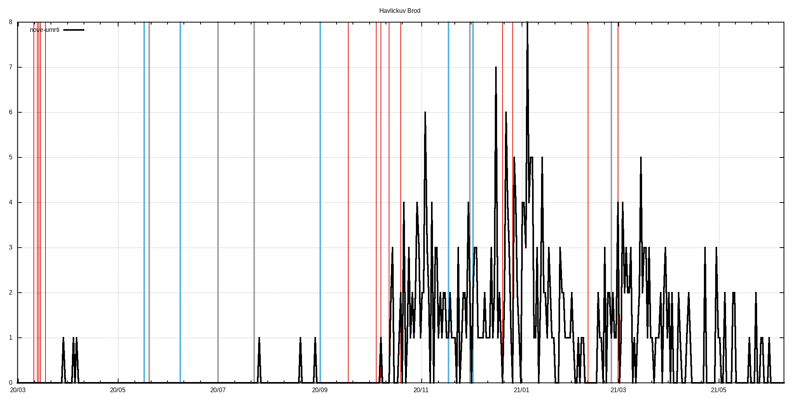
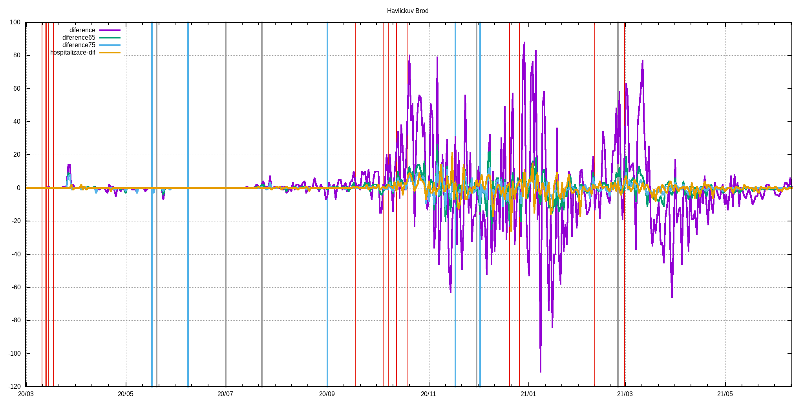
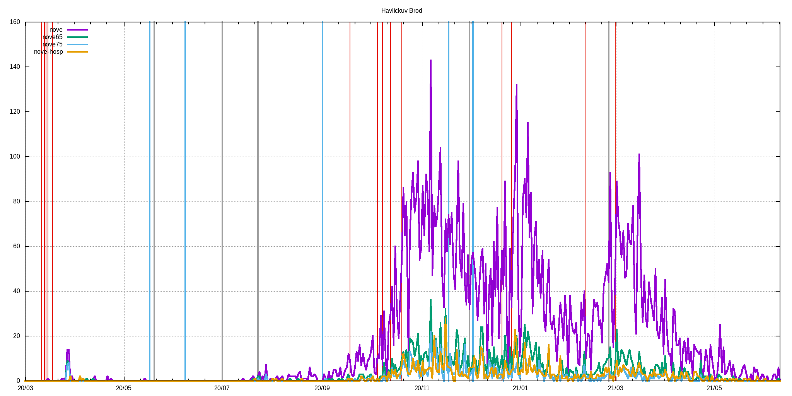
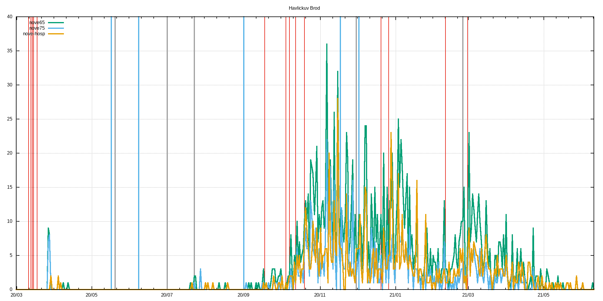
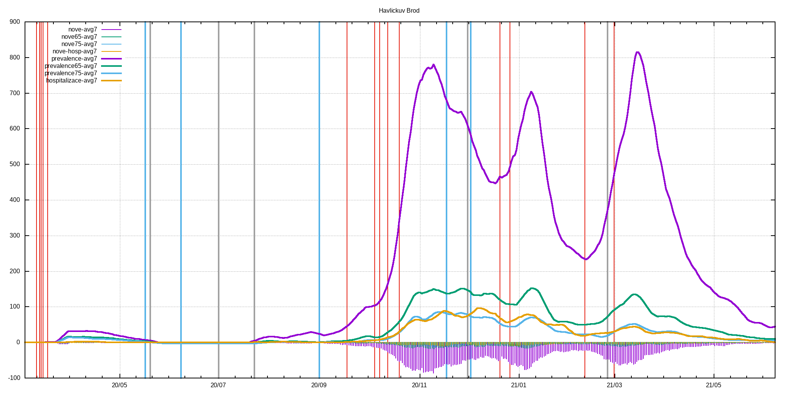

# c19_cz orp data extractor with gnuplot visualization
Few lame BASH & AWK & GNUPLOT scripts that extract ORP, LAU level and other data published by MZCR

## TL;DR - graphs are in ./figs & ./figs-lau directories and at the bottom of this README.md

**Data source**: https://onemocneni-aktualne.mzcr.cz/api/v2/covid-19/orp.csv

**Directories logic**:
```
./extr                              #extracted & processed data for each ORP
./extr/2001.csv                     #original data for Benesov
./extr/2001.dif                     #processed data for Benesov - first difference & daily new cases added
./extr/2001.difa                    #7-day average of dtto

./extr-lau                          #LAU level of data - cumsum of pozitive,recovered,deaths
./extr-lau/CZ0100.csv               #original data for CZ0100 LAU -> Prague
./extr-lau/CZ0100.dif               #1st difference of original data -> # of new poz./rec./deaths
./extr-lau/CZ0100.difa              #7-day average of dtto
./extr-lau/CZ0100d.csv              #dates and ages of deceased

./figs                              #figs. generated by gnuplot scripts, leading 'a' in the filename means averaged version
./figs/Benesov/2001dif.png          #1st difference of prevalence data
./figs/Benesov/2001dif65.png        #dtto but only for 65+, 75+ & hospitalizations data
./figs/Benesov/2001new.png          #daily new cases
./figs/Benesov/2001new65.png        #dtto but only for 65+, 75+ & hospitalization data
./figs/Benesov/2001p.png            #prevalence
./figs/Benesov/2001p65.png          #dtto but only for 65+, 75+ & hospitalization data

./figs-lau                          #figs. for LAUs
./figs-lau/Benesov/CZ0201.png       #new pozitive & new recovered
./figs-lau/Benesov/CZ0201d.png      #deaths
./figs-lau/Benesov/CZ0201hist.png   #histogram of all deaths for this LAU
```
## Selected restrictions (red), easings (blue) and outbreaks (black)
```
# restrictions
2020-03-11 Schools closed
2020-03-13 Borders closed
2020-03-14 Services closed
2020-03-15 Lockdown
2020-03-18 Masks
2020-09-01 Indoor masks excl. schools
2020-09-18 Univ. masks
2020-10-05 SoE
2020-10-08 Distance learning at univs. & secondary schools
2020-10-13 Anti-COVID measures
2020-10-20 Outdoor mask & partial lockdown
2020-11-18 Shops restrictions
2020-12-21 UK flights banned
2020-12-27 PES at 4. with exceptions
2021-02-11 Cheb, Sokolov and Trutnov isolated
2021-02-25 FFP2+ mandatory
2021-03-01 Lockdown

#easings
2020-05-17 End of SoE
2020-06-08 Restrictions lifting, borders opened
2020-09-01 Schools reopened
2020-11-18 Primary schools reopened
2020-12-03 PES at 3.

#outbreaks
2020-05-20 Karvina miners outbreak
2020-07-01 OKD outbreak
2020-07-23 Prague music club outbreak
2020-12-01 B.1.1.7 confirmed in December
2021-02-25 B.1.351 confirmed
```
## Time evolution of C-19 positively tested population
<br>

## Prevalence divided among age groups
<br>

## Time evolution of deaths by age groups
<br>

## Time evolution of deaths histograms
<br>

## Up-to-date overall deaths histogram
<br>
## Histogram statistics
```


* FILE: 
  Records:           30197
  Out of range:          0
  Invalid:               0
  Column headers:        0
  Blank:                 0
  Data Blocks:           1

* COLUMNS:
  Mean:             298.9222               77.2119
  Std Dev:           65.7685               10.5290
  Sample StdDev:     65.7696               10.5292
  Skewness:          -0.7404               -0.8052
  Kurtosis:           4.5512                4.5228
  Avg Dev:           53.7523                8.1640
  Sum:           9.02655e+06           2.33157e+06
  Sum Sq.:       2.82885e+09           1.83372e+08

  Mean Err.:          0.3785                0.0606
  Std Dev Err.:       0.2676                0.0428
  Skewness Err.:      0.0141                0.0141
  Kurtosis Err.:      0.0282                0.0282

  Minimum:            0.0000 [    0]        0.0000 [28662]
  Maximum:          441.0000 [30196]      104.0000 [13231]
  Quartile:         245.0000               71.0000
  Median:           304.0000               78.0000
  Quartile:         352.0000               85.0000

  Linear Model:       y = -0.02198 x + 83.78
  Slope:              -0.02198 +- 0.0009126
  Intercept:          83.78 +- 0.2793
  Correlation:        r = -0.1373
  Sum xy:             6.941e+08

iter      chisq       delta/lim  lambda   a             b             c             d            
   0 5.8751418121e+06   0.00e+00  3.21e+03    1.508380e-03   1.158730e+01   4.015430e+02   9.436430e-03
   1 1.1780204622e+06  -3.99e+05  3.21e+02    1.530551e-03   1.298781e+01   4.941608e+02   8.548689e-03
   * 1.8375558629e+06   3.59e+04  3.21e+03    2.130807e-03   1.092861e+01   5.835648e+02   9.464334e-03
   2 9.5195142554e+05  -2.37e+04  3.21e+02    1.556588e-03   1.317090e+01   5.084130e+02   8.486412e-03
   * 1.7204561025e+06   4.47e+04  3.21e+03    2.064157e-03   1.104651e+01   5.821205e+02   9.422242e-03
   3 9.4018219058e+05  -1.25e+03  3.21e+02    1.578906e-03   1.314241e+01   5.129273e+02   8.497023e-03
   * 1.6549317085e+06   4.32e+04  3.21e+03    2.058770e-03   1.104457e+01   5.832539e+02   9.434462e-03
   4 9.3406182412e+05  -6.55e+02  3.21e+02    1.599903e-03   1.307796e+01   5.156142e+02   8.523195e-03
   * 1.5791900472e+06   4.09e+04  3.21e+03    2.059802e-03   1.103437e+01   5.844844e+02   9.451293e-03
   5 9.2855944840e+05  -5.93e+02  3.21e+02    1.619885e-03   1.301016e+01   5.179542e+02   8.551446e-03
   * 1.5080420536e+06   3.84e+04  3.21e+03    2.061620e-03   1.102386e+01   5.856608e+02   9.467863e-03
   6 9.2350916449e+05  -5.47e+02  3.21e+02    1.638949e-03   1.294410e+01   5.201861e+02   8.579490e-03
   * 1.4436966825e+06   3.60e+04  3.21e+03    2.063468e-03   1.101397e+01   5.867702e+02   9.483519e-03
   7 9.1886317104e+05  -5.06e+02  3.21e+02    1.657158e-03   1.288045e+01   5.223497e+02   8.606954e-03
   * 1.3858999452e+06   3.37e+04  3.21e+03    2.065248e-03   1.100474e+01   5.878163e+02   9.498242e-03
   8 9.1458180668e+05  -4.68e+02  3.21e+02    1.674569e-03   1.281920e+01   5.244528e+02   8.633782e-03
   * 1.3340354099e+06   3.14e+04  3.21e+03    2.066956e-03   1.099609e+01   5.888044e+02   9.512105e-03
   9 9.1063030142e+05  -4.34e+02  3.21e+02    1.691229e-03   1.276026e+01   5.264983e+02   8.659974e-03
   * 1.2874870128e+06   2.93e+04  3.21e+03    2.068595e-03   1.098795e+01   5.897394e+02   9.525183e-03
  10 9.0697799391e+05  -4.03e+02  3.21e+02    1.707185e-03   1.270350e+01   5.284883e+02   8.685541e-03
   * 1.2456941483e+06   2.72e+04  3.21e+03    2.070169e-03   1.098024e+01   5.906259e+02   9.537548e-03
  11 9.0359773153e+05  -3.74e+02  3.21e+02    1.722477e-03   1.264883e+01   5.304246e+02   8.710494e-03
   * 1.2081548276e+06   2.52e+04  3.21e+03    2.071684e-03   1.097292e+01   5.914679e+02   9.549262e-03
  12 9.0046537839e+05  -3.48e+02  3.21e+02    1.737143e-03   1.259612e+01   5.323089e+02   8.734846e-03
   * 1.1744208135e+06   2.33e+04  3.21e+03    2.073143e-03   1.096594e+01   5.922689e+02   9.560380e-03
  13 8.9755940656e+05  -3.24e+02  3.21e+02    1.751217e-03   1.254530e+01   5.341427e+02   8.758609e-03
   * 1.1440920310e+06   2.15e+04  3.21e+03    2.074548e-03   1.095926e+01   5.930322e+02   9.570954e-03
  14 8.9486055346e+05  -3.02e+02  3.21e+02    1.764730e-03   1.249627e+01   5.359278e+02   8.781798e-03
   * 1.1168113872e+06   1.99e+04  3.21e+03    2.075903e-03   1.095284e+01   5.937607e+02   9.581027e-03
  15 8.9235153288e+05  -2.81e+02  3.21e+02    1.777713e-03   1.244894e+01   5.376656e+02   8.804425e-03
   * 1.0922601213e+06   1.83e+04  3.21e+03    2.077209e-03   1.094665e+01   5.944569e+02   9.590640e-03
  16 8.9001678988e+05  -2.62e+02  3.21e+02    1.790192e-03   1.240325e+01   5.393575e+02   8.826503e-03
   * 1.0701536534e+06   1.68e+04  3.21e+03    2.078468e-03   1.094066e+01   5.951233e+02   9.599828e-03
  17 8.8784229179e+05  -2.45e+02  3.21e+02    1.802193e-03   1.235911e+01   5.410051e+02   8.848047e-03
   * 1.0502378803e+06   1.55e+04  3.21e+03    2.079683e-03   1.093486e+01   5.957619e+02   9.608625e-03
  18 8.8581534917e+05  -2.29e+02  3.21e+02    1.813738e-03   1.231646e+01   5.426097e+02   8.869068e-03
   * 1.0322858711e+06   1.42e+04  3.21e+03    2.080855e-03   1.092922e+01   5.963748e+02   9.617059e-03
  19 8.8392446182e+05  -2.14e+02  3.21e+02    1.824850e-03   1.227523e+01   5.441725e+02   8.889582e-03
   * 1.0160949197e+06   1.30e+04  3.21e+03    2.081984e-03   1.092373e+01   5.969637e+02   9.625157e-03
  20 8.8215918559e+05  -2.00e+02  3.21e+02    1.835549e-03   1.223535e+01   5.456949e+02   8.909600e-03
   * 1.0014839167e+06   1.19e+04  3.21e+03    2.083073e-03   1.091838e+01   5.975302e+02   9.632943e-03
  21 8.8051001694e+05  -1.87e+02  3.21e+02    1.845854e-03   1.219678e+01   5.471781e+02   8.929135e-03
   * 9.8829100660e+05   1.09e+04  3.21e+03    2.084123e-03   1.091314e+01   5.980758e+02   9.640440e-03
  22 8.7896829238e+05  -1.75e+02  3.21e+02    1.855783e-03   1.215946e+01   5.486232e+02   8.948200e-03
   * 9.7637149907e+05   9.98e+03  3.21e+03    2.085134e-03   1.090801e+01   5.986019e+02   9.647667e-03
  23 8.7752610058e+05  -1.64e+02  3.21e+02    1.865352e-03   1.212333e+01   5.500315e+02   8.966807e-03
   * 9.6559600871e+05   9.12e+03  3.21e+03    2.086108e-03   1.090299e+01   5.991097e+02   9.654642e-03
  24 8.7617620536e+05  -1.54e+02  3.21e+02    1.874578e-03   1.208834e+01   5.514040e+02   8.984969e-03
   * 9.5584879730e+05   8.34e+03  3.21e+03    2.087045e-03   1.089806e+01   5.996002e+02   9.661383e-03
  25 8.7491197790e+05  -1.44e+02  3.21e+02    1.883475e-03   1.205446e+01   5.527418e+02   9.002696e-03
   * 9.4702629762e+05   7.61e+03  3.21e+03    2.087948e-03   1.089321e+01   6.000747e+02   9.667905e-03
  26 8.7372733699e+05  -1.36e+02  3.21e+02    1.892056e-03   1.202162e+01   5.540460e+02   9.020002e-03
   * 9.3903579863e+05   6.95e+03  3.21e+03    2.088815e-03   1.088844e+01   6.005341e+02   9.674221e-03
  27 8.7261669616e+05  -1.27e+02  3.21e+02    1.900336e-03   1.198980e+01   5.553175e+02   9.036897e-03
   * 9.3179427491e+05   6.35e+03  3.21e+03    2.089649e-03   1.088374e+01   6.009792e+02   9.680344e-03
  28 8.7157491675e+05  -1.20e+02  3.21e+02    1.908327e-03   1.195896e+01   5.565573e+02   9.053393e-03
   * 9.2522734406e+05   5.80e+03  3.21e+03    2.090450e-03   1.087912e+01   6.014108e+02   9.686288e-03
  29 8.7059726624e+05  -1.12e+02  3.21e+02    1.916039e-03   1.192904e+01   5.577663e+02   9.069499e-03
   * 9.1926833871e+05   5.29e+03  3.21e+03    2.091219e-03   1.087455e+01   6.018298e+02   9.692061e-03
  30 8.6967938103e+05  -1.06e+02  3.21e+02    1.923485e-03   1.190003e+01   5.589455e+02   9.085228e-03
   * 9.1385747987e+05   4.83e+03  3.21e+03    2.091957e-03   1.087005e+01   6.022369e+02   9.697676e-03
  31 8.6881723329e+05  -9.92e+01  3.21e+02    1.930675e-03   1.187188e+01   5.600958e+02   9.100588e-03
   * 9.0894114089e+05   4.41e+03  3.21e+03    2.092664e-03   1.086561e+01   6.026327e+02   9.703140e-03
  32 8.6800710113e+05  -9.33e+01  3.21e+02    1.937618e-03   1.184456e+01   5.612179e+02   9.115591e-03
   * 9.0447119199e+05   4.03e+03  3.21e+03    2.093342e-03   1.086122e+01   6.030178e+02   9.708462e-03
  33 8.6724554196e+05  -8.78e+01  3.21e+02    1.944325e-03   1.181804e+01   5.623126e+02   9.130246e-03
   * 9.0040441617e+05   3.68e+03  3.21e+03    2.093990e-03   1.085688e+01   6.033928e+02   9.713652e-03
  34 8.6652936852e+05  -8.26e+01  3.21e+02    1.950804e-03   1.179229e+01   5.633809e+02   9.144562e-03
   * 8.9670198896e+05   3.36e+03  3.21e+03    2.094610e-03   1.085259e+01   6.037582e+02   9.718715e-03
  35 8.6585562719e+05  -7.78e+01  3.21e+02    1.957064e-03   1.176728e+01   5.644235e+02   9.158549e-03
   * 8.9332901482e+05   3.08e+03  3.21e+03    2.095202e-03   1.084834e+01   6.041145e+02   9.723660e-03
  36 8.6522157854e+05  -7.33e+01  3.21e+02    1.963113e-03   1.174298e+01   5.654410e+02   9.172216e-03
   * 8.9025411367e+05   2.81e+03  3.21e+03    2.095766e-03   1.084415e+01   6.044623e+02   9.728491e-03
  37 8.6462467968e+05  -6.90e+01  3.21e+02    1.968959e-03   1.171938e+01   5.664343e+02   9.185572e-03
   * 8.8744905254e+05   2.57e+03  3.21e+03    2.096305e-03   1.083999e+01   6.048018e+02   9.733216e-03
  38 8.6406256828e+05  -6.51e+01  3.21e+02    1.974609e-03   1.169644e+01   5.674040e+02   9.198625e-03
   * 8.8488841677e+05   2.35e+03  3.21e+03    2.096817e-03   1.083588e+01   6.051336e+02   9.737841e-03
  39 8.6353304809e+05  -6.13e+01  3.21e+02    1.980070e-03   1.167413e+01   5.683508e+02   9.211383e-03
   * 8.8254931680e+05   2.15e+03  3.21e+03    2.097305e-03   1.083181e+01   6.054580e+02   9.742369e-03
  40 8.6303407580e+05  -5.78e+01  3.21e+02    1.985349e-03   1.165245e+01   5.692754e+02   9.223856e-03
   * 8.8041112645e+05   1.97e+03  3.21e+03    2.097767e-03   1.082778e+01   6.057754e+02   9.746806e-03
  41 8.6256374905e+05  -5.45e+01  3.21e+02    1.990452e-03   1.163136e+01   5.701783e+02   9.236049e-03
   * 8.7845524926e+05   1.81e+03  3.21e+03    2.098206e-03   1.082378e+01   6.060860e+02   9.751158e-03
  42 8.6212029555e+05  -5.14e+01  3.21e+02    1.995386e-03   1.161085e+01   5.710603e+02   9.247973e-03
   * 8.7666490977e+05   1.66e+03  3.21e+03    2.098621e-03   1.081983e+01   6.063903e+02   9.755427e-03
  43 8.6170206309e+05  -4.85e+01  3.21e+02    2.000156e-03   1.159089e+01   5.719219e+02   9.259632e-03
   * 8.7502496709e+05   1.52e+03  3.21e+03    2.099014e-03   1.081591e+01   6.066884e+02   9.759618e-03
  44 8.6130751053e+05  -4.58e+01  3.21e+02    2.004769e-03   1.157147e+01   5.727637e+02   9.271036e-03
   * 8.7352174821e+05   1.40e+03  3.21e+03    2.099384e-03   1.081202e+01   6.069808e+02   9.763734e-03
  45 8.6093519945e+05  -4.32e+01  3.21e+02    2.009229e-03   1.155256e+01   5.735862e+02   9.282191e-03
   * 8.7214289894e+05   1.29e+03  3.21e+03    2.099732e-03   1.080817e+01   6.072676e+02   9.767780e-03
  46 8.6058378652e+05  -4.08e+01  3.21e+02    2.013541e-03   1.153415e+01   5.743901e+02   9.293103e-03
   * 8.7087725065e+05   1.18e+03  3.21e+03    2.100059e-03   1.080435e+01   6.075491e+02   9.771758e-03
  47 8.6025201658e+05  -3.86e+01  3.21e+02    2.017711e-03   1.151623e+01   5.751758e+02   9.303780e-03
   * 8.6971470087e+05   1.09e+03  3.21e+03    2.100365e-03   1.080057e+01   6.078255e+02   9.775672e-03
  48 8.5993871624e+05  -3.64e+01  3.21e+02    2.021744e-03   1.149877e+01   5.759438e+02   9.314229e-03
   * 8.6864610653e+05   1.00e+03  3.21e+03    2.100651e-03   1.079681e+01   6.080970e+02   9.779525e-03
  49 8.5964278796e+05  -3.44e+01  3.21e+02    2.025643e-03   1.148177e+01   5.766946e+02   9.324454e-03
   * 8.6766318823e+05   9.24e+02  3.21e+03    2.100917e-03   1.079309e+01   6.083640e+02   9.783319e-03
  50 8.5936320468e+05  -3.25e+01  3.21e+02    2.029413e-03   1.146520e+01   5.774288e+02   9.334463e-03
   * 8.6675844447e+05   8.53e+02  3.21e+03    2.101164e-03   1.078940e+01   6.086264e+02   9.787057e-03
  51 8.5909900486e+05  -3.08e+01  3.21e+02    2.033060e-03   1.144905e+01   5.781468e+02   9.344261e-03
   * 8.6592507479e+05   7.88e+02  3.21e+03    2.101392e-03   1.078574e+01   6.088846e+02   9.790741e-03
  52 8.5884928787e+05  -2.91e+01  3.21e+02    2.036585e-03   1.143331e+01   5.788490e+02   9.353854e-03
   * 8.6515691080e+05   7.29e+02  3.21e+03    2.101602e-03   1.078210e+01   6.091388e+02   9.794374e-03
  53 8.5861320977e+05  -2.75e+01  3.21e+02    2.039994e-03   1.141796e+01   5.795358e+02   9.363248e-03
   * 8.6444835427e+05   6.75e+02  3.21e+03    2.101794e-03   1.077850e+01   6.093890e+02   9.797958e-03
  54 8.5838997944e+05  -2.60e+01  3.21e+02    2.043290e-03   1.140300e+01   5.802078e+02   9.372448e-03
   * 8.6379432161e+05   6.26e+02  3.21e+03    2.101968e-03   1.077492e+01   6.096355e+02   9.801496e-03
  55 8.5817885493e+05  -2.46e+01  3.21e+02    2.046477e-03   1.138840e+01   5.808653e+02   9.381460e-03
   * 8.6319019392e+05   5.81e+02  3.21e+03    2.102126e-03   1.077137e+01   6.098783e+02   9.804988e-03
  56 8.5797914018e+05  -2.33e+01  3.21e+02    2.049558e-03   1.137417e+01   5.815088e+02   9.390289e-03
   * 8.6263177215e+05   5.39e+02  3.21e+03    2.102267e-03   1.076785e+01   6.101177e+02   9.808437e-03
  57 8.5779018190e+05  -2.20e+01  3.21e+02    2.052537e-03   1.136028e+01   5.821385e+02   9.398939e-03
   * 8.6211523679e+05   5.02e+02  3.21e+03    2.102392e-03   1.076436e+01   6.103538e+02   9.811845e-03
  58 8.5761136675e+05  -2.09e+01  3.21e+02    2.055417e-03   1.134672e+01   5.827550e+02   9.407416e-03
   * 8.6163711159e+05   4.67e+02  3.21e+03    2.102501e-03   1.076089e+01   6.105867e+02   9.815213e-03
  59 8.5744211866e+05  -1.97e+01  3.21e+02    2.058200e-03   1.133349e+01   5.833585e+02   9.415724e-03
   * 8.6119423089e+05   4.36e+02  3.21e+03    2.102594e-03   1.075744e+01   6.108165e+02   9.818543e-03
  60 8.5728189642e+05  -1.87e+01  3.21e+02    2.060890e-03   1.132057e+01   5.839495e+02   9.423867e-03
   * 8.6078371026e+05   4.07e+02  3.21e+03    2.102673e-03   1.075402e+01   6.110434e+02   9.821836e-03
  61 8.5713019138e+05  -1.77e+01  3.21e+02    2.063490e-03   1.130796e+01   5.845282e+02   9.431852e-03
   * 8.6040292002e+05   3.80e+02  3.21e+03    2.102738e-03   1.075063e+01   6.112674e+02   9.825095e-03
  62 8.5698652534e+05  -1.68e+01  3.21e+02    2.066002e-03   1.129564e+01   5.850950e+02   9.439681e-03
   * 8.6004946136e+05   3.56e+02  3.21e+03    2.102788e-03   1.074725e+01   6.114887e+02   9.828320e-03
  63 8.5685044861e+05  -1.59e+01  3.21e+02    2.068430e-03   1.128361e+01   5.856503e+02   9.447359e-03
   * 8.5972114482e+05   3.34e+02  3.21e+03    2.102824e-03   1.074390e+01   6.117074e+02   9.831512e-03
  64 8.5672153815e+05  -1.50e+01  3.21e+02    2.070775e-03   1.127185e+01   5.861943e+02   9.454890e-03
   * 8.5941597089e+05   3.14e+02  3.21e+03    2.102846e-03   1.074058e+01   6.119235e+02   9.834673e-03
  65 8.5659939590e+05  -1.43e+01  3.21e+02    2.073041e-03   1.126036e+01   5.867274e+02   9.462278e-03
   * 8.5913211250e+05   2.95e+02  3.21e+03    2.102856e-03   1.073728e+01   6.121372e+02   9.837805e-03
  66 8.5648364720e+05  -1.35e+01  3.21e+02    2.075229e-03   1.124913e+01   5.872498e+02   9.469527e-03
   * 8.5886789916e+05   2.78e+02  3.21e+03    2.102853e-03   1.073399e+01   6.123486e+02   9.840907e-03
  67 8.5637393931e+05  -1.28e+01  3.21e+02    2.077342e-03   1.123816e+01   5.877619e+02   9.476641e-03
   * 8.5862180268e+05   2.62e+02  3.21e+03    2.102837e-03   1.073073e+01   6.125576e+02   9.843982e-03
  68 8.5626994005e+05  -1.21e+01  3.21e+02    2.079382e-03   1.122743e+01   5.882640e+02   9.483624e-03
   * 8.5839242428e+05   2.47e+02  3.21e+03    2.102809e-03   1.072750e+01   6.127645e+02   9.847030e-03
  69 8.5617133651e+05  -1.15e+01  3.21e+02    2.081352e-03   1.121693e+01   5.887562e+02   9.490478e-03
   * 8.5817848284e+05   2.34e+02  3.21e+03    2.102769e-03   1.072428e+01   6.129693e+02   9.850052e-03
  70 8.5607783386e+05  -1.09e+01  3.21e+02    2.083253e-03   1.120667e+01   5.892389e+02   9.497208e-03
   * 8.5797880438e+05   2.22e+02  3.21e+03    2.102718e-03   1.072108e+01   6.131721e+02   9.853050e-03
  71 8.5598915424e+05  -1.04e+01  3.21e+02    2.085088e-03   1.119663e+01   5.897124e+02   9.503817e-03
   * 8.5779231247e+05   2.10e+02  3.21e+03    2.102656e-03   1.071790e+01   6.133729e+02   9.856024e-03
  72 8.5590503575e+05  -9.83e+00  3.21e+02    2.086858e-03   1.118680e+01   5.901769e+02   9.510307e-03
   * 8.5761801953e+05   2.00e+02  3.21e+03    2.102582e-03   1.071474e+01   6.135718e+02   9.858974e-03
  73 8.5582523143e+05  -9.32e+00  3.21e+02    2.088566e-03   1.117718e+01   5.906325e+02   9.516684e-03
   * 8.5745501904e+05   1.90e+02  3.21e+03    2.102498e-03   1.071160e+01   6.137689e+02   9.861903e-03
  74 8.5574950838e+05  -8.85e+00  3.21e+02    2.090213e-03   1.116777e+01   5.910797e+02   9.522948e-03
   * 8.5730247835e+05   1.81e+02  3.21e+03    2.102403e-03   1.070848e+01   6.139643e+02   9.864810e-03
  75 8.5567764691e+05  -8.40e+00  3.21e+02    2.091800e-03   1.115856e+01   5.915186e+02   9.529104e-03
   * 8.5715963224e+05   1.73e+02  3.21e+03    2.102299e-03   1.070538e+01   6.141579e+02   9.867697e-03
  76 8.5560943976e+05  -7.97e+00  3.21e+02    2.093331e-03   1.114953e+01   5.919494e+02   9.535154e-03
   * 8.5702577708e+05   1.65e+02  3.21e+03    2.102184e-03   1.070229e+01   6.143499e+02   9.870564e-03
  77 8.5554469133e+05  -7.57e+00  3.21e+02    2.094806e-03   1.114069e+01   5.923724e+02   9.541102e-03
   * 8.5690026547e+05   1.58e+02  3.21e+03    2.102060e-03   1.069923e+01   6.145403e+02   9.873411e-03
  78 8.5548321702e+05  -7.19e+00  3.21e+02    2.096226e-03   1.113204e+01   5.927877e+02   9.546950e-03
   * 8.5678250143e+05   1.52e+02  3.21e+03    2.101926e-03   1.069618e+01   6.147292e+02   9.876240e-03
  79 8.5542484254e+05  -6.82e+00  3.21e+02    2.097595e-03   1.112355e+01   5.931956e+02   9.552700e-03
   * 8.5667193599e+05   1.46e+02  3.21e+03    2.101784e-03   1.069314e+01   6.149166e+02   9.879051e-03
  80 8.5536940333e+05  -6.48e+00  3.21e+02    2.098912e-03   1.111524e+01   5.935963e+02   9.558356e-03
   * 8.5656806320e+05   1.40e+02  3.21e+03    2.101632e-03   1.069013e+01   6.151026e+02   9.881845e-03
  81 8.5531674399e+05  -6.16e+00  3.21e+02    2.100180e-03   1.110709e+01   5.939899e+02   9.563919e-03
   * 8.5647041648e+05   1.35e+02  3.21e+03    2.101472e-03   1.068712e+01   6.152872e+02   9.884622e-03
  82 8.5526671772e+05  -5.85e+00  3.21e+02    2.101400e-03   1.109911e+01   5.943768e+02   9.569393e-03
   * 8.5637856535e+05   1.30e+02  3.21e+03    2.101303e-03   1.068414e+01   6.154704e+02   9.887384e-03
  83 8.5521918585e+05  -5.56e+00  3.21e+02    2.102573e-03   1.109127e+01   5.947569e+02   9.574780e-03
   * 8.5629211235e+05   1.25e+02  3.21e+03    2.101126e-03   1.068117e+01   6.156524e+02   9.890129e-03
  84 8.5517401734e+05  -5.28e+00  3.21e+02    2.103700e-03   1.108359e+01   5.951306e+02   9.580082e-03
   * 8.5621069035e+05   1.21e+02  3.21e+03    2.100941e-03   1.067821e+01   6.158331e+02   9.892860e-03
  85 8.5513108835e+05  -5.02e+00  3.21e+02    2.104784e-03   1.107606e+01   5.954980e+02   9.585301e-03
   * 8.5613396003e+05   1.17e+02  3.21e+03    2.100749e-03   1.067527e+01   6.160126e+02   9.895576e-03
  86 8.5509028184e+05  -4.77e+00  3.21e+02    2.105824e-03   1.106867e+01   5.958592e+02   9.590440e-03
   * 8.5606160757e+05   1.13e+02  3.21e+03    2.100549e-03   1.067235e+01   6.161910e+02   9.898278e-03
  87 8.5505148715e+05  -4.54e+00  3.21e+02    2.106823e-03   1.106141e+01   5.962145e+02   9.595501e-03
   * 8.5599334262e+05   1.10e+02  3.21e+03    2.100341e-03   1.066944e+01   6.163681e+02   9.900966e-03
  88 8.5501459966e+05  -4.31e+00  3.21e+02    2.107782e-03   1.105429e+01   5.965639e+02   9.600485e-03
   * 8.5592889634e+05   1.07e+02  3.21e+03    2.100126e-03   1.066654e+01   6.165443e+02   9.903641e-03
  89 8.5497952044e+05  -4.10e+00  3.21e+02    2.108701e-03   1.104730e+01   5.969078e+02   9.605396e-03
   * 8.5586801970e+05   1.04e+02  3.21e+03    2.099905e-03   1.066365e+01   6.167193e+02   9.906304e-03
  90 8.5494615591e+05  -3.90e+00  3.21e+02    2.109582e-03   1.104044e+01   5.972461e+02   9.610234e-03
   * 8.5581048190e+05   1.01e+02  3.21e+03    2.099676e-03   1.066078e+01   6.168933e+02   9.908955e-03
  91 8.5491441756e+05  -3.71e+00  3.21e+02    2.110426e-03   1.103370e+01   5.975791e+02   9.615003e-03
   * 8.5575606887e+05   9.84e+01  3.21e+03    2.099441e-03   1.065792e+01   6.170663e+02   9.911593e-03
  92 8.5488422165e+05  -3.53e+00  3.21e+02    2.111234e-03   1.102708e+01   5.979068e+02   9.619703e-03
   * 8.5570458199e+05   9.59e+01  3.21e+03    2.099199e-03   1.065508e+01   6.172384e+02   9.914220e-03
  93 8.5485548895e+05  -3.36e+00  3.21e+02    2.112006e-03   1.102057e+01   5.982295e+02   9.624337e-03
   * 8.5565583686e+05   9.35e+01  3.21e+03    2.098951e-03   1.065224e+01   6.174095e+02   9.916836e-03
  94 8.5482814448e+05  -3.20e+00  3.21e+02    2.112745e-03   1.101418e+01   5.985473e+02   9.628906e-03
   * 8.5560966217e+05   9.13e+01  3.21e+03    2.098697e-03   1.064942e+01   6.175798e+02   9.919441e-03
  95 8.5480211726e+05  -3.04e+00  3.21e+02    2.113450e-03   1.100790e+01   5.988603e+02   9.633413e-03
   * 8.5556589871e+05   8.93e+01  3.21e+03    2.098437e-03   1.064661e+01   6.177491e+02   9.922036e-03
  96 8.5477734013e+05  -2.90e+00  3.21e+02    2.114123e-03   1.100173e+01   5.991686e+02   9.637858e-03
   * 8.5552439842e+05   8.73e+01  3.21e+03    2.098172e-03   1.064381e+01   6.179176e+02   9.924621e-03
  97 8.5475374948e+05  -2.76e+00  3.21e+02    2.114765e-03   1.099566e+01   5.994724e+02   9.642244e-03
   * 8.5548502353e+05   8.55e+01  3.21e+03    2.097900e-03   1.064102e+01   6.180853e+02   9.927196e-03
  98 8.5473128510e+05  -2.63e+00  3.21e+02    2.115376e-03   1.098969e+01   5.997717e+02   9.646571e-03
   * 8.5544764578e+05   8.37e+01  3.21e+03    2.097623e-03   1.063825e+01   6.182522e+02   9.929762e-03
  99 8.5470988996e+05  -2.50e+00  3.21e+02    2.115958e-03   1.098381e+01   6.000668e+02   9.650843e-03
   * 8.5541214570e+05   8.21e+01  3.21e+03    2.097341e-03   1.063548e+01   6.184184e+02   9.932319e-03
 100 8.5468951007e+05  -2.38e+00  3.21e+02    2.116511e-03   1.097803e+01   6.003576e+02   9.655059e-03
   * 8.5537841195e+05   8.05e+01  3.21e+03    2.097054e-03   1.063273e+01   6.185837e+02   9.934866e-03
 101 8.5467009426e+05  -2.27e+00  3.21e+02    2.117036e-03   1.097235e+01   6.006444e+02   9.659222e-03
   * 8.5534634069e+05   7.91e+01  3.21e+03    2.096761e-03   1.062998e+01   6.187484e+02   9.937406e-03
 102 8.5465159408e+05  -2.16e+00  3.21e+02    2.117533e-03   1.096675e+01   6.009272e+02   9.663334e-03
   * 8.5531583505e+05   7.77e+01  3.21e+03    2.096464e-03   1.062725e+01   6.189124e+02   9.939937e-03
 103 8.5463396361e+05  -2.06e+00  3.21e+02    2.118004e-03   1.096125e+01   6.012062e+02   9.667394e-03
   * 8.5528680459e+05   7.63e+01  3.21e+03    2.096161e-03   1.062452e+01   6.190757e+02   9.942460e-03
 104 8.5461715936e+05  -1.97e+00  3.21e+02    2.118449e-03   1.095582e+01   6.014814e+02   9.671406e-03
   * 8.5525916487e+05   7.51e+01  3.21e+03    2.095854e-03   1.062181e+01   6.192383e+02   9.944975e-03
 105 8.5460114009e+05  -1.87e+00  3.21e+02    2.118869e-03   1.095048e+01   6.017529e+02   9.675369e-03
   * 8.5523283694e+05   7.39e+01  3.21e+03    2.095543e-03   1.061910e+01   6.194003e+02   9.947483e-03
 106 8.5458586674e+05  -1.79e+00  3.21e+02    2.119265e-03   1.094522e+01   6.020209e+02   9.679286e-03
   * 8.5520774702e+05   7.27e+01  3.21e+03    2.095227e-03   1.061640e+01   6.195617e+02   9.949983e-03
 107 8.5457130226e+05  -1.70e+00  3.21e+02    2.119637e-03   1.094004e+01   6.022855e+02   9.683158e-03
   * 8.5518382607e+05   7.16e+01  3.21e+03    2.094907e-03   1.061372e+01   6.197224e+02   9.952477e-03
 108 8.5455741155e+05  -1.63e+00  3.21e+02    2.119986e-03   1.093493e+01   6.025466e+02   9.686985e-03
   * 8.5516100946e+05   7.06e+01  3.21e+03    2.094582e-03   1.061104e+01   6.198827e+02   9.954963e-03
 109 8.5454416132e+05  -1.55e+00  3.21e+02    2.120313e-03   1.092990e+01   6.028045e+02   9.690770e-03
   * 8.5513923670e+05   6.96e+01  3.21e+03    2.094254e-03   1.060837e+01   6.200423e+02   9.957444e-03
 110 8.5453152001e+05  -1.48e+00  3.21e+02    2.120617e-03   1.092494e+01   6.030592e+02   9.694512e-03
   * 8.5511845109e+05   6.86e+01  3.21e+03    2.093922e-03   1.060570e+01   6.202014e+02   9.959917e-03
 111 8.5451945768e+05  -1.41e+00  3.21e+02    2.120901e-03   1.092005e+01   6.033108e+02   9.698214e-03
   * 8.5509859949e+05   6.77e+01  3.21e+03    2.093585e-03   1.060305e+01   6.203600e+02   9.962385e-03
 112 8.5450794594e+05  -1.35e+00  3.21e+02    2.121164e-03   1.091522e+01   6.035594e+02   9.701877e-03
   * 8.5507963204e+05   6.69e+01  3.21e+03    2.093245e-03   1.060040e+01   6.205180e+02   9.964846e-03
 113 8.5449695786e+05  -1.29e+00  3.21e+02    2.121406e-03   1.091046e+01   6.038050e+02   9.705501e-03
   * 8.5506150199e+05   6.60e+01  3.21e+03    2.092901e-03   1.059776e+01   6.206756e+02   9.967302e-03
 114 8.5448646791e+05  -1.23e+00  3.21e+02    2.121629e-03   1.090577e+01   6.040478e+02   9.709087e-03
   * 8.5504416541e+05   6.52e+01  3.21e+03    2.092554e-03   1.059513e+01   6.208327e+02   9.969752e-03
 115 8.5447645184e+05  -1.17e+00  3.21e+02    2.121834e-03   1.090114e+01   6.042877e+02   9.712637e-03
   * 8.5502758107e+05   6.45e+01  3.21e+03    2.092203e-03   1.059251e+01   6.209893e+02   9.972197e-03
 116 8.5446688666e+05  -1.12e+00  3.21e+02    2.122019e-03   1.089657e+01   6.045250e+02   9.716152e-03
   * 8.5501171018e+05   6.37e+01  3.21e+03    2.091849e-03   1.058989e+01   6.211455e+02   9.974637e-03
 117 8.5445775055e+05  -1.07e+00  3.21e+02    2.122187e-03   1.089206e+01   6.047596e+02   9.719632e-03
   * 8.5499651632e+05   6.30e+01  3.21e+03    2.091492e-03   1.058728e+01   6.213012e+02   9.977071e-03
 118 8.5444902280e+05  -1.02e+00  3.21e+02    2.122337e-03   1.088760e+01   6.049917e+02   9.723078e-03
   * 8.5498196518e+05   6.23e+01  3.21e+03    2.091131e-03   1.058468e+01   6.214565e+02   9.979501e-03
 119 8.5444068376e+05  -9.76e-01  3.21e+02    2.122470e-03   1.088320e+01   6.052212e+02   9.726492e-03
iter      chisq       delta/lim  lambda   a             b             c             d            

After 119 iterations the fit converged.
final sum of squares of residuals : 854441
rel. change during last iteration : -9.75966e-06

degrees of freedom    (FIT_NDF)                        : 43
rms of residuals      (FIT_STDFIT) = sqrt(WSSR/ndf)    : 140.964
variance of residuals (reduced chisquare) = WSSR/ndf   : 19870.7

Final set of parameters            Asymptotic Standard Error
=======================            ==========================
a               = 0.00212247       +/- 0.0102       (480.5%)
b               = 10.8832          +/- 48.44        (445.1%)
c               = 605.221          +/- 2717         (448.8%)
d               = 0.00972649       +/- 0.04372      (449.5%)

correlation matrix of the fit parameters:
                a      b      c      d      
a               1.000 
b               0.998  1.000 
c              -0.999 -1.000  1.000 
d              -0.999 -1.000  1.000  1.000 
```

## Example output for LAU
<br>
<em>Havl Brod</em><br>
<br>
<br>
<br>
<br>
<br>

## Example output for ORP
<br>
<em>Havl Brod</em><br>
<br>
<br>
<br>
<br>
<br>
<br>
<br>
<br>
<br>
<br>
<br>
<br>

