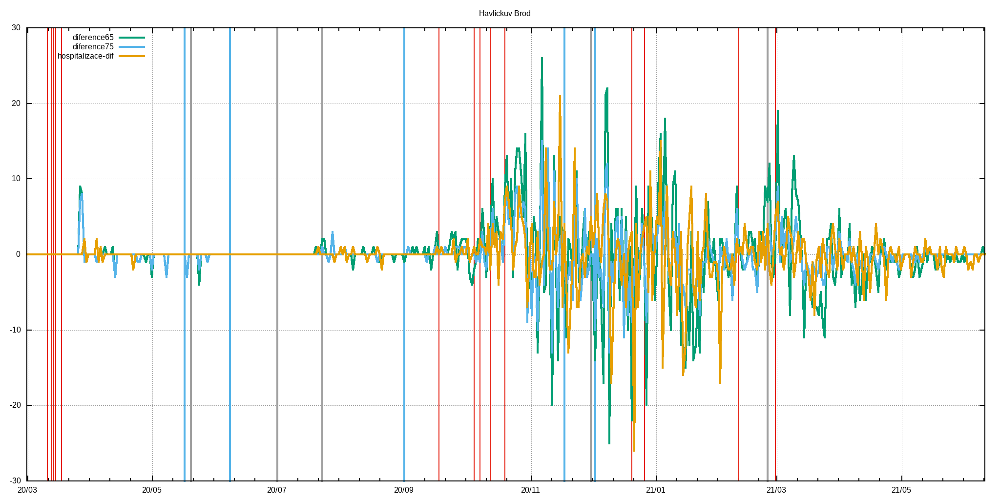

# c19_cz orp data extractor with gnuplot visualization
Few lame BASH & AWK & GNUPLOT scripts that extract ORP, LAU level and other data published by MZCR

## TL;DR - graphs are in ./figs & ./figs-lau directories and at the bottom of this README.md

**Data source**: https://onemocneni-aktualne.mzcr.cz/api/v2/covid-19/orp.csv

**Directories logic**:
```
./extr                              #extracted & processed data for each ORP
./extr/2001.csv                     #original data for Benesov
./extr/2001.dif                     #processed data for Benesov - first difference & daily new cases added
./extr/2001.difa                    #7-day average of dtto

./extr-lau                          #LAU level of data - cumsum of pozitive,recovered,deaths
./extr-lau/CZ0100.csv               #original data for CZ0100 LAU -> Prague
./extr-lau/CZ0100.dif               #1st difference of original data -> # of new poz./rec./deaths
./extr-lau/CZ0100.difa              #7-day average of dtto
./extr-lau/CZ0100d.csv              #dates and ages of deceased

./figs                              #figs. generated by gnuplot scripts, leading 'a' in the filename means averaged version
./figs/Benesov/2001dif.png          #1st difference of prevalence data
./figs/Benesov/2001dif65.png        #dtto but only for 65+, 75+ & hospitalizations data
./figs/Benesov/2001new.png          #daily new cases
./figs/Benesov/2001new65.png        #dtto but only for 65+, 75+ & hospitalization data
./figs/Benesov/2001p.png            #prevalence
./figs/Benesov/2001p65.png          #dtto but only for 65+, 75+ & hospitalization data

./figs-lau                          #figs. for LAUs
./figs-lau/Benesov/CZ0201.png       #new pozitive & new recovered
./figs-lau/Benesov/CZ0201d.png      #deaths
./figs-lau/Benesov/CZ0201hist.png   #histogram of all deaths for this LAU
```
## Selected restrictions (red), easings (blue) and outbreaks (black)
```
# restrictions
2020-03-11 Schools closed
2020-03-13 Borders closed
2020-03-14 Services closed
2020-03-15 Lockdown
2020-03-18 Masks
2020-09-01 Indoor masks excl. schools
2020-09-18 Univ. masks
2020-10-05 SoE
2020-10-08 Distance learning at univs. & secondary schools
2020-10-13 Anti-COVID measures
2020-10-20 Outdoor mask & partial lockdown
2020-11-18 Shops restrictions
2020-12-21 UK flights banned
2020-12-27 PES at 4. with exceptions
2021-02-11 Cheb, Sokolov and Trutnov isolated
2021-02-25 FFP2+ mandatory
2021-03-01 Lockdown

#easings
2020-05-17 End of SoE
2020-06-08 Restrictions lifting, borders opened
2020-09-01 Schools reopened
2020-11-18 Primary schools reopened
2020-12-03 PES at 3.

#outbreaks
2020-05-20 Karvina miners outbreak
2020-07-01 OKD outbreak
2020-07-23 Prague music club outbreak
2020-12-01 B.1.1.7 confirmed in December
2021-02-25 B.1.351 confirmed
```
## Time evolution of C-19 positively tested population
<br>

## Prevalence divided among age groups
<br>

## Time evolution of deaths by age groups
<br>

## Time evolution of deaths histograms
<br>

## Up-to-date overall deaths histogram
<br>
## Histogram statistics
```


* FILE: 
  Records:           26174
  Out of range:          0
  Invalid:               0
  Column headers:        0
  Blank:                 0
  Data Blocks:           1

* COLUMNS:
  Mean:             285.4777               77.6505
  Std Dev:           59.6462               10.3937
  Sample StdDev:     59.6473               10.3939
  Skewness:          -1.0211               -0.8229
  Kurtosis:           5.5942                4.5208
  Avg Dev:           48.3677                8.0649
  Sum:           7.47209e+06           2.03242e+06
  Sum Sq.:       2.22623e+09           1.60646e+08

  Mean Err.:          0.3687                0.0642
  Std Dev Err.:       0.2607                0.0454
  Skewness Err.:      0.0151                0.0151
  Kurtosis Err.:      0.0303                0.0303

  Minimum:            0.0000 [    0]        8.0000 [19669]
  Maximum:          371.0000 [26173]      104.0000 [13067]
  Quartile:         238.0000               72.0000
  Median:           292.0000               78.0000
  Quartile:         337.0000               85.0000

  Linear Model:       y = -0.01829 x + 82.87
  Slope:              -0.01829 +- 0.001071
  Intercept:          82.87 +- 0.3124
  Correlation:        r = -0.1049
  Sum xy:             5.785e+08

iter      chisq       delta/lim  lambda   a             b             c             d            
   0 2.3323936999e+06   0.00e+00  3.28e+03    1.508380e-03   1.158730e+01   4.015430e+02   9.436430e-03
   1 7.0313994684e+05  -2.32e+05  3.28e+02    1.518497e-03   1.241186e+01   4.554438e+02   8.910549e-03
   2 6.5929013271e+05  -6.65e+03  3.28e+01    1.785388e-03   1.140732e+01   5.049029e+02   9.411715e-03
   * 3.9763892946e+07   9.83e+04  3.28e+02   -9.261983e-04  -5.477590e+00   1.260801e+03   2.344740e-02
   3 6.1198323016e+05  -7.73e+03  3.28e+01    1.825073e-03   1.104934e+01   5.236506e+02   9.701911e-03
   * 3.9763889877e+07   9.85e+04  3.28e+02   -1.203498e-03  -5.761283e+00   1.328635e+03   2.463741e-02
   4 6.0990402308e+05  -3.41e+02  3.28e+01    1.782034e-03   1.089966e+01   5.320358e+02   9.855420e-03
   * 3.9763886126e+07   9.85e+04  3.28e+02   -1.233934e-03  -6.080869e+00   1.368416e+03   2.537470e-02
   * 6.0991150673e+05   1.23e+00  3.28e+03    1.743425e-03   1.072205e+01   5.410055e+02   1.002489e-02
   5 6.0979224992e+05  -1.83e+01  3.28e+02    1.781576e-03   1.090009e+01   5.321252e+02   9.858195e-03
   * 6.0990028989e+05   1.77e+01  3.28e+03    1.741725e-03   1.072266e+01   5.410114e+02   1.002568e-02
   * 6.0979393538e+05   2.76e-01  3.28e+04    1.781064e-03   1.089882e+01   5.322021e+02   9.859741e-03
   * 6.0979317856e+05   1.52e-01  3.28e+05    1.781572e-03   1.090017e+01   5.321260e+02   9.858285e-03
   * 6.0979227105e+05   3.47e-03  3.28e+06    1.781576e-03   1.090009e+01   5.321252e+02   9.858198e-03
   * 6.0979225013e+05   3.48e-05  3.28e+07    1.781576e-03   1.090009e+01   5.321252e+02   9.858195e-03
   * 6.0979224992e+05   3.48e-07  3.28e+08    1.781576e-03   1.090009e+01   5.321252e+02   9.858195e-03
   * 6.0979224992e+05   3.68e-09  3.28e+09    1.781576e-03   1.090009e+01   5.321252e+02   9.858195e-03
   * 6.0979224992e+05   3.82e-11  3.28e+10    1.781576e-03   1.090009e+01   5.321252e+02   9.858195e-03
   6 6.0979224992e+05   0.00e+00  3.28e+09    1.781576e-03   1.090009e+01   5.321252e+02   9.858195e-03
iter      chisq       delta/lim  lambda   a             b             c             d            

After 6 iterations the fit converged.
final sum of squares of residuals : 609792
rel. change during last iteration : 0

degrees of freedom    (FIT_NDF)                        : 41
rms of residuals      (FIT_STDFIT) = sqrt(WSSR/ndf)    : 121.955
variance of residuals (reduced chisquare) = WSSR/ndf   : 14873

Final set of parameters            Asymptotic Standard Error
=======================            ==========================
a               = 0.00178158       +/- 0.008337     (467.9%)
b               = 10.9001          +/- 47.09        (432%)
c               = 532.125          +/- 2319         (435.7%)
d               = 0.0098582        +/- 0.04301      (436.3%)

correlation matrix of the fit parameters:
                a      b      c      d      
a               1.000 
b               0.998  1.000 
c              -0.998 -1.000  1.000 
d              -0.999 -1.000  1.000  1.000 
```

## Example output for LAU
<br>
<em>Havl Brod</em><br>
<br>
<br>
<br>
<br>
<br>

## Example output for ORP
<br>
<em>Havl Brod</em><br>
<br>
<br>
<br>
<br>
<br>
<br>
<br>
<br>
<br>
<br>
<br>
<br>

