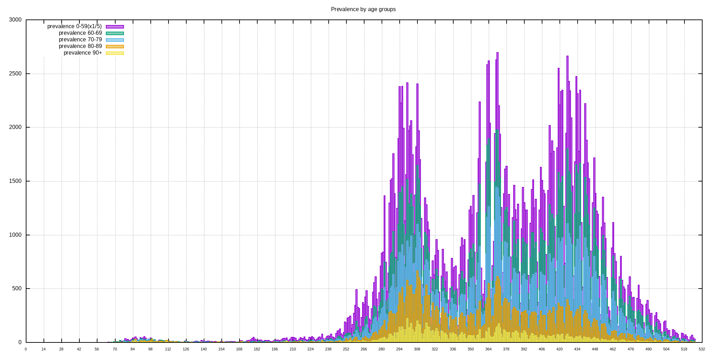
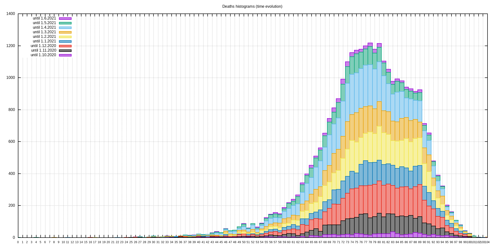
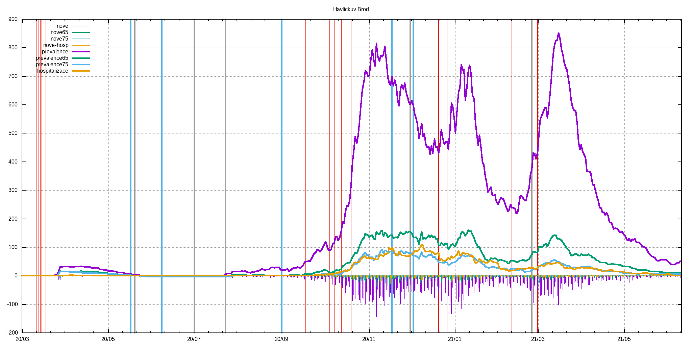

# c19_cz orp data extractor with gnuplot visualization
Few lame BASH & AWK & GNUPLOT scripts that extract ORP, LAU level and other data published by MZCR

## TL;DR - graphs are in ./figs & ./figs-lau directories and at the bottom of this README.md

**Data source**: https://onemocneni-aktualne.mzcr.cz/api/v2/covid-19/orp.csv

**Directories logic**:
```
./extr                              #extracted & processed data for each ORP
./extr/2001.csv                     #original data for Benesov
./extr/2001.dif                     #processed data for Benesov - first difference & daily new cases added
./extr/2001.difa                    #7-day average of dtto

./extr-lau                          #LAU level of data - cumsum of pozitive,recovered,deaths
./extr-lau/CZ0100.csv               #original data for CZ0100 LAU -> Prague
./extr-lau/CZ0100.dif               #1st difference of original data -> # of new poz./rec./deaths
./extr-lau/CZ0100.difa              #7-day average of dtto
./extr-lau/CZ0100d.csv              #dates and ages of deceased

./figs                              #figs. generated by gnuplot scripts, leading 'a' in the filename means averaged version
./figs/Benesov/2001dif.png          #1st difference of prevalence data
./figs/Benesov/2001dif65.png        #dtto but only for 65+, 75+ & hospitalizations data
./figs/Benesov/2001new.png          #daily new cases
./figs/Benesov/2001new65.png        #dtto but only for 65+, 75+ & hospitalization data
./figs/Benesov/2001p.png            #prevalence
./figs/Benesov/2001p65.png          #dtto but only for 65+, 75+ & hospitalization data

./figs-lau                          #figs. for LAUs
./figs-lau/Benesov/CZ0201.png       #new pozitive & new recovered
./figs-lau/Benesov/CZ0201d.png      #deaths
./figs-lau/Benesov/CZ0201hist.png   #histogram of all deaths for this LAU
```
## Selected restrictions (red), easings (blue) and outbreaks (black)
```
# restrictions
2020-03-11 Schools closed
2020-03-13 Borders closed
2020-03-14 Services closed
2020-03-15 Lockdown
2020-03-18 Masks
2020-09-01 Indoor masks excl. schools
2020-09-18 Univ. masks
2020-10-05 SoE
2020-10-08 Distance learning at univs. & secondary schools
2020-10-13 Anti-COVID measures
2020-10-20 Outdoor mask & partial lockdown
2020-11-18 Shops restrictions
2020-12-21 UK flights banned
2020-12-27 PES at 4. with exceptions
2021-02-11 Cheb, Sokolov and Trutnov isolated
2021-02-25 FFP2+ mandatory
2021-03-01 Lockdown

#easings
2020-05-17 End of SoE
2020-06-08 Restrictions lifting, borders opened
2020-09-01 Schools reopened
2020-11-18 Primary schools reopened
2020-12-03 PES at 3.

#outbreaks
2020-05-20 Karvina miners outbreak
2020-07-01 OKD outbreak
2020-07-23 Prague music club outbreak
2020-12-01 B.1.1.7 confirmed in December
2021-02-25 B.1.351 confirmed
```
## Time evolution of C-19 positively tested population
<br>

## Prevalence divided among age groups
<br>

## Time evolution of deaths by age groups
<br>

## Time evolution of deaths histograms
<br>

## Up-to-date overall deaths histogram
<br>
## Histogram statistics
```


* FILE: 
  Records:           27174
  Out of range:          0
  Invalid:               0
  Column headers:        0
  Blank:                 0
  Data Blocks:           1

* COLUMNS:
  Mean:             288.7269               77.5570
  Std Dev:           60.8708               10.4146
  Sample StdDev:     60.8720               10.4148
  Skewness:          -0.9718               -0.8141
  Kurtosis:           5.3247                4.4869
  Avg Dev:           49.5440                8.0809
  Sum:           7.84587e+06           2.10753e+06
  Sum Sq.:       2.36600e+09           1.66401e+08

  Mean Err.:          0.3693                0.0632
  Std Dev Err.:       0.2611                0.0447
  Skewness Err.:      0.0149                0.0149
  Kurtosis Err.:      0.0297                0.0297

  Minimum:            0.0000 [    0]        8.0000 [19664]
  Maximum:          378.0000 [27173]      104.0000 [13131]
  Quartile:         240.0000               72.0000
  Median:           294.0000               78.0000
  Quartile:         341.0000               85.0000

  Linear Model:       y = -0.01903 x + 83.05
  Slope:              -0.01903 +- 0.001031
  Intercept:          83.05 +- 0.3044
  Correlation:        r = -0.1112
  Sum xy:             6.066e+08

iter      chisq       delta/lim  lambda   a             b             c             d            
   0 3.0693421925e+06   0.00e+00  3.28e+03    1.508380e-03   1.158730e+01   4.015430e+02   9.436430e-03
   1 8.1006249642e+05  -2.79e+05  3.28e+02    1.520875e-03   1.255680e+01   4.650292e+02   8.818807e-03
   2 7.8800125265e+05  -2.80e+03  3.28e+01    1.855394e-03   1.133988e+01   5.235174e+02   9.407612e-03
   * 4.2746790369e+07   9.82e+04  3.28e+02   -9.995655e-04  -5.930626e+00   1.330686e+03   2.383982e-02
   3 6.8180983579e+05  -1.56e+04  3.28e+01    1.917438e-03   1.092529e+01   5.467611e+02   9.752194e-03
   * 4.2746788126e+07   9.84e+04  3.28e+02   -1.418606e-03  -6.346591e+00   1.421234e+03   2.537449e-02
   4 6.7688077207e+05  -7.28e+02  3.28e+01    1.856907e-03   1.082227e+01   5.542896e+02   9.884388e-03
   * 4.2746784575e+07   9.84e+04  3.28e+02   -1.483037e-03  -7.049017e+00   1.478040e+03   2.638871e-02
   * 6.7689831198e+05   2.59e+00  3.28e+03    1.809049e-03   1.065036e+01   5.635287e+02   1.005525e-02
   5 6.7676585133e+05  -1.70e+01  3.28e+02    1.856235e-03   1.082299e+01   5.543601e+02   9.887018e-03
   * 6.7688569292e+05   1.77e+01  3.28e+03    1.807176e-03   1.065115e+01   5.635274e+02   1.005597e-02
   * 6.7676716639e+05   1.94e-01  3.28e+04    1.855511e-03   1.082210e+01   5.544228e+02   9.888380e-03
   * 6.7676693321e+05   1.60e-01  3.28e+05    1.856229e-03   1.082308e+01   5.543607e+02   9.887110e-03
   * 6.7676587735e+05   3.84e-03  3.28e+06    1.856235e-03   1.082299e+01   5.543601e+02   9.887021e-03
   * 6.7676585159e+05   3.87e-05  3.28e+07    1.856235e-03   1.082299e+01   5.543601e+02   9.887018e-03
   * 6.7676585133e+05   3.87e-07  3.28e+08    1.856235e-03   1.082299e+01   5.543601e+02   9.887018e-03
   * 6.7676585133e+05   4.08e-09  3.28e+09    1.856235e-03   1.082299e+01   5.543601e+02   9.887018e-03
   * 6.7676585133e+05   2.58e-10  3.28e+10    1.856235e-03   1.082299e+01   5.543601e+02   9.887018e-03
   6 6.7676585133e+05   0.00e+00  3.28e+09    1.856235e-03   1.082299e+01   5.543601e+02   9.887018e-03
iter      chisq       delta/lim  lambda   a             b             c             d            

After 6 iterations the fit converged.
final sum of squares of residuals : 676766
rel. change during last iteration : 0

degrees of freedom    (FIT_NDF)                        : 41
rms of residuals      (FIT_STDFIT) = sqrt(WSSR/ndf)    : 128.478
variance of residuals (reduced chisquare) = WSSR/ndf   : 16506.5

Final set of parameters            Asymptotic Standard Error
=======================            ==========================
a               = 0.00185624       +/- 0.008867     (477.7%)
b               = 10.823           +/- 47.77        (441.4%)
c               = 554.36           +/- 2468         (445.2%)
d               = 0.00988702       +/- 0.04408      (445.8%)

correlation matrix of the fit parameters:
                a      b      c      d      
a               1.000 
b               0.998  1.000 
c              -0.999 -1.000  1.000 
d              -0.999 -1.000  1.000  1.000 
```

## Example output for LAU
<br>
<em>Havl Brod</em><br>
<br>
<br>
<br>
<br>
<br>

## Example output for ORP
<br>
<em>Havl Brod</em><br>
<br>
<br>
<br>
<br>
<br>
<br>
<br>
<br>
<br>
<br>
<br>
<br>

