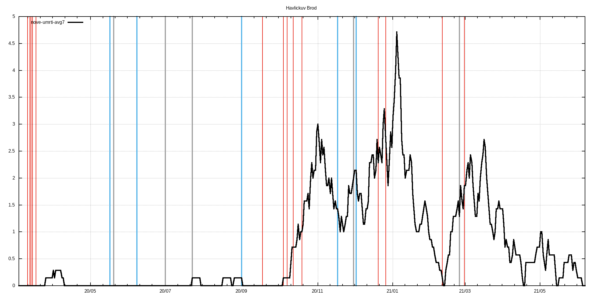

# c19_cz orp data extractor with gnuplot visualization
Few lame BASH & AWK & GNUPLOT scripts that extract ORP and LAU level data published by MZCR

## TL;DR - graphs are in ./figs & ./figs-lau directories

**Data source**: https://onemocneni-aktualne.mzcr.cz/api/v2/covid-19/orp.csv

**Directories logic**:
```
./extr                              #extracted & processed data for each ORP
./extr/2001.csv                     #original data for Benesov
./extr/2001.dif                     #processed data for Benesov - first difference & daily new cases added
./extr/2001.difa                    #7-day average of dtto

./extr-lau                          #LAU level of data - cumsum of pozitive,recovered,deaths
./extr-lau/CZ0100.csv               #original data for CZ0100 LAU -> Prague
./extr-lau/CZ0100.dif               #1st difference of original data -> # of new poz./rec./deaths
./extr-lau/CZ0100.difa              #7-day average of dtto
./extr-lau/CZ0100d.csv              #dates and ages of deceased

./figs                              #figs. generated by gnuplot scripts, leading 'a' in the filename means averaged version
./figs/Benesov/2001dif.png          #1st difference of prevalence data
./figs/Benesov/2001dif65.png        #dtto but only for 65+, 75+ & hospitalizations data
./figs/Benesov/2001new.png          #daily new cases
./figs/Benesov/2001new65.png        #dtto but only for 65+, 75+ & hospitalization data
./figs/Benesov/2001p.png            #prevalence
./figs/Benesov/2001p65.png          #dtto but only for 65+, 75+ & hospitalization data

./figs-lau                          #figs. for LAUs
./figs-lau/Benesov/CZ0201.png       #new pozitive & new recovered
./figs-lau/Benesov/CZ0201d.png      #deaths
./figs-lau/Benesov/CZ0201hist.png   #histogram of all deaths for this LAU
```
## Selected restrictions (red), easings (blue) and outbreaks (black)
```
# restrictions
2020-03-11 Schools closed
2020-03-13 Borders closed
2020-03-14 Services closed
2020-03-15 Lockdown
2020-03-18 Masks
2020-09-01 Indoor masks excl. schools
2020-09-18 Univ. masks
2020-10-05 SoE
2020-10-08 Distance learning at univs. & secondary schools
2020-10-13 Anti-COVID measures
2020-10-20 Outdoor mask & partial lockdown
2020-11-18 Shops restrictions
2020-12-21 UK flights banned
2020-12-27 PES at 4. with exceptions
2021-02-11 Cheb, Sokolov and Trutnov isolated
2021-02-25 FFP2+ mandatory
2021-03-01 Lockdown

#easings
2020-05-17 End of SoE
2020-06-08 Restrictions lifting, borders opened
2020-09-01 Schools reopened
2020-11-18 Primary schools reopened
2020-12-03 PES at 3.

#outbreaks
2020-05-20 Karvina miners outbreak
2020-07-01 OKD outbreak
2020-07-23 Prague music club outbreak
2020-12-01 B.1.1.7 confirmed in December
2021-02-25 B.1.351 confirmed
```
## Example output for LAU
<br>
<em>Havl Brod</em><br>
<br>
<br>
<br>
<br>
<br>

## Example output for ORP
<br>
<em>Havl Brod</em><br>
<br>
<br>
<br>
<br>
<br>
<br>
<br>
<br>
<br>
<br>
<br>
<br>

## Overall deaths histogram
<br>
## Histogram statistics
```


* FILE: 
  Records:           22073
  Out of range:          0
  Invalid:               0
  Column headers:        0
  Blank:                 0
  Data Blocks:           1

* COLUMNS:
  Mean:             271.7176               78.1089
  Std Dev:           54.7694               10.3122
  Sample StdDev:     54.7706               10.3124
  Skewness:          -1.2666               -0.8558
  Kurtosis:           7.0208                4.6479
  Avg Dev:           43.3665                8.0043
  Sum:           5.99762e+06           1.72410e+06
  Sum Sq.:       1.69587e+09           1.37015e+08

  Mean Err.:          0.3686                0.0694
  Std Dev Err.:       0.2607                0.0491
  Skewness Err.:      0.0165                0.0165
  Kurtosis Err.:      0.0330                0.0330

  Minimum:            0.0000 [    0]        8.0000 [19720]
  Maximum:          350.0000 [22072]      104.0000 [13212]
  Quartile:         232.0000               72.0000
  Median:           277.0000               79.0000
  Quartile:         314.0000               86.0000

  Linear Model:       y = -0.01214 x + 81.41
  Slope:              -0.01214 +- 0.001265
  Intercept:          81.41 +- 0.3506
  Correlation:        r = -0.06446
  Sum xy:             4.677e+08

iter      chisq       delta/lim  lambda   a             b             c             d            
   0 5.2150221324e+05   0.00e+00  3.32e+03    1.508380e-03   1.158730e+01   4.015430e+02   9.436430e-03
   1 4.1189122593e+05  -2.66e+04  3.32e+02    1.510163e-03   1.180216e+01   4.155489e+02   9.297571e-03
   2 4.0568898862e+05  -1.53e+03  3.32e+01    1.546773e-03   1.152457e+01   4.301364e+02   9.471379e-03
   * 2.8596396978e+07   9.86e+04  3.32e+02   -2.778619e-04  -1.212350e+00   9.096472e+02   2.003010e-02
   3 4.0547609245e+05  -5.25e+01  3.32e+01    1.540903e-03   1.133920e+01   4.371543e+02   9.614972e-03
   * 2.8596743211e+07   9.86e+04  3.32e+02   -2.888264e-04  -1.112722e+00   9.214719e+02   2.027971e-02
   4 4.0544217203e+05  -8.37e+00  3.32e+01    1.524220e-03   1.118935e+01   4.429954e+02   9.741776e-03
   * 2.8596825862e+07   9.86e+04  3.32e+02   -2.880715e-04  -1.080297e+00   9.331127e+02   2.053448e-02
   5 4.0543726536e+05  -1.21e+00  3.32e+01    1.505442e-03   1.104839e+01   4.486487e+02   9.865895e-03
   * 2.8596869481e+07   9.86e+04  3.32e+02   -2.831405e-04  -1.051332e+00   9.443979e+02   2.078277e-02
   6 4.0543684352e+05  -1.04e-01  3.32e+01    1.486506e-03   1.091064e+01   4.543168e+02   9.990602e-03
iter      chisq       delta/lim  lambda   a             b             c             d            

After 6 iterations the fit converged.
final sum of squares of residuals : 405437
rel. change during last iteration : -1.04047e-06

degrees of freedom    (FIT_NDF)                        : 40
rms of residuals      (FIT_STDFIT) = sqrt(WSSR/ndf)    : 100.677
variance of residuals (reduced chisquare) = WSSR/ndf   : 10135.9

Final set of parameters            Asymptotic Standard Error
=======================            ==========================
a               = 0.00148651       +/- 0.006657     (447.9%)
b               = 10.9106          +/- 44.95        (412%)
c               = 454.317          +/- 1889         (415.7%)
d               = 0.0099906        +/- 0.04159      (416.3%)

correlation matrix of the fit parameters:
                a      b      c      d      
a               1.000 
b               0.998  1.000 
c              -0.998 -1.000  1.000 
d              -0.999 -1.000  1.000  1.000 
```
