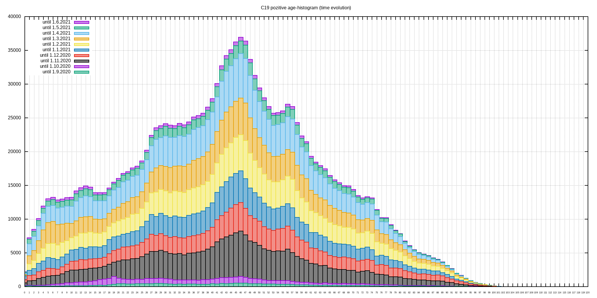
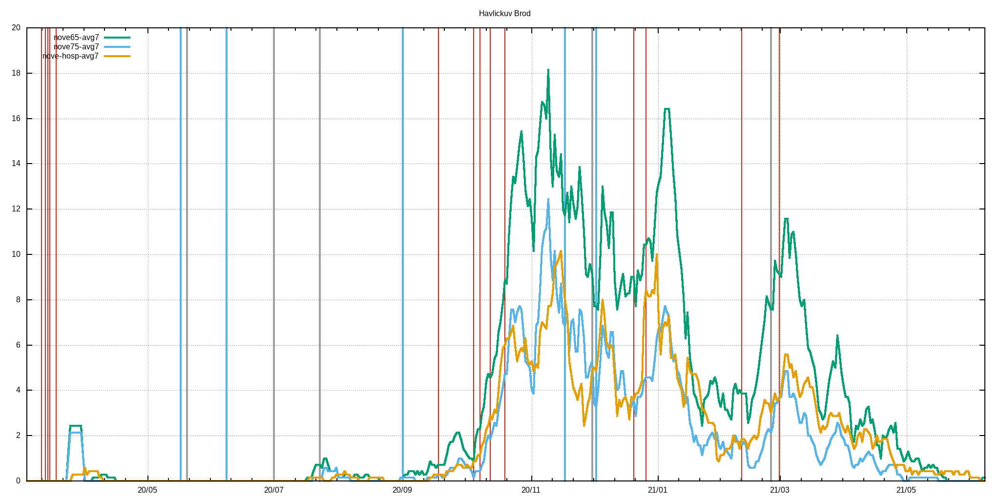

# c19_cz orp data extractor with gnuplot visualization
Few lame BASH & AWK & GNUPLOT scripts that extract ORP, LAU level and other data published by MZCR

## TL;DR - graphs are in ./figs & ./figs-lau directories and at the bottom of this README.md

**Data source**: https://onemocneni-aktualne.mzcr.cz/api/v2/covid-19/orp.csv

**Directories logic**:
```
./extr                              #extracted & processed data for each ORP
./extr/2001.csv                     #original data for Benesov
./extr/2001.dif                     #processed data for Benesov - first difference & daily new cases added
./extr/2001.difa                    #7-day average of dtto

./extr-lau                          #LAU level of data - cumsum of pozitive,recovered,deaths
./extr-lau/CZ0100.csv               #original data for CZ0100 LAU -> Prague
./extr-lau/CZ0100.dif               #1st difference of original data -> # of new poz./rec./deaths
./extr-lau/CZ0100.difa              #7-day average of dtto
./extr-lau/CZ0100d.csv              #dates and ages of deceased

./figs                              #figs. generated by gnuplot scripts, leading 'a' in the filename means averaged version
./figs/Benesov/2001dif.png          #1st difference of prevalence data
./figs/Benesov/2001dif65.png        #dtto but only for 65+, 75+ & hospitalizations data
./figs/Benesov/2001new.png          #daily new cases
./figs/Benesov/2001new65.png        #dtto but only for 65+, 75+ & hospitalization data
./figs/Benesov/2001p.png            #prevalence
./figs/Benesov/2001p65.png          #dtto but only for 65+, 75+ & hospitalization data

./figs-lau                          #figs. for LAUs
./figs-lau/Benesov/CZ0201.png       #new pozitive & new recovered
./figs-lau/Benesov/CZ0201d.png      #deaths
./figs-lau/Benesov/CZ0201hist.png   #histogram of all deaths for this LAU
```
## Selected restrictions (red), easings (blue) and outbreaks (black)
```
# restrictions
2020-03-11 Schools closed
2020-03-13 Borders closed
2020-03-14 Services closed
2020-03-15 Lockdown
2020-03-18 Masks
2020-09-01 Indoor masks excl. schools
2020-09-18 Univ. masks
2020-10-05 SoE
2020-10-08 Distance learning at univs. & secondary schools
2020-10-13 Anti-COVID measures
2020-10-20 Outdoor mask & partial lockdown
2020-11-18 Shops restrictions
2020-12-21 UK flights banned
2020-12-27 PES at 4. with exceptions
2021-02-11 Cheb, Sokolov and Trutnov isolated
2021-02-25 FFP2+ mandatory
2021-03-01 Lockdown

#easings
2020-05-17 End of SoE
2020-06-08 Restrictions lifting, borders opened
2020-09-01 Schools reopened
2020-11-18 Primary schools reopened
2020-12-03 PES at 3.

#outbreaks
2020-05-20 Karvina miners outbreak
2020-07-01 OKD outbreak
2020-07-23 Prague music club outbreak
2020-12-01 B.1.1.7 confirmed in December
2021-02-25 B.1.351 confirmed
```
## Time evolution of C-19 positively tested population
<br>

## Prevalence divided among age groups
<br>

## Time evolution of deaths by age groups
<br>

## Time evolution of deaths histograms
<br>

## Up-to-date overall deaths histogram
<br>
## Histogram statistics
```


* FILE: 
  Records:           28616
  Out of range:          0
  Invalid:               0
  Column headers:        0
  Blank:                 0
  Data Blocks:           1

* COLUMNS:
  Mean:             293.3635               77.4008
  Std Dev:           62.7378               10.4507
  Sample StdDev:     62.7389               10.4509
  Skewness:          -0.8957               -0.8030
  Kurtosis:           4.9713                4.4868
  Avg Dev:           51.2680                8.1082
  Sum:           8.39489e+06           2.21490e+06
  Sum Sq.:       2.57539e+09           1.74560e+08

  Mean Err.:          0.3709                0.0618
  Std Dev Err.:       0.2622                0.0437
  Skewness Err.:      0.0145                0.0145
  Kurtosis Err.:      0.0290                0.0290

  Minimum:            0.0000 [    0]        0.0000 [28429]
  Maximum:          392.0000 [28615]      104.0000 [13237]
  Quartile:         242.0000               72.0000
  Median:           299.0000               78.0000
  Quartile:         346.0000               85.0000

  Linear Model:       y = -0.02058 x + 83.44
  Slope:              -0.02058 +- 0.0009772
  Intercept:          83.44 +- 0.2932
  Correlation:        r = -0.1235
  Sum xy:             6.475e+08

iter      chisq       delta/lim  lambda   a             b             c             d            
   0 4.3172656463e+06   0.00e+00  3.25e+03    1.508380e-03   1.158730e+01   4.015430e+02   9.436430e-03
   1 9.8342029804e+05  -3.39e+05  3.25e+02    1.525219e-03   1.276575e+01   4.790385e+02   8.688388e-03
   * 1.1211256033e+06   1.23e+04  3.25e+03    1.976428e-03   1.116547e+01   5.520734e+02   9.432927e-03
   2 8.3575754710e+05  -1.77e+04  3.25e+02    1.543754e-03   1.294304e+01   4.919949e+02   8.614307e-03
   * 1.1223027354e+06   2.55e+04  3.25e+03    1.934315e-03   1.123710e+01   5.512031e+02   9.401806e-03
   3 8.2843706000e+05  -8.84e+02  3.25e+02    1.559954e-03   1.292865e+01   4.957425e+02   8.618371e-03
   * 1.1030402498e+06   2.49e+04  3.25e+03    1.931074e-03   1.123449e+01   5.519498e+02   9.409275e-03
   4 8.2500304298e+05  -4.16e+02  3.25e+02    1.575303e-03   1.288172e+01   4.978079e+02   8.637911e-03
   * 1.0749420090e+06   2.33e+04  3.25e+03    1.932031e-03   1.122616e+01   5.527645e+02   9.420692e-03
   5 8.2191078229e+05  -3.76e+02  3.25e+02    1.589994e-03   1.283092e+01   4.995521e+02   8.659798e-03
   * 1.0475486798e+06   2.15e+04  3.25e+03    1.933490e-03   1.121751e+01   5.535507e+02   9.432217e-03
   6 8.1904704556e+05  -3.50e+02  3.25e+02    1.604084e-03   1.278098e+01   5.012059e+02   8.681687e-03
   * 1.0224952722e+06   1.99e+04  3.25e+03    1.934964e-03   1.120919e+01   5.543004e+02   9.443276e-03
   7 8.1638939236e+05  -3.26e+02  3.25e+02    1.617610e-03   1.273260e+01   5.028093e+02   8.703168e-03
   * 9.9984800176e+05   1.83e+04  3.25e+03    1.936392e-03   1.120123e+01   5.550153e+02   9.453813e-03
   8 8.1392000371e+05  -3.03e+02  3.25e+02    1.630601e-03   1.268586e+01   5.043703e+02   8.724178e-03
   * 9.7941156415e+05   1.69e+04  3.25e+03    1.937767e-03   1.119360e+01   5.556978e+02   9.463856e-03
   9 8.1162304485e+05  -2.83e+02  3.25e+02    1.643086e-03   1.264068e+01   5.058910e+02   8.744714e-03
   * 9.6096711197e+05   1.55e+04  3.25e+03    1.939094e-03   1.118627e+01   5.563504e+02   9.473441e-03
  10 8.0948431314e+05  -2.64e+02  3.25e+02    1.655092e-03   1.259701e+01   5.073731e+02   8.764783e-03
   * 9.4431175102e+05   1.43e+04  3.25e+03    1.940372e-03   1.117922e+01   5.569752e+02   9.482603e-03
  11 8.0749102144e+05  -2.47e+02  3.25e+02    1.666642e-03   1.255478e+01   5.088175e+02   8.784394e-03
   * 9.2926307273e+05   1.31e+04  3.25e+03    1.941605e-03   1.117241e+01   5.575743e+02   9.491375e-03
  12 8.0563162490e+05  -2.31e+02  3.25e+02    1.677759e-03   1.251393e+01   5.102256e+02   8.803558e-03
   * 9.1565792084e+05   1.20e+04  3.25e+03    1.942795e-03   1.116583e+01   5.581493e+02   9.499785e-03
  13 8.0389567490e+05  -2.16e+02  3.25e+02    1.688464e-03   1.247440e+01   5.115983e+02   8.822285e-03
   * 9.0335042067e+05   1.10e+04  3.25e+03    1.943942e-03   1.115944e+01   5.587020e+02   9.507859e-03
  14 8.0227369379e+05  -2.02e+02  3.25e+02    1.698776e-03   1.243612e+01   5.129368e+02   8.840585e-03
   * 8.9221009356e+05   1.01e+04  3.25e+03    1.945050e-03   1.115324e+01   5.592339e+02   9.515622e-03
  15 8.0075706671e+05  -1.89e+02  3.25e+02    1.708714e-03   1.239906e+01   5.142420e+02   8.858468e-03
   * 8.8212016719e+05   9.22e+03  3.25e+03    1.946118e-03   1.114721e+01   5.597462e+02   9.523096e-03
  16 7.9933794769e+05  -1.78e+02  3.25e+02    1.718294e-03   1.236315e+01   5.155149e+02   8.875944e-03
   * 8.7297607682e+05   8.44e+03  3.25e+03    1.947149e-03   1.114134e+01   5.602403e+02   9.530299e-03
  17 7.9800917778e+05  -1.67e+02  3.25e+02    1.727533e-03   1.232836e+01   5.167565e+02   8.893022e-03
   * 8.6468413761e+05   7.71e+03  3.25e+03    1.948143e-03   1.113561e+01   5.607172e+02   9.537250e-03
  18 7.9676421362e+05  -1.56e+02  3.25e+02    1.736446e-03   1.229463e+01   5.179677e+02   8.909713e-03
   * 8.5716036725e+05   7.05e+03  3.25e+03    1.949102e-03   1.113001e+01   5.611781e+02   9.543967e-03
  19 7.9559706462e+05  -1.47e+02  3.25e+02    1.745046e-03   1.226193e+01   5.191494e+02   8.926026e-03
   * 8.5032944128e+05   6.44e+03  3.25e+03    1.950026e-03   1.112453e+01   5.616239e+02   9.550463e-03
  20 7.9450223785e+05  -1.38e+02  3.25e+02    1.753346e-03   1.223021e+01   5.203024e+02   8.941970e-03
   * 8.4412376505e+05   5.88e+03  3.25e+03    1.950916e-03   1.111916e+01   5.620555e+02   9.556753e-03
  21 7.9347468925e+05  -1.29e+02  3.25e+02    1.761360e-03   1.219944e+01   5.214276e+02   8.957555e-03
   * 8.3848264917e+05   5.37e+03  3.25e+03    1.951774e-03   1.111390e+01   5.624738e+02   9.562849e-03
  22 7.9250978060e+05  -1.22e+02  3.25e+02    1.769099e-03   1.216957e+01   5.225257e+02   8.972789e-03
   * 8.3335157590e+05   4.90e+03  3.25e+03    1.952601e-03   1.110874e+01   5.628794e+02   9.568764e-03
  23 7.9160324121e+05  -1.15e+02  3.25e+02    1.776575e-03   1.214058e+01   5.235976e+02   8.987682e-03
   * 8.2868154647e+05   4.47e+03  3.25e+03    1.953396e-03   1.110367e+01   5.632732e+02   9.574509e-03
  24 7.9075113395e+05  -1.08e+02  3.25e+02    1.783796e-03   1.211243e+01   5.246440e+02   9.002243e-03
   * 8.2442849986e+05   4.08e+03  3.25e+03    1.954161e-03   1.109869e+01   5.636557e+02   9.580092e-03
  25 7.8994982487e+05  -1.01e+02  3.25e+02    1.790775e-03   1.208510e+01   5.256656e+02   9.016479e-03
   * 8.2055279482e+05   3.73e+03  3.25e+03    1.954897e-03   1.109380e+01   5.640276e+02   9.585525e-03
  26 7.8919595609e+05  -9.55e+01  3.25e+02    1.797520e-03   1.205854e+01   5.266630e+02   9.030400e-03
   * 8.1701874845e+05   3.41e+03  3.25e+03    1.955604e-03   1.108898e+01   5.643895e+02   9.590815e-03
  27 7.8848642153e+05  -9.00e+01  3.25e+02    1.804039e-03   1.203274e+01   5.276371e+02   9.044012e-03
   * 8.1379422440e+05   3.11e+03  3.25e+03    1.956283e-03   1.108423e+01   5.647418e+02   9.595970e-03
  28 7.8781834509e+05  -8.48e+01  3.25e+02    1.810343e-03   1.200766e+01   5.285885e+02   9.057325e-03
   * 8.1085026559e+05   2.84e+03  3.25e+03    1.956935e-03   1.107956e+01   5.650851e+02   9.600998e-03
  29 7.8718906103e+05  -7.99e+01  3.25e+02    1.816438e-03   1.198328e+01   5.295177e+02   9.070346e-03
   * 8.0816076630e+05   2.59e+03  3.25e+03    1.957560e-03   1.107495e+01   5.654199e+02   9.605906e-03
  30 7.8659609633e+05  -7.54e+01  3.25e+02    1.822332e-03   1.195957e+01   5.304255e+02   9.083083e-03
   * 8.0570217933e+05   2.37e+03  3.25e+03    1.958159e-03   1.107040e+01   5.657465e+02   9.610700e-03
  31 7.8603715468e+05  -7.11e+01  3.25e+02    1.828033e-03   1.193651e+01   5.313124e+02   9.095542e-03
   * 8.0345325430e+05   2.17e+03  3.25e+03    1.958732e-03   1.106592e+01   5.660653e+02   9.615386e-03
  32 7.8551010212e+05  -6.71e+01  3.25e+02    1.833548e-03   1.191409e+01   5.321789e+02   9.107732e-03
   * 8.0139480377e+05   1.98e+03  3.25e+03    1.959281e-03   1.106149e+01   5.663769e+02   9.619970e-03
  33 7.8501295390e+05  -6.33e+01  3.25e+02    1.838883e-03   1.189226e+01   5.330258e+02   9.119659e-03
   * 7.9950949398e+05   1.81e+03  3.25e+03    1.959805e-03   1.105712e+01   5.666814e+02   9.624457e-03
  34 7.8454386268e+05  -5.98e+01  3.25e+02    1.844045e-03   1.187102e+01   5.338535e+02   9.131331e-03
   * 7.9778165775e+05   1.66e+03  3.25e+03    1.960306e-03   1.105281e+01   5.669792e+02   9.628852e-03
  35 7.8410110771e+05  -5.65e+01  3.25e+02    1.849040e-03   1.185035e+01   5.346625e+02   9.142753e-03
   * 7.9619712681e+05   1.52e+03  3.25e+03    1.960784e-03   1.104854e+01   5.672707e+02   9.633159e-03
  36 7.8368308501e+05  -5.33e+01  3.25e+02    1.853874e-03   1.183022e+01   5.354533e+02   9.153933e-03
   * 7.9474308184e+05   1.39e+03  3.25e+03    1.961239e-03   1.104433e+01   5.675561e+02   9.637382e-03
  37 7.8328829850e+05  -5.04e+01  3.25e+02    1.858551e-03   1.181062e+01   5.362266e+02   9.164876e-03
   * 7.9340791794e+05   1.28e+03  3.25e+03    1.961673e-03   1.104017e+01   5.678358e+02   9.641527e-03
  38 7.8291535176e+05  -4.76e+01  3.25e+02    1.863078e-03   1.179153e+01   5.369826e+02   9.175589e-03
   * 7.9218112417e+05   1.17e+03  3.25e+03    1.962085e-03   1.103605e+01   5.681099e+02   9.645596e-03
  39 7.8256294061e+05  -4.50e+01  3.25e+02    1.867460e-03   1.177293e+01   5.377220e+02   9.186078e-03
   * 7.9105317544e+05   1.07e+03  3.25e+03    1.962475e-03   1.103197e+01   5.683787e+02   9.649593e-03
  40 7.8222984630e+05  -4.26e+01  3.25e+02    1.871701e-03   1.175480e+01   5.384452e+02   9.196349e-03
   * 7.9001543552e+05   9.85e+02  3.25e+03    1.962846e-03   1.102794e+01   5.686425e+02   9.653522e-03
  41 7.8191492924e+05  -4.03e+01  3.25e+02    1.875806e-03   1.173714e+01   5.391525e+02   9.206408e-03
   * 7.8906007006e+05   9.06e+02  3.25e+03    1.963196e-03   1.102395e+01   5.689015e+02   9.657385e-03
  42 7.8161712326e+05  -3.81e+01  3.25e+02    1.879780e-03   1.171992e+01   5.398446e+02   9.216260e-03
   * 7.8817996833e+05   8.33e+02  3.25e+03    1.963527e-03   1.102001e+01   5.691558e+02   9.661185e-03
  43 7.8133543038e+05  -3.61e+01  3.25e+02    1.883627e-03   1.170314e+01   5.405216e+02   9.225910e-03
   * 7.8736867310e+05   7.66e+02  3.25e+03    1.963839e-03   1.101610e+01   5.694057e+02   9.664926e-03
  44 7.8106891594e+05  -3.41e+01  3.25e+02    1.887351e-03   1.168677e+01   5.411842e+02   9.235364e-03
   * 7.8662031741e+05   7.06e+02  3.25e+03    1.964132e-03   1.101223e+01   5.696514e+02   9.668609e-03
  45 7.8081670419e+05  -3.23e+01  3.25e+02    1.890956e-03   1.167080e+01   5.418326e+02   9.244628e-03
   * 7.8592956788e+05   6.51e+02  3.25e+03    1.964408e-03   1.100840e+01   5.698930e+02   9.672238e-03
  46 7.8057797412e+05  -3.06e+01  3.25e+02    1.894446e-03   1.165523e+01   5.424673e+02   9.253705e-03
   * 7.8529157361e+05   6.00e+02  3.25e+03    1.964665e-03   1.100461e+01   5.701307e+02   9.675815e-03
  47 7.8035195577e+05  -2.90e+01  3.25e+02    1.897824e-03   1.164003e+01   5.430886e+02   9.262601e-03
   * 7.8470192021e+05   5.54e+02  3.25e+03    1.964905e-03   1.100085e+01   5.703647e+02   9.679342e-03
  48 7.8013792667e+05  -2.74e+01  3.25e+02    1.901094e-03   1.162520e+01   5.436968e+02   9.271321e-03
   * 7.8415658840e+05   5.12e+02  3.25e+03    1.965129e-03   1.099713e+01   5.705950e+02   9.682821e-03
  49 7.7993520865e+05  -2.60e+01  3.25e+02    1.904260e-03   1.161073e+01   5.442924e+02   9.279869e-03
   * 7.8365191672e+05   4.74e+02  3.25e+03    1.965336e-03   1.099344e+01   5.708220e+02   9.686254e-03
  50 7.7974316486e+05  -2.46e+01  3.25e+02    1.907324e-03   1.159660e+01   5.448757e+02   9.288250e-03
   * 7.8318456792e+05   4.39e+02  3.25e+03    1.965526e-03   1.098978e+01   5.710456e+02   9.689643e-03
  51 7.7956119702e+05  -2.33e+01  3.25e+02    1.910290e-03   1.158280e+01   5.454469e+02   9.296468e-03
   * 7.8275149864e+05   4.08e+02  3.25e+03    1.965702e-03   1.098616e+01   5.712660e+02   9.692989e-03
  52 7.7938874287e+05  -2.21e+01  3.25e+02    1.913161e-03   1.156933e+01   5.460065e+02   9.304528e-03
   * 7.8234993207e+05   3.78e+02  3.25e+03    1.965862e-03   1.098256e+01   5.714834e+02   9.696295e-03
  53 7.7922527377e+05  -2.10e+01  3.25e+02    1.915940e-03   1.155617e+01   5.465547e+02   9.312433e-03
   * 7.8197733323e+05   3.52e+02  3.25e+03    1.966007e-03   1.097900e+01   5.716978e+02   9.699562e-03
  54 7.7907029257e+05  -1.99e+01  3.25e+02    1.918629e-03   1.154331e+01   5.470919e+02   9.320187e-03
   * 7.8163138674e+05   3.28e+02  3.25e+03    1.966137e-03   1.097547e+01   5.719094e+02   9.702792e-03
  55 7.7892333154e+05  -1.89e+01  3.25e+02    1.921232e-03   1.153075e+01   5.476183e+02   9.327796e-03
   * 7.8130997662e+05   3.05e+02  3.25e+03    1.966254e-03   1.097196e+01   5.721183e+02   9.705986e-03
  56 7.7878395046e+05  -1.79e+01  3.25e+02    1.923751e-03   1.151847e+01   5.481342e+02   9.335261e-03
   * 7.8101116812e+05   2.85e+02  3.25e+03    1.966356e-03   1.096849e+01   5.723245e+02   9.709146e-03
  57 7.7865173493e+05  -1.70e+01  3.25e+02    1.926188e-03   1.150647e+01   5.486399e+02   9.342588e-03
   * 7.8073319127e+05   2.67e+02  3.25e+03    1.966445e-03   1.096504e+01   5.725282e+02   9.712272e-03
  58 7.7852629465e+05  -1.61e+01  3.25e+02    1.928546e-03   1.149474e+01   5.491357e+02   9.349780e-03
   * 7.8047442595e+05   2.50e+02  3.25e+03    1.966521e-03   1.096162e+01   5.727295e+02   9.715366e-03
  59 7.7840726200e+05  -1.53e+01  3.25e+02    1.930827e-03   1.148327e+01   5.496218e+02   9.356840e-03
   * 7.8023338844e+05   2.34e+02  3.25e+03    1.966584e-03   1.095823e+01   5.729284e+02   9.718430e-03
  60 7.7829429054e+05  -1.45e+01  3.25e+02    1.933034e-03   1.147205e+01   5.500985e+02   9.363771e-03
   * 7.8000871921e+05   2.20e+02  3.25e+03    1.966635e-03   1.095486e+01   5.731251e+02   9.721464e-03
  61 7.7818705374e+05  -1.38e+01  3.25e+02    1.935168e-03   1.146108e+01   5.505660e+02   9.370578e-03
   * 7.7979917187e+05   2.07e+02  3.25e+03    1.966673e-03   1.095151e+01   5.733196e+02   9.724469e-03
  62 7.7808524374e+05  -1.31e+01  3.25e+02    1.937232e-03   1.145034e+01   5.510246e+02   9.377263e-03
   * 7.7960360312e+05   1.95e+02  3.25e+03    1.966699e-03   1.094819e+01   5.735120e+02   9.727447e-03
  63 7.7798857019e+05  -1.24e+01  3.25e+02    1.939229e-03   1.143984e+01   5.514746e+02   9.383830e-03
   * 7.7942096369e+05   1.84e+02  3.25e+03    1.966714e-03   1.094490e+01   5.737023e+02   9.730399e-03
  64 7.7789675921e+05  -1.18e+01  3.25e+02    1.941159e-03   1.142955e+01   5.519161e+02   9.390281e-03
   * 7.7925029008e+05   1.74e+02  3.25e+03    1.966718e-03   1.094163e+01   5.738907e+02   9.733325e-03
  65 7.7780955238e+05  -1.12e+01  3.25e+02    1.943024e-03   1.141949e+01   5.523494e+02   9.396620e-03
   * 7.7909069709e+05   1.64e+02  3.25e+03    1.966710e-03   1.093838e+01   5.740772e+02   9.736227e-03
  66 7.7772670580e+05  -1.07e+01  3.25e+02    1.944828e-03   1.140964e+01   5.527746e+02   9.402849e-03
   * 7.7894137100e+05   1.56e+02  3.25e+03    1.966692e-03   1.093515e+01   5.742619e+02   9.739105e-03
  67 7.7764798920e+05  -1.01e+01  3.25e+02    1.946571e-03   1.139999e+01   5.531921e+02   9.408972e-03
   * 7.7880156343e+05   1.48e+02  3.25e+03    1.966663e-03   1.093195e+01   5.744448e+02   9.741960e-03
  68 7.7757318519e+05  -9.62e+00  3.25e+02    1.948255e-03   1.139054e+01   5.536019e+02   9.414991e-03
   * 7.7867058571e+05   1.41e+02  3.25e+03    1.966624e-03   1.092877e+01   5.746260e+02   9.744793e-03
  69 7.7750208842e+05  -9.14e+00  3.25e+02    1.949882e-03   1.138129e+01   5.540044e+02   9.420908e-03
   * 7.7854780375e+05   1.34e+02  3.25e+03    1.966575e-03   1.092560e+01   5.748056e+02   9.747605e-03
  70 7.7743450492e+05  -8.69e+00  3.25e+02    1.951453e-03   1.137222e+01   5.543996e+02   9.426728e-03
   * 7.7843263346e+05   1.28e+02  3.25e+03    1.966516e-03   1.092246e+01   5.749835e+02   9.750397e-03
  71 7.7737025142e+05  -8.27e+00  3.25e+02    1.952971e-03   1.136333e+01   5.547879e+02   9.432451e-03
   * 7.7832453650e+05   1.23e+02  3.25e+03    1.966447e-03   1.091934e+01   5.751600e+02   9.753168e-03
  72 7.7730915471e+05  -7.86e+00  3.25e+02    1.954436e-03   1.135463e+01   5.551693e+02   9.438081e-03
   * 7.7822301638e+05   1.17e+02  3.25e+03    1.966370e-03   1.091624e+01   5.753349e+02   9.755921e-03
  73 7.7725105105e+05  -7.48e+00  3.25e+02    1.955850e-03   1.134609e+01   5.555440e+02   9.443620e-03
   * 7.7812761505e+05   1.13e+02  3.25e+03    1.966283e-03   1.091316e+01   5.755084e+02   9.758655e-03
  74 7.7719578566e+05  -7.11e+00  3.25e+02    1.957214e-03   1.133772e+01   5.559123e+02   9.449070e-03
   * 7.7803790964e+05   1.08e+02  3.25e+03    1.966188e-03   1.091009e+01   5.756805e+02   9.761371e-03
  75 7.7714321215e+05  -6.76e+00  3.25e+02    1.958531e-03   1.132952e+01   5.562743e+02   9.454434e-03
   * 7.7795350955e+05   1.04e+02  3.25e+03    1.966084e-03   1.090705e+01   5.758513e+02   9.764070e-03
  76 7.7709319208e+05  -6.44e+00  3.25e+02    1.959801e-03   1.132147e+01   5.566301e+02   9.459714e-03
   * 7.7787405384e+05   1.00e+02  3.25e+03    1.965972e-03   1.090402e+01   5.760208e+02   9.766752e-03
  77 7.7704559449e+05  -6.13e+00  3.25e+02    1.961025e-03   1.131357e+01   5.569800e+02   9.464912e-03
   * 7.7779920874e+05   9.69e+01  3.25e+03    1.965851e-03   1.090101e+01   5.761890e+02   9.769419e-03
  78 7.7700029546e+05  -5.83e+00  3.25e+02    1.962205e-03   1.130583e+01   5.573240e+02   9.470031e-03
   * 7.7772866550e+05   9.37e+01  3.25e+03    1.965723e-03   1.089801e+01   5.763560e+02   9.772069e-03
  79 7.7695717774e+05  -5.55e+00  3.25e+02    1.963342e-03   1.129823e+01   5.576624e+02   9.475071e-03
   * 7.7766213832e+05   9.07e+01  3.25e+03    1.965587e-03   1.089504e+01   5.765218e+02   9.774705e-03
  80 7.7691613035e+05  -5.28e+00  3.25e+02    1.964438e-03   1.129077e+01   5.579952e+02   9.480036e-03
   * 7.7759936252e+05   8.79e+01  3.25e+03    1.965443e-03   1.089208e+01   5.766864e+02   9.777326e-03
  81 7.7687704821e+05  -5.03e+00  3.25e+02    1.965492e-03   1.128344e+01   5.583227e+02   9.484927e-03
   * 7.7754009285e+05   8.53e+01  3.25e+03    1.965292e-03   1.088913e+01   5.768500e+02   9.779933e-03
  82 7.7683983187e+05  -4.79e+00  3.25e+02    1.966508e-03   1.127625e+01   5.586449e+02   9.489746e-03
   * 7.7748410195e+05   8.29e+01  3.25e+03    1.965134e-03   1.088620e+01   5.770125e+02   9.782526e-03
  83 7.7680438714e+05  -4.56e+00  3.25e+02    1.967484e-03   1.126919e+01   5.589620e+02   9.494496e-03
   * 7.7743117892e+05   8.06e+01  3.25e+03    1.964969e-03   1.088329e+01   5.771739e+02   9.785107e-03
  84 7.7677062480e+05  -4.35e+00  3.25e+02    1.968424e-03   1.126226e+01   5.592741e+02   9.499177e-03
   * 7.7738112802e+05   7.85e+01  3.25e+03    1.964797e-03   1.088039e+01   5.773344e+02   9.787674e-03
  85 7.7673846035e+05  -4.14e+00  3.25e+02    1.969327e-03   1.125545e+01   5.595814e+02   9.503792e-03
   * 7.7733376752e+05   7.66e+01  3.25e+03    1.964618e-03   1.087750e+01   5.774939e+02   9.790229e-03
  86 7.7670781375e+05  -3.95e+00  3.25e+02    1.970195e-03   1.124875e+01   5.598839e+02   9.508342e-03
   * 7.7728892858e+05   7.48e+01  3.25e+03    1.964433e-03   1.087463e+01   5.776524e+02   9.792772e-03
  87 7.7667860914e+05  -3.76e+00  3.25e+02    1.971028e-03   1.124217e+01   5.601819e+02   9.512829e-03
   * 7.7724645423e+05   7.31e+01  3.25e+03    1.964241e-03   1.087177e+01   5.778100e+02   9.795304e-03
  88 7.7665077463e+05  -3.58e+00  3.25e+02    1.971828e-03   1.123571e+01   5.604754e+02   9.517255e-03
   * 7.7720619853e+05   7.15e+01  3.25e+03    1.964044e-03   1.086893e+01   5.779668e+02   9.797825e-03
  89 7.7662424211e+05  -3.42e+00  3.25e+02    1.972595e-03   1.122935e+01   5.607646e+02   9.521621e-03
   * 7.7716802567e+05   7.00e+01  3.25e+03    1.963840e-03   1.086610e+01   5.781226e+02   9.800334e-03
  90 7.7659894700e+05  -3.26e+00  3.25e+02    1.973331e-03   1.122310e+01   5.610495e+02   9.525929e-03
   * 7.7713180918e+05   6.86e+01  3.25e+03    1.963631e-03   1.086328e+01   5.782777e+02   9.802833e-03
  91 7.7657482806e+05  -3.11e+00  3.25e+02    1.974036e-03   1.121695e+01   5.613302e+02   9.530180e-03
   * 7.7709743132e+05   6.73e+01  3.25e+03    1.963416e-03   1.086047e+01   5.784319e+02   9.805322e-03
  92 7.7655182725e+05  -2.96e+00  3.25e+02    1.974711e-03   1.121091e+01   5.616069e+02   9.534376e-03
   * 7.7706478231e+05   6.60e+01  3.25e+03    1.963195e-03   1.085768e+01   5.785854e+02   9.807802e-03
  93 7.7652988951e+05  -2.83e+00  3.25e+02    1.975356e-03   1.120496e+01   5.618797e+02   9.538518e-03
   * 7.7703375982e+05   6.48e+01  3.25e+03    1.962969e-03   1.085490e+01   5.787381e+02   9.810271e-03
  94 7.7650896265e+05  -2.69e+00  3.25e+02    1.975974e-03   1.119911e+01   5.621487e+02   9.542608e-03
   * 7.7700426837e+05   6.37e+01  3.25e+03    1.962738e-03   1.085213e+01   5.788901e+02   9.812732e-03
  95 7.7648899712e+05  -2.57e+00  3.25e+02    1.976563e-03   1.119335e+01   5.624140e+02   9.546647e-03
   * 7.7697621885e+05   6.27e+01  3.25e+03    1.962502e-03   1.084937e+01   5.790413e+02   9.815183e-03
  96 7.7646994594e+05  -2.45e+00  3.25e+02    1.977126e-03   1.118768e+01   5.626756e+02   9.550636e-03
   * 7.7694952805e+05   6.17e+01  3.25e+03    1.962260e-03   1.084662e+01   5.791919e+02   9.817626e-03
  97 7.7645176455e+05  -2.34e+00  3.25e+02    1.977663e-03   1.118210e+01   5.629337e+02   9.554576e-03
   * 7.7692411822e+05   6.08e+01  3.25e+03    1.962014e-03   1.084389e+01   5.793418e+02   9.820060e-03
  98 7.7643441064e+05  -2.24e+00  3.25e+02    1.978174e-03   1.117660e+01   5.631884e+02   9.558470e-03
   * 7.7689991667e+05   5.99e+01  3.25e+03    1.961763e-03   1.084116e+01   5.794910e+02   9.822487e-03
  99 7.7641784407e+05  -2.13e+00  3.25e+02    1.978660e-03   1.117118e+01   5.634397e+02   9.562317e-03
   * 7.7687685544e+05   5.91e+01  3.25e+03    1.961507e-03   1.083845e+01   5.796396e+02   9.824905e-03
 100 7.7640202674e+05  -2.04e+00  3.25e+02    1.979123e-03   1.116585e+01   5.636877e+02   9.566120e-03
   * 7.7685487090e+05   5.83e+01  3.25e+03    1.961247e-03   1.083574e+01   5.797876e+02   9.827316e-03
 101 7.7638692248e+05  -1.95e+00  3.25e+02    1.979562e-03   1.116060e+01   5.639326e+02   9.569879e-03
   * 7.7683390352e+05   5.75e+01  3.25e+03    1.960983e-03   1.083305e+01   5.799351e+02   9.829720e-03
 102 7.7637249696e+05  -1.86e+00  3.25e+02    1.979977e-03   1.115542e+01   5.641744e+02   9.573595e-03
   * 7.7681389751e+05   5.68e+01  3.25e+03    1.960714e-03   1.083036e+01   5.800819e+02   9.832116e-03
 103 7.7635871758e+05  -1.77e+00  3.25e+02    1.980371e-03   1.115031e+01   5.644131e+02   9.577270e-03
   * 7.7679480061e+05   5.61e+01  3.25e+03    1.960441e-03   1.082769e+01   5.802282e+02   9.834505e-03
 104 7.7634555337e+05  -1.70e+00  3.25e+02    1.980743e-03   1.114528e+01   5.646489e+02   9.580905e-03
   * 7.7677656381e+05   5.55e+01  3.25e+03    1.960164e-03   1.082502e+01   5.803739e+02   9.836888e-03
 105 7.7633297495e+05  -1.62e+00  3.25e+02    1.981094e-03   1.114032e+01   5.648819e+02   9.584501e-03
   * 7.7675914113e+05   5.49e+01  3.25e+03    1.959883e-03   1.082236e+01   5.805191e+02   9.839264e-03
 106 7.7632095438e+05  -1.55e+00  3.25e+02    1.981425e-03   1.113543e+01   5.651120e+02   9.588058e-03
   * 7.7674248943e+05   5.43e+01  3.25e+03    1.959599e-03   1.081971e+01   5.806638e+02   9.841633e-03
 107 7.7630946515e+05  -1.48e+00  3.25e+02    1.981735e-03   1.113061e+01   5.653394e+02   9.591578e-03
   * 7.7672656820e+05   5.37e+01  3.25e+03    1.959310e-03   1.081707e+01   5.808080e+02   9.843997e-03
 108 7.7629848205e+05  -1.41e+00  3.25e+02    1.982026e-03   1.112584e+01   5.655642e+02   9.595062e-03
   * 7.7671133938e+05   5.32e+01  3.25e+03    1.959018e-03   1.081444e+01   5.809518e+02   9.846355e-03
 109 7.7628798115e+05  -1.35e+00  3.25e+02    1.982298e-03   1.112115e+01   5.657864e+02   9.598511e-03
   * 7.7669676721e+05   5.26e+01  3.25e+03    1.958722e-03   1.081182e+01   5.810950e+02   9.848707e-03
 110 7.7627793969e+05  -1.29e+00  3.25e+02    1.982552e-03   1.111651e+01   5.660061e+02   9.601925e-03
   * 7.7668281804e+05   5.21e+01  3.25e+03    1.958423e-03   1.080920e+01   5.812379e+02   9.851053e-03
 111 7.7626833606e+05  -1.24e+00  3.25e+02    1.982787e-03   1.111194e+01   5.662234e+02   9.605305e-03
   * 7.7666946025e+05   5.16e+01  3.25e+03    1.958121e-03   1.080660e+01   5.813802e+02   9.853394e-03
 112 7.7625914971e+05  -1.18e+00  3.25e+02    1.983006e-03   1.110742e+01   5.664382e+02   9.608653e-03
   * 7.7665666404e+05   5.12e+01  3.25e+03    1.957815e-03   1.080400e+01   5.815222e+02   9.855730e-03
 113 7.7625036111e+05  -1.13e+00  3.25e+02    1.983207e-03   1.110296e+01   5.666508e+02   9.611969e-03
   * 7.7664440138e+05   5.07e+01  3.25e+03    1.957506e-03   1.080140e+01   5.816637e+02   9.858060e-03
 114 7.7624195168e+05  -1.08e+00  3.25e+02    1.983391e-03   1.109855e+01   5.668611e+02   9.615254e-03
   * 7.7663264584e+05   5.03e+01  3.25e+03    1.957194e-03   1.079882e+01   5.818049e+02   9.860386e-03
 115 7.7623390379e+05  -1.04e+00  3.25e+02    1.983560e-03   1.109420e+01   5.670691e+02   9.618509e-03
   * 7.7662137254e+05   4.99e+01  3.25e+03    1.956879e-03   1.079624e+01   5.819456e+02   9.862707e-03
 116 7.7622620064e+05  -9.92e-01  3.25e+02    1.983713e-03   1.108990e+01   5.672751e+02   9.621734e-03
iter      chisq       delta/lim  lambda   a             b             c             d            

After 116 iterations the fit converged.
final sum of squares of residuals : 776226
rel. change during last iteration : -9.92384e-06

degrees of freedom    (FIT_NDF)                        : 42
rms of residuals      (FIT_STDFIT) = sqrt(WSSR/ndf)    : 135.947
variance of residuals (reduced chisquare) = WSSR/ndf   : 18481.6

Final set of parameters            Asymptotic Standard Error
=======================            ==========================
a               = 0.00198371       +/- 0.009586     (483.2%)
b               = 11.0899          +/- 49.56        (446.9%)
c               = 567.275          +/- 2557         (450.7%)
d               = 0.00962173       +/- 0.04343      (451.3%)

correlation matrix of the fit parameters:
                a      b      c      d      
a               1.000 
b               0.998  1.000 
c              -0.999 -1.000  1.000 
d              -0.999 -1.000  1.000  1.000 
```

## Example output for LAU
<br>
<em>Havl Brod</em><br>
<br>
<br>
<br>
<br>
<br>

## Example output for ORP
<br>
<em>Havl Brod</em><br>
<br>
<br>
<br>
<br>
<br>
<br>
<br>
<br>
<br>
<br>
<br>
<br>

