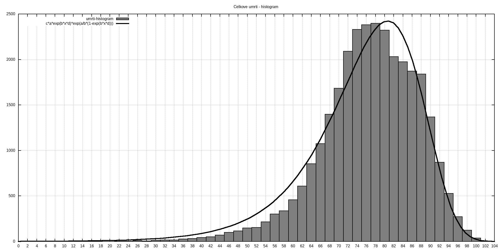
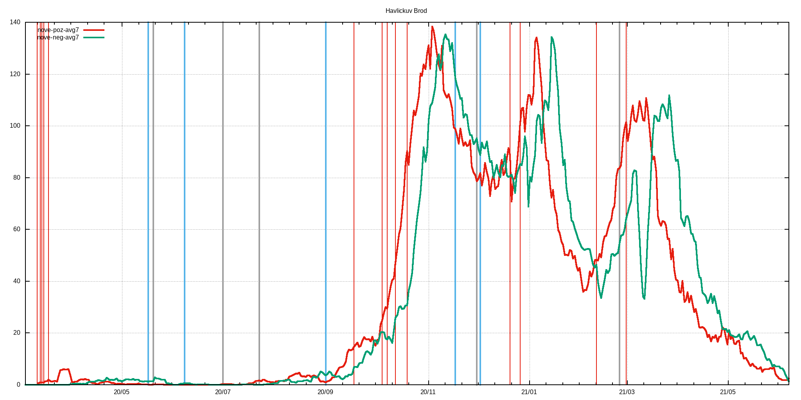

# c19_cz orp data extractor with gnuplot visualization
Few lame BASH & AWK & GNUPLOT scripts that extract ORP, LAU level and other data published by MZCR

## TL;DR - graphs are in ./figs & ./figs-lau directories and at the bottom of this README.md

**Data source**: https://onemocneni-aktualne.mzcr.cz/api/v2/covid-19/orp.csv

**Directories logic**:
```
./extr                              #extracted & processed data for each ORP
./extr/2001.csv                     #original data for Benesov
./extr/2001.dif                     #processed data for Benesov - first difference & daily new cases added
./extr/2001.difa                    #7-day average of dtto

./extr-lau                          #LAU level of data - cumsum of pozitive,recovered,deaths
./extr-lau/CZ0100.csv               #original data for CZ0100 LAU -> Prague
./extr-lau/CZ0100.dif               #1st difference of original data -> # of new poz./rec./deaths
./extr-lau/CZ0100.difa              #7-day average of dtto
./extr-lau/CZ0100d.csv              #dates and ages of deceased

./figs                              #figs. generated by gnuplot scripts, leading 'a' in the filename means averaged version
./figs/Benesov/2001dif.png          #1st difference of prevalence data
./figs/Benesov/2001dif65.png        #dtto but only for 65+, 75+ & hospitalizations data
./figs/Benesov/2001new.png          #daily new cases
./figs/Benesov/2001new65.png        #dtto but only for 65+, 75+ & hospitalization data
./figs/Benesov/2001p.png            #prevalence
./figs/Benesov/2001p65.png          #dtto but only for 65+, 75+ & hospitalization data

./figs-lau                          #figs. for LAUs
./figs-lau/Benesov/CZ0201.png       #new pozitive & new recovered
./figs-lau/Benesov/CZ0201d.png      #deaths
./figs-lau/Benesov/CZ0201hist.png   #histogram of all deaths for this LAU
```
## Selected restrictions (red), easings (blue) and outbreaks (black)
```
# restrictions
2020-03-11 Schools closed
2020-03-13 Borders closed
2020-03-14 Services closed
2020-03-15 Lockdown
2020-03-18 Masks
2020-09-01 Indoor masks excl. schools
2020-09-18 Univ. masks
2020-10-05 SoE
2020-10-08 Distance learning at univs. & secondary schools
2020-10-13 Anti-COVID measures
2020-10-20 Outdoor mask & partial lockdown
2020-11-18 Shops restrictions
2020-12-21 UK flights banned
2020-12-27 PES at 4. with exceptions
2021-02-11 Cheb, Sokolov and Trutnov isolated
2021-02-25 FFP2+ mandatory
2021-03-01 Lockdown

#easings
2020-05-17 End of SoE
2020-06-08 Restrictions lifting, borders opened
2020-09-01 Schools reopened
2020-11-18 Primary schools reopened
2020-12-03 PES at 3.

#outbreaks
2020-05-20 Karvina miners outbreak
2020-07-01 OKD outbreak
2020-07-23 Prague music club outbreak
2020-12-01 B.1.1.7 confirmed in December
2021-02-25 B.1.351 confirmed
```
## Time evolution of C-19 positively tested population
<br>

## Incidence divided among age groups
<br>

## Time evolution of deaths histograms
<br>

## Up-to-date overall deaths histogram
<br>
## Histogram statistics
```


* FILE: 
  Records:           24984
  Out of range:          0
  Invalid:               0
  Column headers:        0
  Blank:                 0
  Data Blocks:           1

* COLUMNS:
  Mean:             281.5856               77.7986
  Std Dev:           58.2502               10.3460
  Sample StdDev:     58.2513               10.3462
  Skewness:          -1.0799               -0.8313
  Kurtosis:           5.9414                4.5686
  Avg Dev:           46.9874                8.0311
  Sum:           7.03514e+06           1.94372e+06
  Sum Sq.:       2.06577e+09           1.53893e+08

  Mean Err.:          0.3685                0.0655
  Std Dev Err.:       0.2606                0.0463
  Skewness Err.:      0.0155                0.0155
  Kurtosis Err.:      0.0310                0.0310

  Minimum:            0.0000 [    0]        8.0000 [19733]
  Maximum:          364.0000 [24983]      104.0000 [13148]
  Quartile:         236.0000               72.0000
  Median:           288.0000               79.0000
  Quartile:         331.0000               85.0000

  Linear Model:       y = -0.01634 x + 82.4
  Slope:              -0.01634 +- 0.001119
  Intercept:          82.4 +- 0.3218
  Correlation:        r = -0.09198
  Sum xy:             5.459e+08

iter      chisq       delta/lim  lambda   a             b             c             d            
   0 1.6174222232e+06   0.00e+00  3.28e+03    1.508380e-03   1.158730e+01   4.015430e+02   9.436430e-03
   1 6.0200889220e+05  -1.69e+05  3.28e+02    1.515588e-03   1.224049e+01   4.441493e+02   9.017386e-03
   2 5.5996079463e+05  -7.51e+03  3.28e+01    1.701731e-03   1.149579e+01   4.824046e+02   9.405256e-03
   * 3.6404740724e+07   9.85e+04  3.28e+02   -7.790911e-04  -4.582567e+00   1.164062e+03   2.266200e-02
   3 5.4645549196e+05  -2.47e+03  3.28e+01    1.720344e-03   1.119764e+01   4.965249e+02   9.639095e-03
   * 3.6404737747e+07   9.85e+04  3.28e+02   -9.199921e-04  -4.661324e+00   1.206408e+03   2.343734e-02
   4 5.4581211317e+05  -1.18e+02  3.28e+01    1.691219e-03   1.102273e+01   5.048232e+02   9.798051e-03
   * 3.6404732658e+07   9.85e+04  3.28e+02   -9.281892e-04  -4.720936e+00   1.232342e+03   2.393957e-02
   5 5.4580222649e+05  -1.81e+00  3.28e+01    1.661142e-03   1.084749e+01   5.130419e+02   9.958690e-03
   * 3.6404732693e+07   9.85e+04  3.28e+02   -9.077573e-04  -4.640010e+00   1.252063e+03   2.432440e-02
   * 5.4580842970e+05   1.14e+00  3.28e+03    1.632976e-03   1.067107e+01   5.215372e+02   1.012407e-02
   6 5.4572656318e+05  -1.39e+01  3.28e+02    1.660900e-03   1.084739e+01   5.131411e+02   9.961415e-03
   * 5.4580115673e+05   1.37e+01  3.28e+03    1.631698e-03   1.067100e+01   5.215673e+02   1.012518e-02
   * 5.4572768194e+05   2.05e-01  3.28e+04    1.660610e-03   1.084576e+01   5.132277e+02   9.963109e-03
   * 5.4572726054e+05   1.28e-01  3.28e+05    1.660898e-03   1.084745e+01   5.131420e+02   9.961490e-03
   * 5.4572658013e+05   3.11e-03  3.28e+06    1.660900e-03   1.084739e+01   5.131411e+02   9.961417e-03
   * 5.4572656335e+05   3.14e-05  3.28e+07    1.660900e-03   1.084739e+01   5.131411e+02   9.961415e-03
   * 5.4572656318e+05   3.14e-07  3.28e+08    1.660900e-03   1.084739e+01   5.131411e+02   9.961415e-03
   * 5.4572656318e+05   3.26e-09  3.28e+09    1.660900e-03   1.084739e+01   5.131411e+02   9.961415e-03
   7 5.4572656318e+05  -1.49e-10  3.28e+08    1.660900e-03   1.084739e+01   5.131411e+02   9.961415e-03
iter      chisq       delta/lim  lambda   a             b             c             d            

After 7 iterations the fit converged.
final sum of squares of residuals : 545727
rel. change during last iteration : -1.49325e-15

degrees of freedom    (FIT_NDF)                        : 41
rms of residuals      (FIT_STDFIT) = sqrt(WSSR/ndf)    : 115.371
variance of residuals (reduced chisquare) = WSSR/ndf   : 13310.4

Final set of parameters            Asymptotic Standard Error
=======================            ==========================
a               = 0.0016609        +/- 0.007637     (459.8%)
b               = 10.8474          +/- 45.99        (424%)
c               = 513.141          +/- 2195         (427.7%)
d               = 0.00996141       +/- 0.04266      (428.3%)

correlation matrix of the fit parameters:
                a      b      c      d      
a               1.000 
b               0.998  1.000 
c              -0.998 -1.000  1.000 
d              -0.999 -1.000  1.000  1.000 
```

## Example output for LAU
<br>
<em>Havl Brod</em><br>
<br>
<br>
<br>
<br>
<br>

## Example output for ORP
<br>
<em>Havl Brod</em><br>
<br>
<br>
<br>
<br>
<br>
<br>
<br>
<br>
<br>
<br>
<br>
<br>

