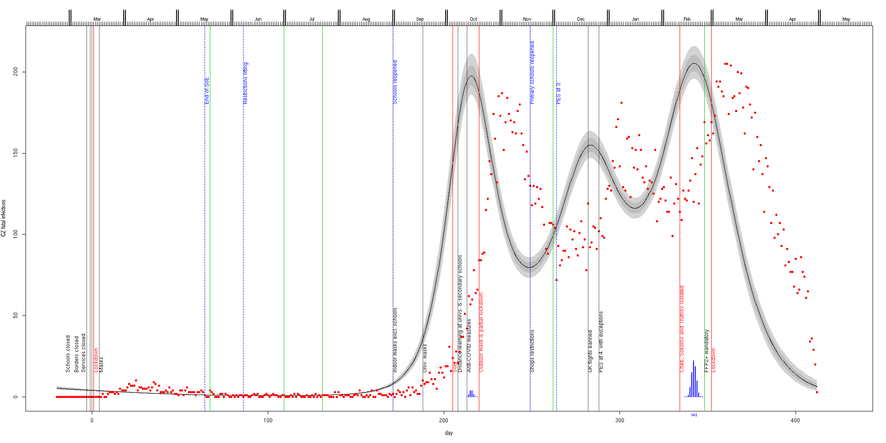
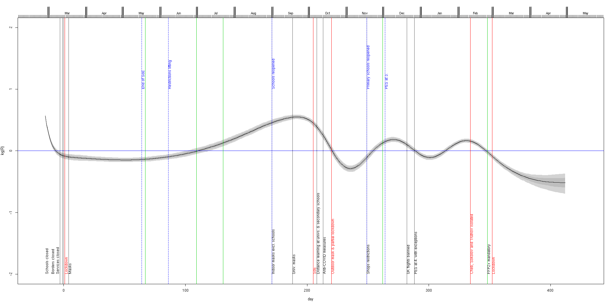
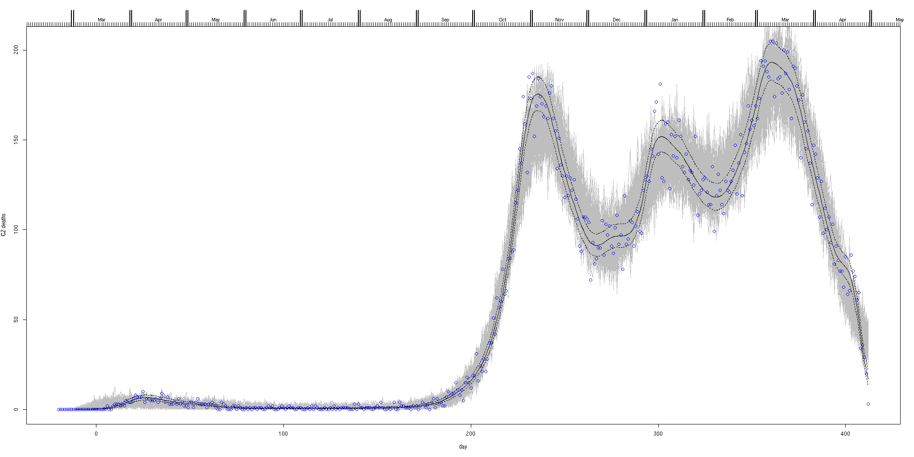

# C19-CZ fatal infections dynamics inferred by the Wood's stochastic model
**Based on paper & R scripts by Wood**: https://onlinelibrary.wiley.com/doi/full/10.1111/biom.13462

There are only 2 inputs:  **the daily number of C19 related deaths** and **onset to death distribution**.

Deaths are taken from closed UZIS hospital data (data range 19.3.2020 - 29.4.2021).

## Onset to death distributions
Comparison of real data & fits based on UZIS closed datasets, together with distributions used in the Wood's paper (Wu,Linton,Verity).
<br>
with following fits (UZIS data)
```
alt-lognorm: 0.0588105*exp(-2.91204*(log(0.0658809*x+0.514951))^2)
gamma: rgamma(41,shape=2.01084,scale=6.28585)
lognorm: rlnorm(34,2.42,.781361)
```
The above is combined together (except alt-lognormal) and mixed with infection to onset distribution ~ (a meta‐analysis by McAloon et al. (2020) suggests a log‐normal distribution with log scale mean and standard deviation of 1.63 and 0.50).

The draws from the combined infection to death distribution model - UZIS data:
<br>
*Left*: Onset to death fits. Dotted - gamma fit, dashed - lognormal fit, blue - alt lognormal fit.

*Mid*: combined onset to death model, thick red is mean model, grey are 100 draws from the distribution of the combined model, blue is as left.

*Right*: as middle, but combined infection to death model.

The draws from the combined infection to death distribution model - Wood's paper:
<br>
*See Fig. 1. in Wood's paper*

**This part should be examined more thoroughly!** to explain discrepancies between Wood's(and others) DFs and UZIS-based DF as described in Sec. 3. in the supplementary material of the Wood's paper.

## Inferred fatal infections
<br>
Inference for the Czech hospital deaths including disease duration uncertainty. Black line is inferred fatal incidence and show the posterior median, while light grey and dark grey regions show, respectively, 95% and 68% confidence regions, including uncertainty in the fatal disease duration distribution. Day 0 is 13th March 2020. Red symbols are the hospital deaths from which incidence is inferred. Notable restrictions (black and red[lockdowns]) and easings(blue) are marked, together with known outbreaks (green - consecutively: Karvina miners outbreak, OKD outbreak, Prague music club outbreak, B.1.1.7 confirmed in December, B.1.351 confirmed)
## Effective reproduction number R
<br>
The inferred R using the simple SEIR approach.
## Sanity check
<br>
Consistency check. In grey are 100 sets of death data simulated forward from the inferred median fatal infection profile. Symbols are the UZIS daily death data on which inference is based. The dashed curves are 95% confidence intervals for underlying death rate estimated by direct fitting of Eq. 1 in the Wood's paper.
