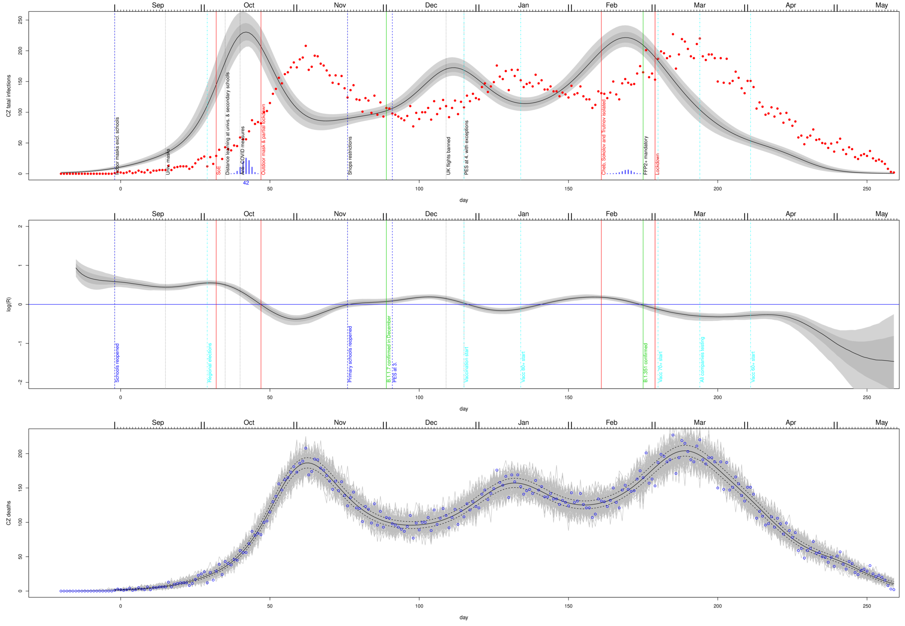
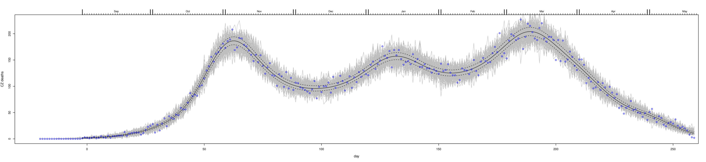
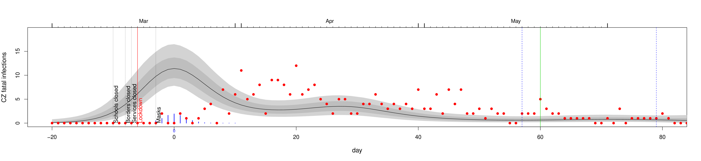
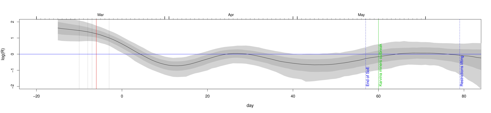
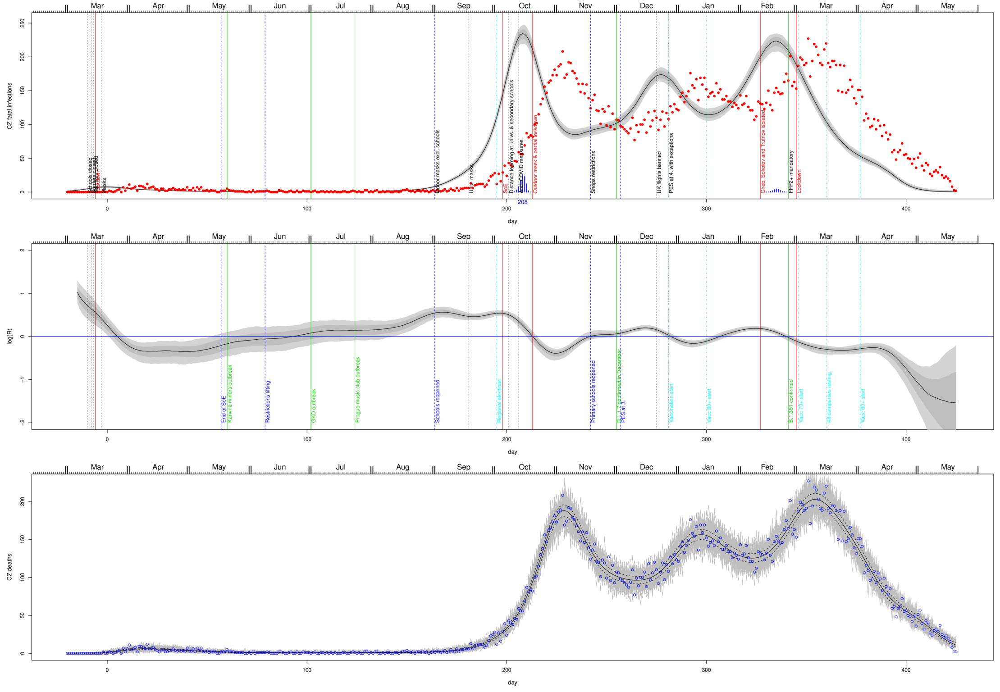

# C19-CZ fatal infections dynamics inferred by the Wood's stochastic model
**Based on paper & R scripts by Wood**: https://onlinelibrary.wiley.com/doi/full/10.1111/biom.13462

There are only 2 inputs:  **the daily number of C19 related deaths** and **onset to death distribution**.

(and also infection to onset distribution as noted later...)

Deaths data are taken from the closed UZIS hospital dataset (data range 19.3.2020 - 29.4.2021).
<br>
The UZIS dataset is a real garbage, the dataset was filtered to include only deaths with the following conditions:
```onset->specimen < onset->hospitalization
0 < onset->death < 61
onset->specimen <= onset->hospitalization
onset->hospitalization < onset->death
specimen->hospitalization > {0,2}
```
then it was divided in two parts with different date range:

1.3.2020 - 1.9.2020 (229 records, s2h>0)

1.9.2020 - 1.5.2021 (4899 records, s2h>2)

and lognormal distributions were fitted to each (parameters of lognorm fits are indicated in plots):
<br>
<br>
<br>

The above are mixed with infection to onset distribution ~ (a meta-analysis by McAloon et al. (2020) suggests a log-normal distribution with log scale mean and standard deviation of 1.63 and 0.50).

The draws from the combined infection to death distribution model - Filtered UZIS data:
<br>
<br>
<br>
*Top*:1.3.2020-1.9.2020

*Mid*:1.9.2020-1.5.2020

*Bottom*: Combined

*Left*: Onset to death lognormal fit.

*Mid*: Thick red is mean model, grey are 100 draws from the distribution of the model.

*Right*: As middle, but combined infection to death model. Blue is mean infection to death distribution based on CHESS data from original paper.

The above is used as an input to the main code together with following DF for infection->death (values in {} are mean onset/infection to death intervals in days):
```
## UZIS filtered 1.3.2020 - 1.9.2020
o2d[le,ls]= [2.567969, 0.5894433] {15.5 days}
i2d[le,ls]= [2.958302, 0.4453127] {21.3 days}
## UZIS filtered 1.9.2020 - 1.5.2021
o2d[le,ls]= [2.745226, 0.4827882] {17.5 days}
i2d[le,ls]= [3.073937, 0.3835695] {23.3 days}
## UZIS filtered combined 1.3.2020 - 1.5.2021
o2d[le,ls]= [2.665169, 0.5541375] {16.8 days}
i2d[le,ls]= [3.022099, 0.4279544] {22.5 days}
## CHESS data from Wood's paper
o2d[le,ls]= [2.891, 0.5560864] {21 days}
i2d[le,ls]= [3.186, 0.443451] {26.7 days}
```

## Model output 1.9.2020 - 1.5.2021
<br>

**TOP Inferred fatal infections**

Inference for the Czech hospital deaths including disease duration uncertainty. Black line is inferred fatal incidence and show the posterior median, while light grey and dark grey regions show, respectively, 95% and 68% confidence regions, including uncertainty in the fatal disease duration distribution. Day 0 is 13th March 2020. Red symbols are the hospital deaths from which incidence is inferred. Notable restrictions (black and red[lockdowns]) and easings(blue) are marked, together with known outbreaks (green - consecutively: Karvina miners outbreak, OKD outbreak, Prague music club outbreak, B.1.1.7 confirmed in December, B.1.351 confirmed) and other outstanding events (pink), full list with dates is attached later.

**MID Effective reproduction number Rt**

The inferred R using the simple SEIR approach.

**BOTTOM Sanity check**

Consistency check. In grey are 100 sets of death data simulated forward from the inferred median fatal infection profile. Symbols are the UZIS daily death data on which inference is based. The dashed curves are 95% confidence intervals for underlying death rate estimated by direct fitting of Eq. 1 in the Wood's paper.

<br>
<br>
<br>

---
## Model output 1.3.2020 - 1.5.2020
**Inferred fatal infections**
<br>
Inference for the Czech hospital deaths including disease duration uncertainty. Black line is inferred fatal incidence and show the posterior median, while light grey and dark grey regions show, respectively, 95% and 68% confidence regions, including uncertainty in the fatal disease duration distribution. Day 0 is 13th March 2020. Red symbols are the hospital deaths from which incidence is inferred. Notable restrictions (black and red[lockdowns]) and easings(blue) are marked, together with known outbreaks (green - consecutively: Karvina miners outbreak, OKD outbreak, Prague music club outbreak, B.1.1.7 confirmed in December, B.1.351 confirmed) and other outstanding events (pink), full list with dates is attached later.

**Effective reproduction number Rt**
<br>
The inferred R using the simple SEIR approach.

**Sanity check**
<br>
Consistency check. In grey are 100 sets of death data simulated forward from the inferred median fatal infection profile. Symbols are the UZIS daily death data on which inference is based. The dashed curves are 95% confidence intervals for underlying death rate estimated by direct fitting of Eq. 1 in the Wood's paper.

## Model output 1.3.2020 - 1.5.2021
<br>

---

List of important events:

```
# restrictions
2020-03-11 Schools closed
2020-03-13 Borders closed
2020-03-14 Services closed
2020-03-15 Lockdown
2020-03-18 Masks
2020-09-01 Indoor masks excl. schools
2020-09-18 Univ. masks
2020-10-05 SoE
2020-10-08 Distance learning at univs. & secondary schools
2020-10-13 Anti-COVID measures
2020-10-20 Outdoor mask & partial lockdown
2020-11-18 Shops restrictions
2020-12-21 UK flights banned
2020-12-27 PES at 4. with exceptions
2021-02-11 Cheb, Sokolov and Trutnov isolated
2021-02-25 FFP2+ mandatory
2021-03-01 Lockdown

#easings
2020-05-17 End of SoE
2020-06-08 Restrictions lifting, borders opened
2020-09-01 Schools reopened
2020-11-18 Primary schools reopened
2020-12-03 PES at 3.

#outbreaks
2020-05-20 Karvina miners outbreak
2020-07-01 OKD outbreak
2020-07-23 Prague music club outbreak
2020-12-01 B.1.1.7 confirmed in December
2021-02-25 B.1.351 confirmed

#other
2020-10-02 Regional elections
2020-12-27 Start of vaccinations
2021-01-15 Start of vaccinations 80+
2021-03-01 Start of vaccinations 70+
2021-03-15 Companies testing (10+ empl.)
2021-04-01 Start of vaccinations 60+
```

---

# First attempt (17th-20th May 2021)
Initial approach...
## Onset to death distributions
Comparison of real data & fits based on UZIS closed datasets, together with distributions used in the Wood's paper (Wu,Linton,Verity).
<br>
with following fits (UZIS data)
```
alt-lognorm: 0.0588105*exp(-2.91204*(log(0.0658809*x+0.514951))^2)
gamma: rgamma(41,shape=2.01084,scale=6.28585)
lognorm: rlnorm(34,2.42,.781361)
```
The above is combined together (except alt-lognormal) and mixed with infection to onset distribution ~ (a meta-analysis by McAloon et al. (2020) suggests a log-normal distribution with log scale mean and standard deviation of 1.63 and 0.50).

The draws from the combined infection to death distribution model - UZIS data:
<br>
*Left*: Onset to death fits. Dotted - gamma fit, dashed - lognormal fit, blue - alt lognormal fit.

*Mid*: combined onset to death model, thick red is mean model, grey are 100 draws from the distribution of the combined model, blue is as left.

*Right*: as middle, but combined infection to death model.

The draws from the combined infection to death distribution model - Wood's paper:
<br>
*See Fig. 1. in Wood's paper*

**This part should be examined more thoroughly!** to explain discrepancies between Wood's(and others) DFs and UZIS-based DF as described in Sec. 3. in the supplementary material of the Wood's paper.
**FILTERED UZIS DATA** gives DF closer to Wood DFs
<br>
with following fits
```
gamma: rgamma(41,shape=3.81923,scale=4.15174)
lognorm: rlnorm(34,2.69743,0.549592)
```
The draws from the combined infection to death distribution model - *filtered* UZIS data:
<br>
*Left*: Onset to death fits. Dotted - gamma fit, full - lognormal fit.

*Mid*: combined onset to death model, thick red is mean model, grey are 100 draws from the distribution of the combined model.

*Right*: as middle, but combined infection to death model, **blue** is infection->death DF based on CHESS database (COVID-19 Hospitalisations in England Surveillance System)

the latter is used in the model of Wood to get the following:

## Inferred fatal infections
<br>
Inference for the Czech hospital deaths including disease duration uncertainty. Black line is inferred fatal incidence and show the posterior median, while light grey and dark grey regions show, respectively, 95% and 68% confidence regions, including uncertainty in the fatal disease duration distribution. Day 0 is 13th March 2020. Red symbols are the hospital deaths from which incidence is inferred. Notable restrictions (black and red[lockdowns]) and easings(blue) are marked, together with known outbreaks (green - consecutively: Karvina miners outbreak, OKD outbreak, Prague music club outbreak, B.1.1.7 confirmed in December, B.1.351 confirmed)
## Effective reproduction number R
<br>
The inferred R using the simple SEIR approach.
## Sanity check
<br>
Consistency check. In grey are 100 sets of death data simulated forward from the inferred median fatal infection profile. Symbols are the UZIS daily death data on which inference is based. The dashed curves are 95% confidence intervals for underlying death rate estimated by direct fitting of Eq. 1 in the Wood's paper.
