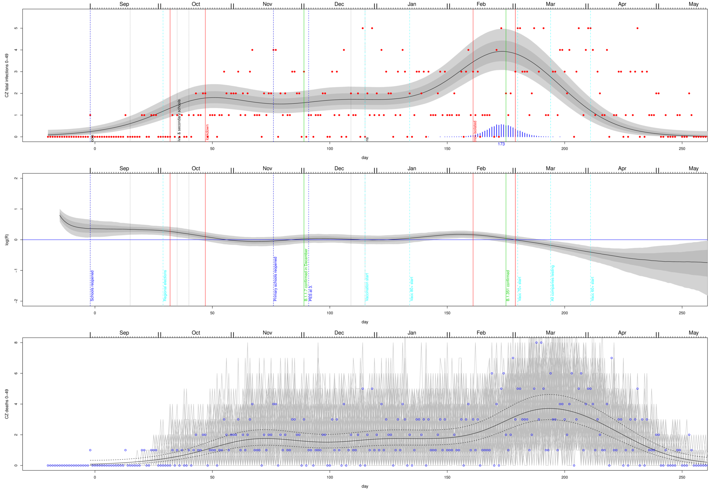
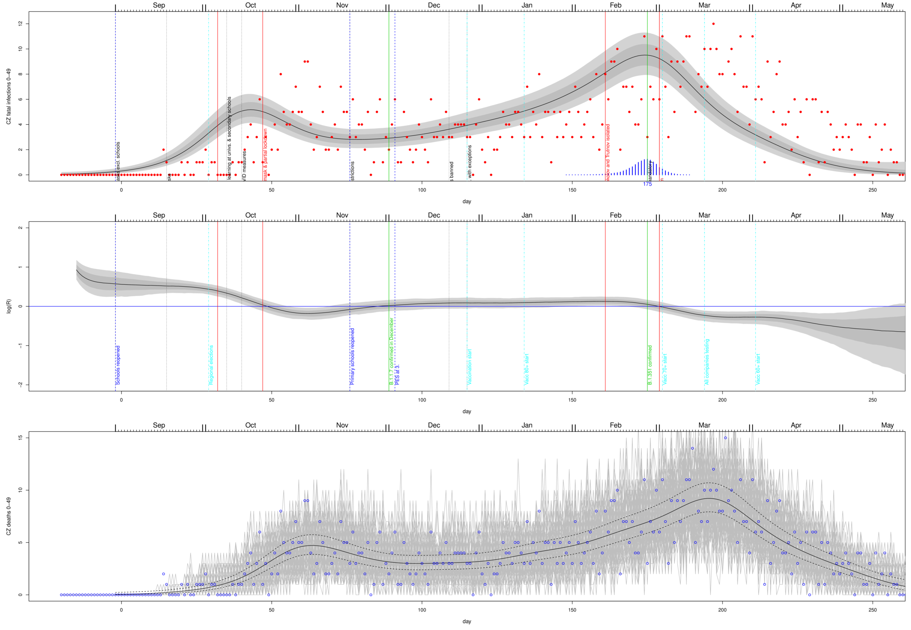
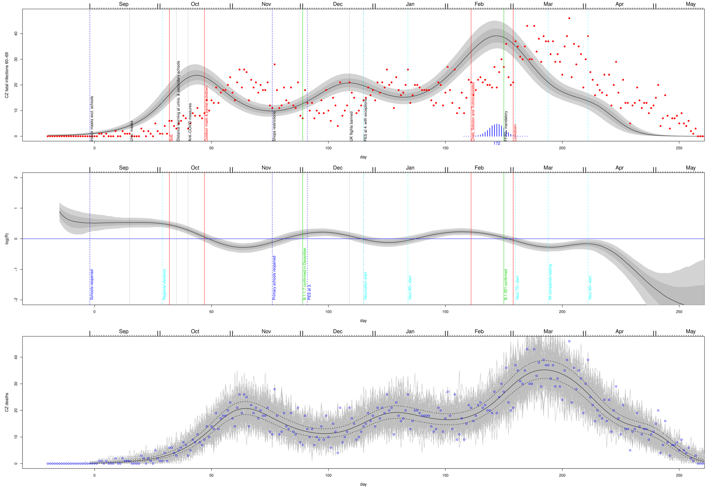
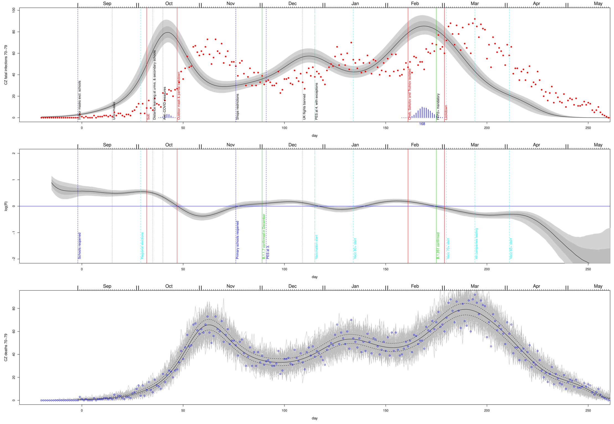
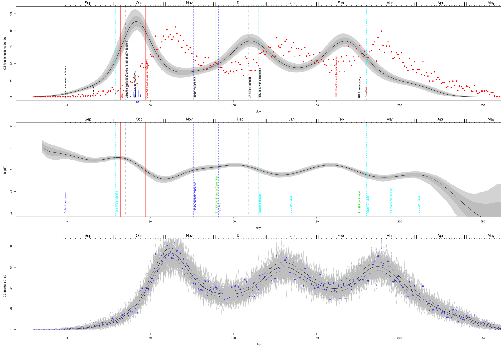
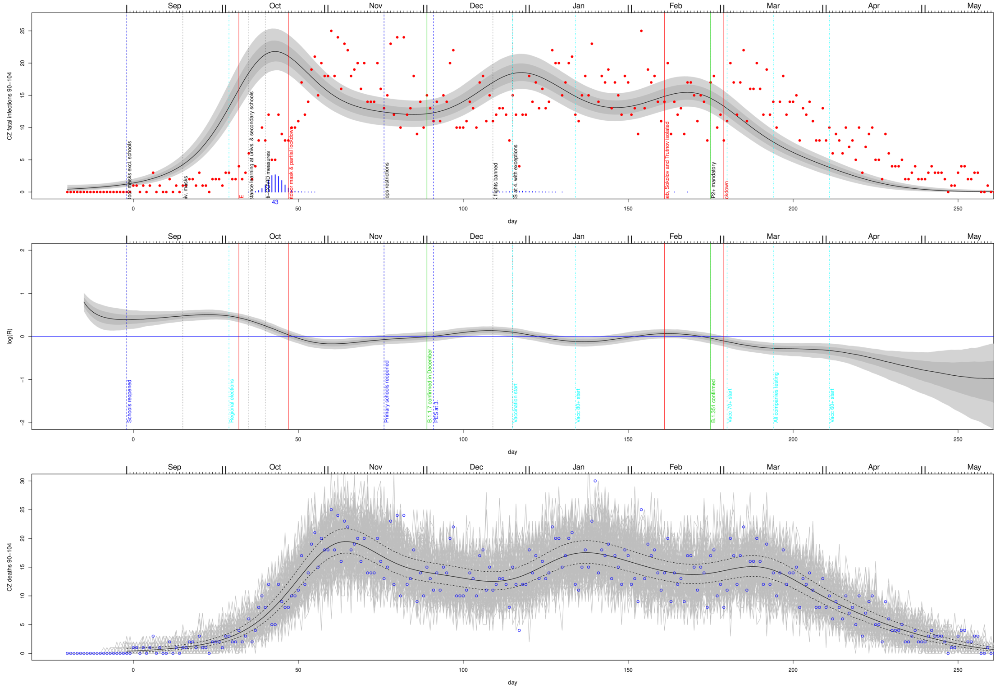

# C19-CZ fatal infections dynamics inferred by the Wood's stochastic model - AGE GROUPS

For different age groups (**TODO check onset->death DFs for each age group**)
## Ages 0-49
 
## Ages 50-59
 
## Ages 60-69
 
## Ages 70-79
 
## Ages 80-89
 
## Ages 90-104
 

