# C19-CZ fatal infections dynamics inferred by the Wood's stochastic model - REGIONS (NUTS3)

For different regions(NUTS3) (**TODO check onset->death DFs for each region**)

# Praha - CZ010
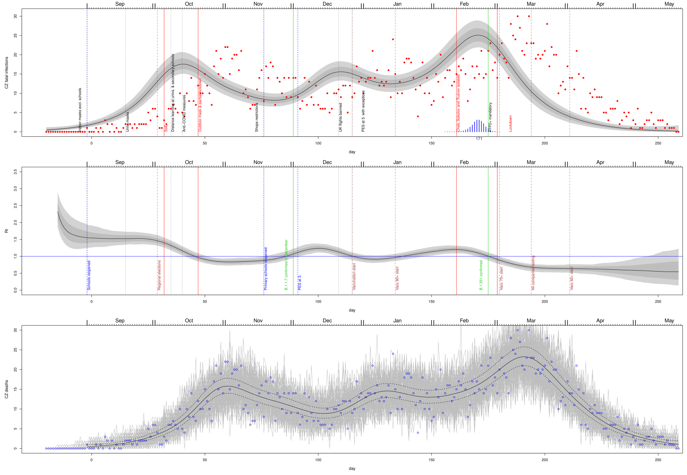 
# Stredocesky - CZ020
 
# Jihocesky - CZ031
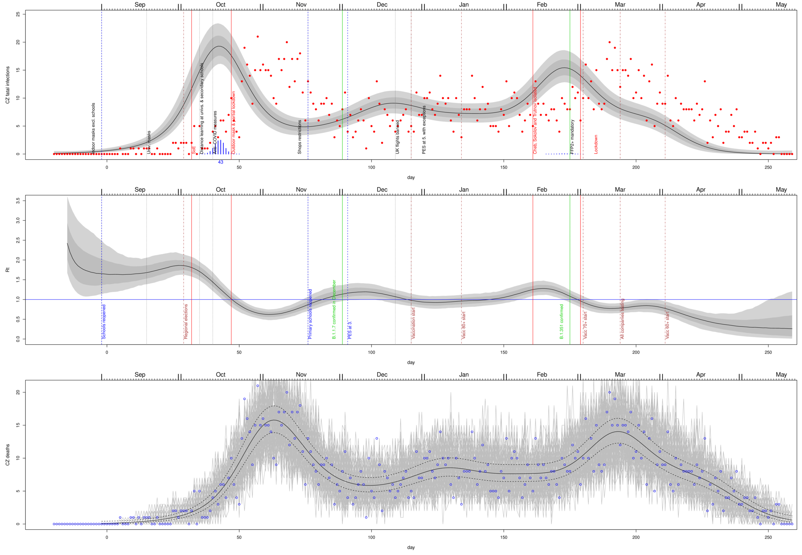 
# Plzensky - CZ032
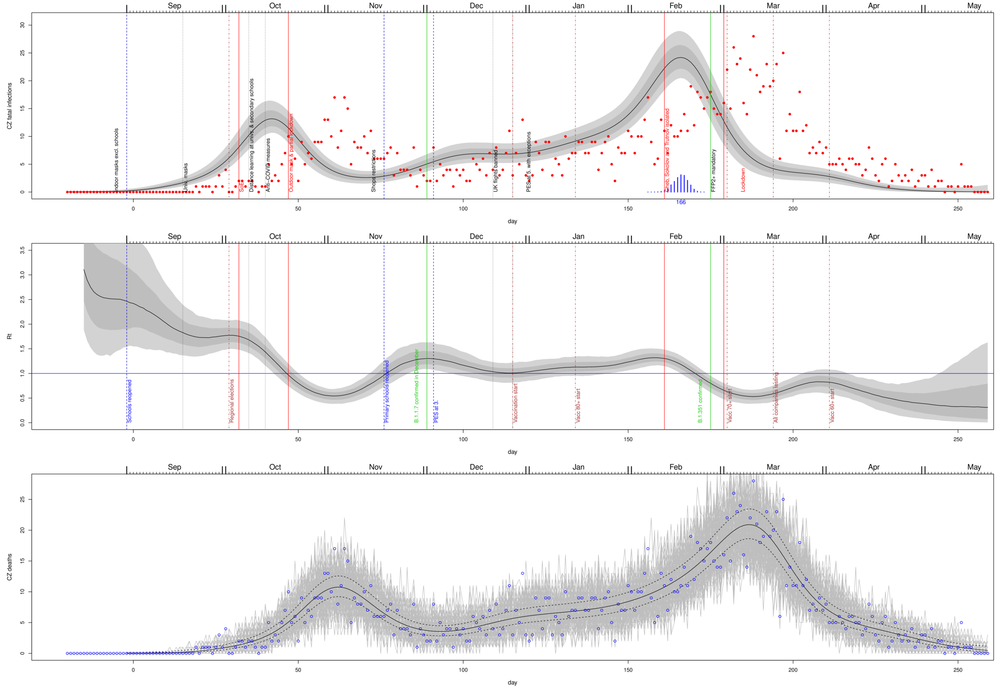 
# Karlovarsky - CZ041
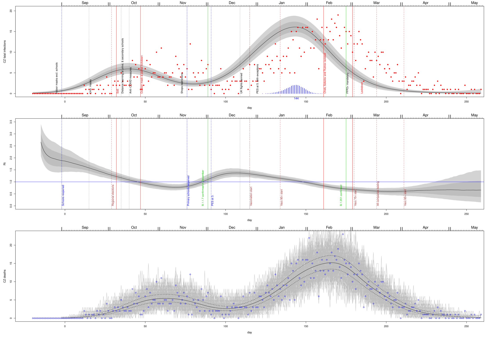 
# Ustecky - CZ042
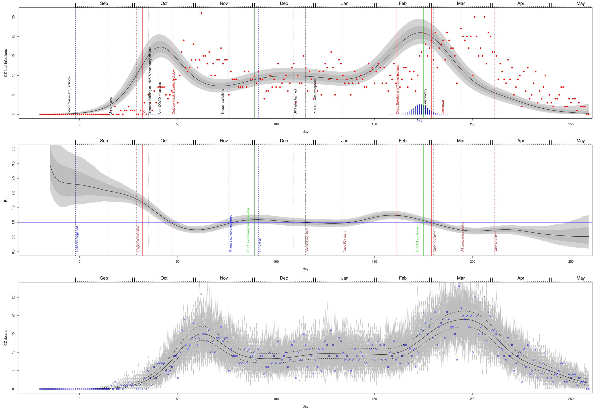 
# Liberecky - CZ051
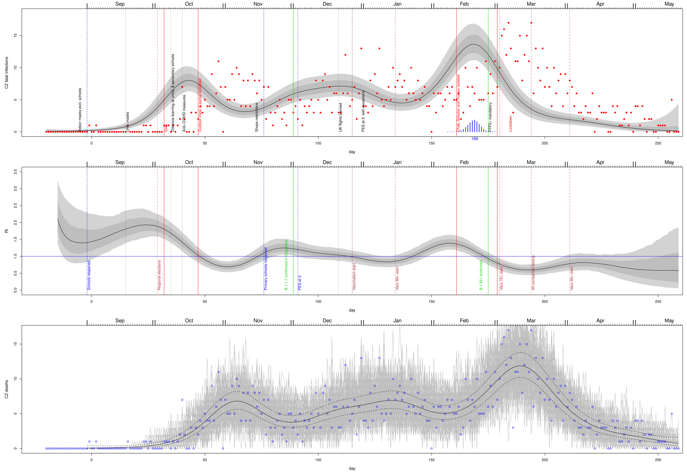 
# Kralovehradecky - CZ052
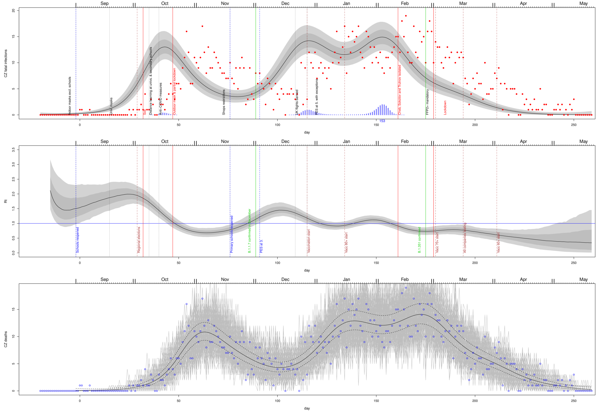 
# Pardubicky - CZ053
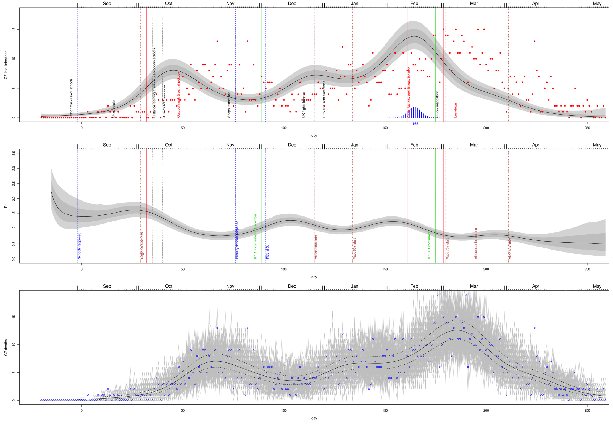 
# Vysocina - CZ063
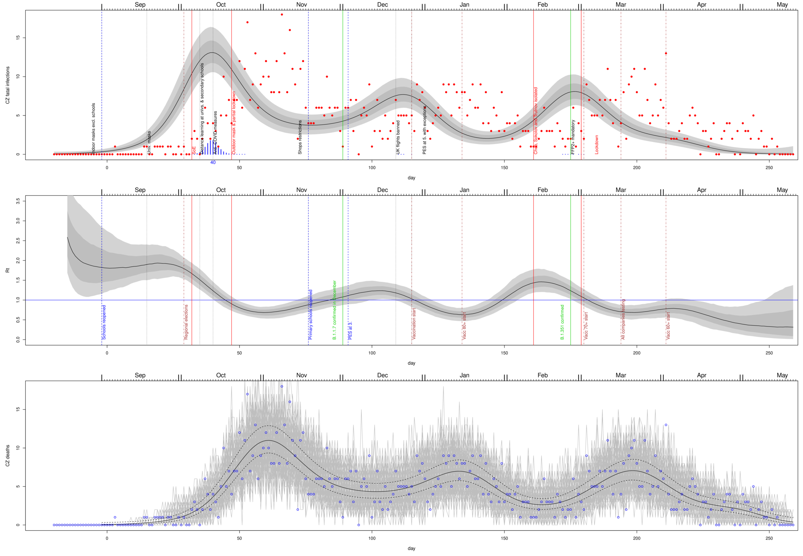 
# Jihomoravsky - CZ064
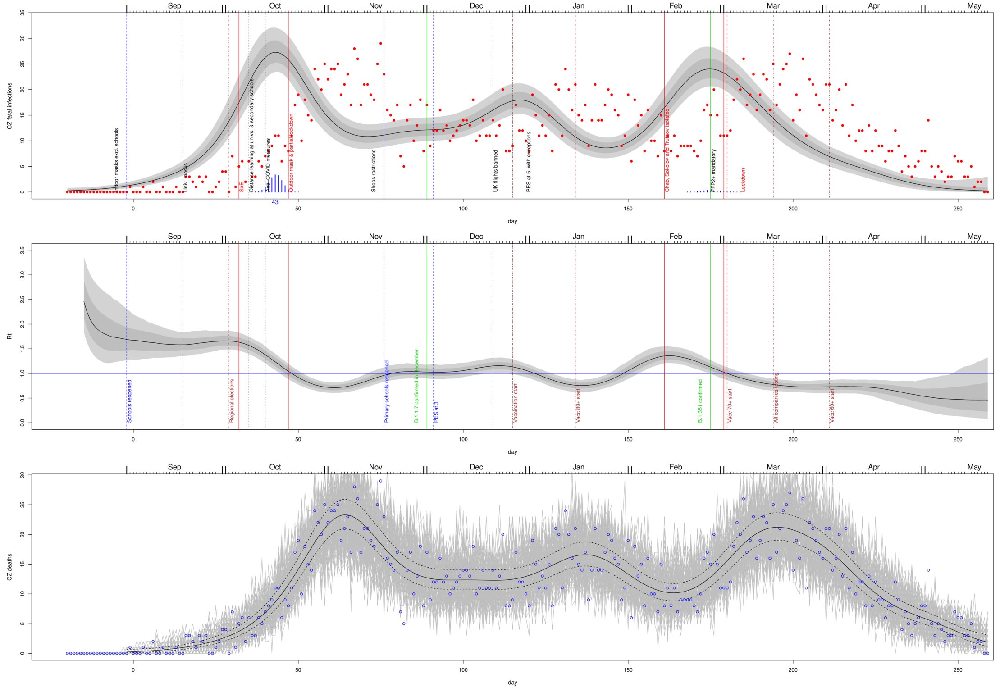 
# Olomoucky - CZ071
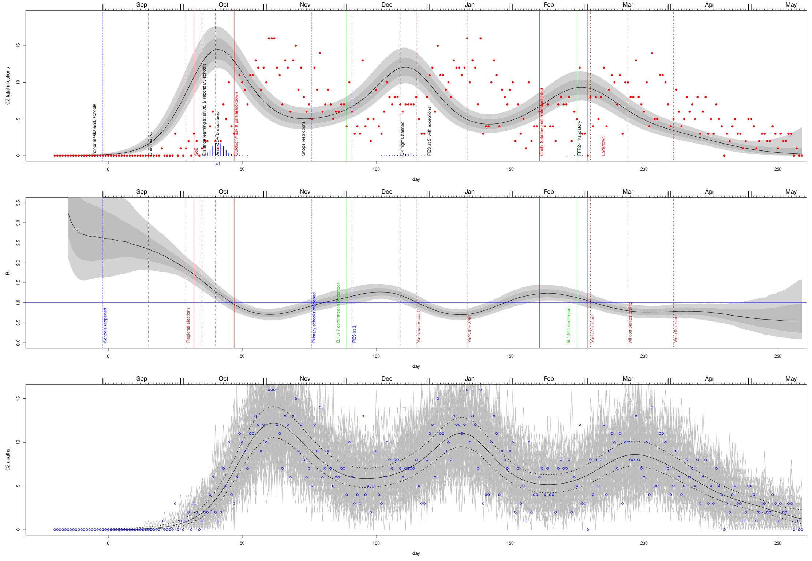 
# Zlinsky - CZ072
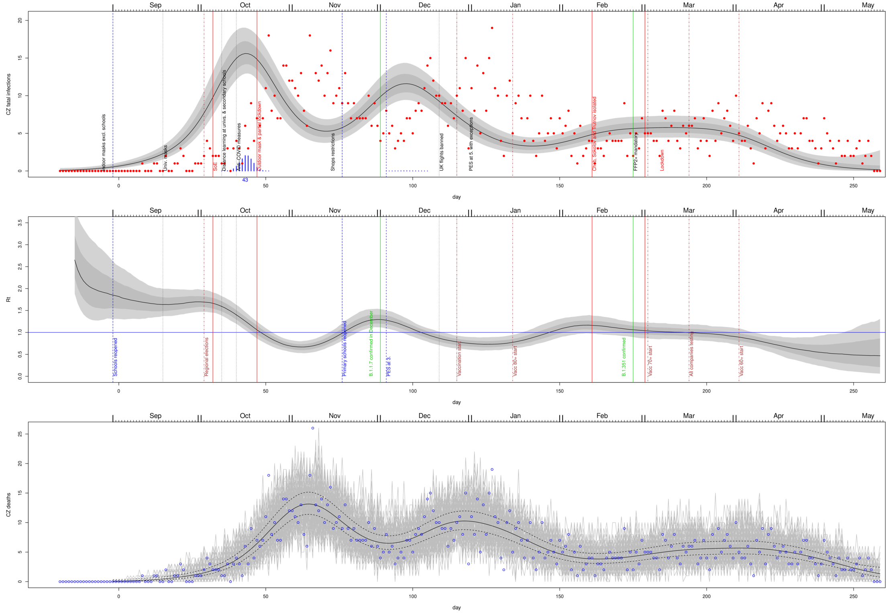 
# Moravskoslezsky - CZ080
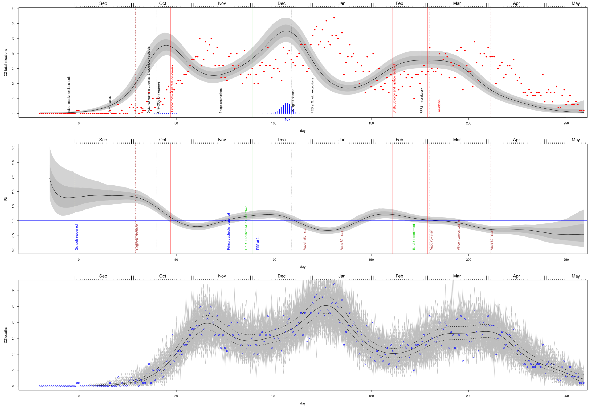 
